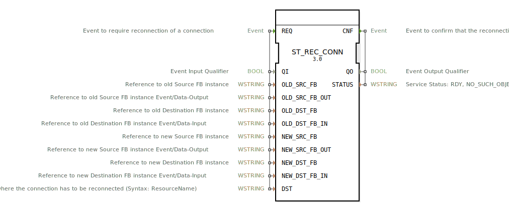

# ST_REC_CONN

```{index} single: ST_REC_CONN
```


* * * * * * * * * *

## Einleitung

Der ST_REC_CONN Funktionsblock dient zur dynamischen Neukonfiguration von Verbindungen zwischen Funktionsbausteinen in 4diac-Systemen. Er ermöglicht das Umleiten von Ereignis- oder Datenverbindungen von bestehenden Quell- und Ziel-Funktionsbausteinen zu neuen Instanzen während der Laufzeit.



## Schnittstellenstruktur

### **Ereignis-Eingänge**

- **REQ**: Startet den Rekonfigurationsprozess für eine Verbindung

### **Ereignis-Ausgänge**

- **CNF**: Bestätigt die erfolgreiche oder fehlgeschlagene Durchführung der Verbindungsrekonfiguration

### **Daten-Eingänge**

- **QI** (BOOL): Qualifiziert die Ereigniseingabe
- **OLD_SRC_FB** (WSTRING): Referenz zur alten Quell-FB-Instanz
- **OLD_SRC_FB_OUT** (WSTRING): Referenz zum alten Quell-FB-Ausgang (Ereignis/Daten)
- **OLD_DST_FB** (WSTRING): Referenz zur alten Ziel-FB-Instanz
- **OLD_DST_FB_IN** (WSTRING): Referenz zum alten Ziel-FB-Eingang (Ereignis/Daten)
- **NEW_SRC_FB** (WSTRING): Referenz zur neuen Quell-FB-Instanz
- **NEW_SRC_FB_OUT** (WSTRING): Referenz zum neuen Quell-FB-Ausgang (Ereignis/Daten)
- **NEW_DST_FB** (WSTRING): Referenz zur neuen Ziel-FB-Instanz
- **NEW_DST_FB_IN** (WSTRING): Referenz zum neuen Ziel-FB-Eingang (Ereignis/Daten)
- **DST** (WSTRING): Zielort für die Rekonfiguration (Syntax: ResourceName)

### **Daten-Ausgänge**

- **QO** (BOOL): Qualifiziert die Ereignisausgabe
- **STATUS** (WSTRING): Service-Status (RDY, NO_SUCH_OBJECT, INVALID_STATE)

### **Adapter**

Keine Adapter-Schnittstellen vorhanden.

## Funktionsweise

Beim Eintreffen des REQ-Ereignisses analysiert der Funktionsblock die übergebenen Parameter und führt folgende Schritte durch:

1. Identifizierung der bestehenden Verbindung zwischen OLD_SRC_FB und OLD_DST_FB
2. Trennung der bestehenden Verbindung
3. Aufbau einer neuen Verbindung zwischen NEW_SRC_FB und NEW_DST_FB
4. Rückmeldung des Operationsstatus über das CNF-Ereignis

Der QI-Eingang steuert dabei die Ausführung: Bei FALSE wird die Operation nicht durchgeführt.

## Technische Besonderheiten

- Unterstützt sowohl Ereignis- als auch Datenverbindungen
- Verwendet WSTRING-Datentypen für alle Referenzparameter
- Arbeitet mit Ressourcen-spezifischen Zielangaben
- Bietet detaillierte Statusrückmeldungen
- Implementiert gemäß IEC 61499-1 Standard für Rekonfiguration

## Zustandsübersicht

Der Funktionsblock arbeitet nach einem einfachen Anfrage-Bestätigungs-Prinzip:
- Wartezustand: Keine aktive Operation
- Ausführungszustand: Verarbeitung der REQ-Anfrage
- Abschlusszustand: Senden der CNF-Bestätigung

## Anwendungsszenarien

- Dynamische Systemrekonfiguration während des Betriebs
- Hot-Swapping von Funktionsbausteinen
- Lastverteilung durch Umleitung von Verbindungen
- Fehlertolerante Systeme mit redundanten Komponenten
- Adaptive Steuerungssysteme mit wechselnden Betriebsmodi

## Vergleich mit ähnlichen Bausteinen

Im Gegensatz zu statischen Verbindungen in 4diac ermöglicht ST_REC_CONN:
- Dynamische Anpassung von Verbindungen zur Laufzeit
- Höhere Flexibilität in adaptiven Systemen
- Komplexere Rekonfigurationsszenarien im Vergleich zu einfachen Verbindungsblöcken

## Fazit

ST_REC_CONN ist ein essentieller Baustein für flexible und adaptive Automatisierungssysteme, die dynamische Rekonfiguration während des Betriebs erfordern. Seine umfassende Parametrisierung ermöglicht präzise Steuerung von Verbindungsänderungen, während die Statusrückmeldungen zuverlässige Überwachung der Rekonfigurationsprozesse gewährleisten.