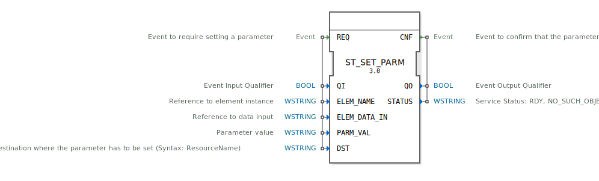

# ST_SET_PARM

```{index} single: ST_SET_PARM
```


* * * * * * * * * *

## Einleitung
Der ST_SET_PARM Funktionsblock dient zum Setzen von Parametern für Dateneingänge von Funktionsblöcken, Ressourcen oder Geräteinstanzen innerhalb eines 4diac-Systems. Dieser Baustein ermöglicht die dynamische Konfiguration von Systemparametern zur Laufzeit.



## Schnittstellenstruktur

### **Ereignis-Eingänge**
- **REQ**: Startet den Vorgang zum Setzen eines Parameters. Wird mit den Daten ELEM_NAME, ELEM_DATA_IN, PARM_VAL, DST und QI assoziiert.

### **Ereignis-Ausgänge**
- **CNF**: Bestätigt, dass der Parameter erfolgreich gesetzt wurde. Wird mit den Daten STATUS und QO assoziiert.

### **Daten-Eingänge**
- **QI** (BOOL): Ereignis-Eingangsqualifikator
- **ELEM_NAME** (WSTRING): Referenz zur Elementinstanz
- **ELEM_DATA_IN** (WSTRING): Referenz zum Dateneingang
- **PARM_VAL** (WSTRING): Parameterwert
- **DST** (WSTRING): Zielort, an dem der Parameter gesetzt werden muss (Syntax: ResourceName)

### **Daten-Ausgänge**
- **QO** (BOOL): Ereignis-Ausgangsqualifikator
- **STATUS** (WSTRING): Servicestatus (RDY, NO_SUCH_OBJECT, INVALID_STATE)

### **Adapter**
Keine Adapter vorhanden.

## Funktionsweise
Beim Eintreffen des REQ-Ereignisses versucht der ST_SET_PARM Funktionsblock, den angegebenen Parameterwert (PARM_VAL) für den spezifizierten Dateneingang (ELEM_DATA_IN) der Zielinstanz (ELEM_NAME) am angegebenen Zielort (DST) zu setzen. Nach Abschluss des Vorgangs wird das CNF-Ereignis mit dem entsprechenden Status ausgegeben.

## Technische Besonderheiten
- Unterstützt Wide-String-Datentypen für alle textbasierten Parameter
- Bietet detaillierte Statusrückmeldungen über den Erfolg oder Fehler der Operation
- Ermöglicht die Konfiguration über Ressourcengrenzen hinweg
- Implementiert als Rekonfigurationsdienst gemäß IEC 61499-1 Standard

## Zustandsübersicht
1. **Idle-Zustand**: Wartet auf REQ-Ereignis
2. **Verarbeitungszustand**: Setzt den Parameter basierend auf den Eingabedaten
3. **Bestätigungszustand**: Sendet CNF-Ereignis mit Statusinformationen

## Anwendungsszenarien
- Dynamische Anpassung von Systemparametern während des Betriebs
- Konfiguration von Funktionsblock-Parametern in verteilten Systemen
- Automatisierte Parametrierung in Produktionsanlagen
- Wartung und Optimierung von Steuerungssystemen

## Vergleich mit ähnlichen Bausteinen
Im Vergleich zu statischen Parametrierungsmethoden bietet ST_SET_PARM die Möglichkeit, Parameter zur Laufzeit zu ändern, was eine höhere Flexibilität in adaptiven Steuerungssystemen ermöglicht. Andere Konfigurationsbausteine arbeiten typischerweise nur während der Initialisierungsphase.

## Fazit
Der ST_SET_PARM Funktionsblock ist ein essentielles Werkzeug für die dynamische Rekonfiguration von 4diac-Systemen. Seine Fähigkeit, Parameter zur Laufzeit zu setzen, macht ihn besonders wertvoll für Anwendungen, die Anpassungsfähigkeit und Flexibilität erfordern. Die klare Schnittstellendefinition und detaillierte Statusrückmeldung gewährleisten eine zuverlässige Integration in komplexe Automatisierungssysteme.