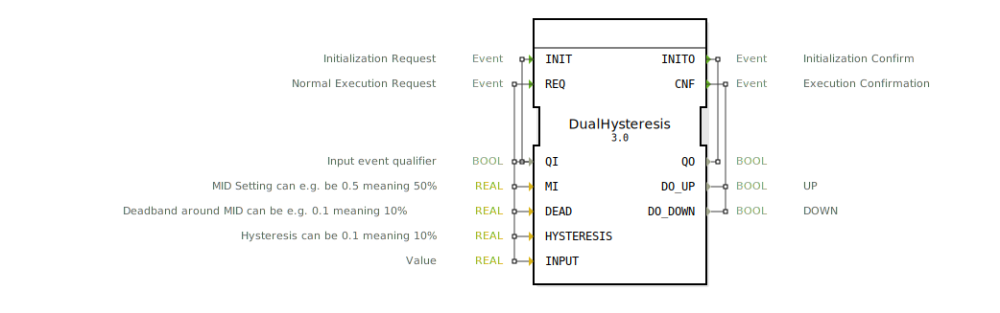

# DualHysteresis

```{index} single: DualHysteresis
```


* * * * * * * * * *
## Einleitung
Der DualHysteresis-Funktionsblock ermöglicht eine bidirektionale Umwandlung von analogen zu digitalen Signalen unter Verwendung einer Hysterese. Er ist besonders nützlich in Steuerungsanwendungen, wo eine zuverlässige Schaltpunktumsetzung mit Totband und Hysterese benötigt wird.



## Schnittstellenstruktur

### **Ereignis-Eingänge**
- `INIT`: Initialisierungsanforderung (mit `QI`)
- `REQ`: Normale Ausführungsanforderung (mit `QI`, `MI`, `DEAD`, `INPUT`, `HYSTERESIS`)

### **Ereignis-Ausgänge**
- `INITO`: Initialisierungsbestätigung (mit `QO`)
- `CNF`: Ausführungsbestätigung (mit `DO_UP`, `DO_DOWN`)

### **Daten-Eingänge**
- `QI` (BOOL): Eingangsereignis-Qualifizierer
- `MI` (REAL, Initialwert: 0.5): Mittelwert-Einstellung (z.B. 0.5 für 50%)
- `DEAD` (REAL, Initialwert: 0.1): Totband um MI (z.B. 0.1 für 10%)
- `HYSTERESIS` (REAL, Initialwert: 0.1): Hysterese (z.B. 0.1 für 10%)
- `INPUT` (REAL): Eingangswert

### **Daten-Ausgänge**
- `QO` (BOOL): Ausgangsereignis-Qualifizierer
- `DO_UP` (BOOL): Signal für Aufwärtsrichtung
- `DO_DOWN` (BOOL): Signal für Abwärtsrichtung

### **Adapter**
Keine Adapter vorhanden.

## Funktionsweise
Der Funktionsblock durchläuft verschiedene Zustände:
1. **Initialisierung**: Setzt die Ausgänge auf sichere Werte
2. **Neutral**: Wartet auf gültige Eingangswerte
3. **UP/DOWN**: Aktiviert entsprechende Ausgänge bei Überschreiten der Schwellwerte
4. **Deinitialisierung**: Kehrt in den sicheren Zustand zurück

Die Hysterese verhindert ein zu häufiges Schalten bei kleinen Signaländerungen um den Schwellwert.

## Technische Besonderheiten
- Verwendet ein Totband (DEAD) um den Mittelwert (MI)
- Implementiert eine symmetrische Hysterese (HYSTERESIS)
- Alle Parameter sind konfigurierbar
- Sicherer Zustand bei Deaktivierung (QI=FALSE)

## Zustandsübersicht
1. **START** → **Init** (bei INIT mit QI=TRUE)
2. **Init** → **Neutral** (bei REQ)
3. **Neutral** → **UP** (wenn INPUT ≥ MI + DEAD + HYSTERESIS)
4. **Neutral** → **DOWN** (wenn INPUT ≤ MI - DEAD - HYSTERESIS)
5. **UP/DOWN** → **Neutral** (bei Rückkehr in den Totbandbereich)
6. **Neutral** → **DeInit** (bei INIT mit QI=FALSE)
7. **DeInit** → **START** (automatisch)

## Anwendungsszenarien
- Positionsregelungen mit Totband
- Temperaturüberwachung mit Hysterese
- Füllstandserkennung mit unterschiedlichen Schaltpunkten für Füllen/Entleeren
- Allgemeine Signalaufbereitung mit Rauschunterdrückung

## ⚖️ Vergleich mit ähnlichen Bausteinen
- Einfache Hysterese-Blöcke haben typischerweise nur einen Schaltausgang
- Standard-Komparatoren bieten keine Totband- oder Hysterese-Funktionalität
- Dieser Block kombiniert beide Richtungen in einem Baustein mit konfigurierbaren Parametern

## Fazit
Der DualHysteresis-Block bietet eine flexible Lösung für Anwendungen, die eine zuverlässige Signalumsetzung mit Totband und Hysterese in beiden Richtungen benötigen. Die klare Zustandsmaschine und konfigurierbaren Parameter machen ihn besonders vielseitig einsetzbar.