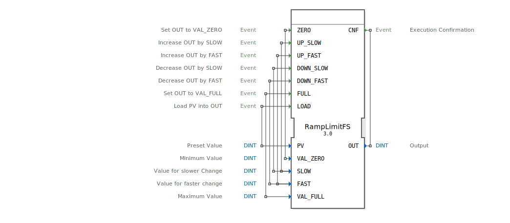

# RampLimitFS

```{index} single: RampLimitFS
```


* * * * * * * * * *
## Einleitung
Der Funktionsblock `RampLimitFS` dient zur schrittweisen Erhöhung oder Verringerung eines Ausgabewertes mit verschiedenen Geschwindigkeiten (schnell/langsam), ähnlich wie bei einer Tempomat-Funktion in Fahrzeugen. Zusätzlich bietet er die Möglichkeit, Minimal- und Maximalwerte zu setzen sowie einen vordefinierten Wert zu laden.



## Schnittstellenstruktur
### **Ereignis-Eingänge**
- `ZERO`: Setzt den Ausgang `OUT` auf den Wert von `VAL_ZERO`.
- `UP_SLOW`: Erhöht `OUT` um den Wert von `SLOW`.
- `UP_FAST`: Erhöht `OUT` um den Wert von `FAST`.
- `DOWN_SLOW`: Verringert `OUT` um den Wert von `SLOW`.
- `DOWN_FAST`: Verringert `OUT` um den Wert von `FAST`.
- `FULL`: Setzt `OUT` auf den Wert von `VAL_FULL`.
- `LOAD`: Lädt den Wert von `PV` in `OUT`.

### **Ereignis-Ausgänge**
- `CNF`: Bestätigt die Ausführung und gibt den aktuellen Wert von `OUT` aus.

### **Daten-Eingänge**
- `PV` (DINT): Voreingestellter Wert, der mit `LOAD` geladen wird.
- `VAL_ZERO` (DINT): Minimaler Wert für `OUT`.
- `SLOW` (DINT): Schrittweite für langsame Änderungen.
- `FAST` (DINT): Schrittweite für schnelle Änderungen.
- `VAL_FULL` (DINT): Maximaler Wert für `OUT`.

### **Daten-Ausgänge**
- `OUT` (DINT): Aktueller Ausgabewert.

### **Adapter**
Keine Adapter vorhanden.

## Funktionsweise
Der Funktionsblock ermöglicht eine schrittweise Anpassung des Ausgabewertes `OUT` durch verschiedene Ereignisse:
- **Schrittweise Erhöhung/Verringerung**:
  - `UP_SLOW`/`DOWN_SLOW`: Ändert `OUT` um den `SLOW`-Wert.
  - `UP_FAST`/`DOWN_FAST`: Ändert `OUT` um den `FAST`-Wert.
- **Direkte Wertezuweisung**:
  - `ZERO` setzt `OUT` auf `VAL_ZERO`.
  - `FULL` setzt `OUT` auf `VAL_FULL`.
  - `LOAD` lädt den Wert von `PV` in `OUT`.

Der Ausgabewert wird dabei immer auf die Grenzen `VAL_ZERO` (Minimum) und `VAL_FULL` (Maximum) begrenzt.

## Technische Besonderheiten
- **Begrenzung des Ausgabewertes**:
  Der Wert von `OUT` wird automatisch auf die definierten Grenzen (`VAL_ZERO`, `VAL_FULL`) begrenzt, falls die Schrittweiten (`SLOW`, `FAST`) diese überschreiten würden.
- **Flexible Schrittweiten**:
  Unterschiedliche Geschwindigkeiten der Wertänderung durch `SLOW` und `FAST`.

## Zustandsübersicht
Der Funktionsblock hat keinen internen Zustand. Jedes Ereignis führt sofort zur entsprechenden Berechnung und Ausgabe.

## Anwendungsszenarien
- **Tempomat-Steuerung**: Schrittweise Geschwindigkeitsanpassung mit langsamem/schnellem Tastendruck.
- **Prozesssteuerung**: Begrenzte Sollwertvorgabe mit manueller Feinjustierung.
- **Parameterladen**: Laden von vordefinierten Werten (z. B. aus einem nichtflüchtigen Speicher).

## ⚖️ Vergleich mit ähnlichen Bausteinen
- **Vergleich mit Standard-Rampenfunktionen**:
  `RampLimitFS` bietet zusätzlich die Möglichkeit, zwischen schnellen und langsamen Schrittweiten zu wechseln und direkte Werte (Min/Max) zuzuweisen.
- **Flexibilität**:
  Im Gegensatz zu einfachen Zählern ermöglicht dieser Baustein eine dynamische Anpassung der Schrittweiten und Grenzwerte.


## 🛠️ Zugehörige Übungen

* [Uebung_009a](../../../training1/Ventilsteuerung/4diacIDE-workspace/test_B/Uebungen_doc/Uebung_009a.md)

## Fazit
Der `RampLimitFS`-Funktionsblock ist ideal für Anwendungen, bei denen ein Wert schrittweise innerhalb definierter Grenzen angepasst werden muss. Durch die Unterscheidung zwischen schnellen und langsamen Änderungen sowie die Möglichkeit, direkte Werte zu laden, bietet er eine hohe Flexibilität für verschiedene Steuerungsaufgaben.