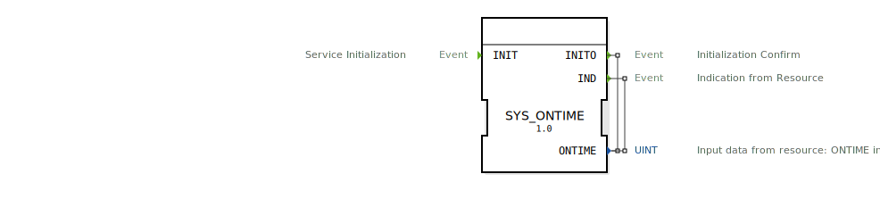

# SYS_ONTIME

```{index} single: SYS_ONTIME
```


* * * * * * * * * *
## Einleitung
Der SYS_ONTIME Funktionsblock dient als Service Interface für die Kommunikation zwischen einer Anwendung und einer Ressource. Er ermöglicht die Übertragung von Betriebszeitdaten in dezimalen Minuten (0,01 Stunden) von der Ressource zur Anwendung.



## Schnittstellenstruktur

### **Ereignis-Eingänge**
- `INIT` (Typ: EInit): Initialisiert den Service. Wird von der Anwendung ausgelöst.

### **Ereignis-Ausgänge**
- `INITO` (Typ: EInit): Bestätigt die Initialisierung. Wird mit dem Datenausgang `ONTIME` kombiniert.
- `IND` (Typ: Event): Indikation von der Ressource. Wird mit dem Datenausgang `ONTIME` kombiniert.

### **Daten-Eingänge**
Keine Daten-Eingänge vorhanden.

### **Daten-Ausgänge**
- `ONTIME` (Typ: UINT): Betriebszeit in dezimalen Minuten (0,01 Stunden).

### **Adapter**
Keine Adapter vorhanden.

## Funktionsweise
Der SYS_ONTIME Funktionsblock ermöglicht die Übertragung von Betriebszeitdaten von einer Ressource zur Anwendung. Die Initialisierung erfolgt über das `INIT`-Ereignis, woraufhin der Block mit `INITO` antwortet. Die Betriebszeitdaten werden über das `IND`-Ereignis und den `ONTIME`-Datenausgang bereitgestellt.

## Technische Besonderheiten
- Der Funktionsblock unterstützt verschiedene Service-Sequenzen für die Initialisierung, Anfrage-Bestätigung und Fehlerbehandlung.
- Die Betriebszeit wird in dezimalen Minuten (0,01 Stunden) übertragen.

### Zeitbasis-Konfiguration
Der Baustein arbeitet mit einer industriellen Zeitbasis (0,6-Minuten-Takt) statt mit Standardminuten:

- **1 Industrieminute** = 0,6 Standardminuten (36 Sekunden)
- **100 Industrieminuten** = 1 Standardstunde (60 Minuten)
- **Umrechnungsfaktor**: 1,666... (Standard- zu Industrieminuten)

### Umrechnungsbeispiele

| Industrieminuten | Standardzeit     |
|------------------|------------------|
| 1                | 0,6 min (36s)    |
| 10               | 6 min            |
| 100              | 60 min (1h)      |
| 150              | 90 min (1,5h)    |

### Technischer Hintergrund:
- Dieser Zeitstandard stammt aus der Prozessautomatisierung
- Ermöglicht ganzzahlige Darstellung typischer Zeitintervalle
- Besonders vorteilhaft für Chargenprozesse und Schichtplanung
- Wird auch als "PROFIBUS-Zeitbasis" bezeichnet

## Zustandsübersicht
1. **Initialisierung**: Wird durch `INIT` ausgelöst und mit `INITO` bestätigt.
2. **Datenübertragung**: Die Betriebszeitdaten werden über `IND` und `ONTIME` übertragen.
3. **Fehlerbehandlung**: Fehler werden über `IND-` mit einem Statuscode gemeldet.

## Anwendungsszenarien
- Überwachung der Betriebszeit von Maschinen und Anlagen.
- Integration in Wartungs- und Diagnosesysteme.

## Vergleich mit ähnlichen Bausteinen
Im Vergleich zu anderen Service Interface Funktionsblöcken bietet SYS_ONTIME eine spezialisierte Funktionalität für die Übertragung von Betriebszeitdaten. Andere Blöcke könnten allgemeinere Daten oder andere spezifische Informationen übertragen.


## Zugehörige Übungen

* [Uebung_140](../../../../training1/Ventilsteuerung/4diacIDE-workspace/test_B/Uebungen_doc/Uebung_140.md)

## Fazit
Der SYS_ONTIME Funktionsblock ist ein spezialisiertes Werkzeug für die Übertragung von Betriebszeitdaten in IEC 61499-basierten Systemen. Seine klare Schnittstellenstruktur und robuste Fehlerbehandlung machen ihn zu einer zuverlässigen Lösung für entsprechende Anwendungen.