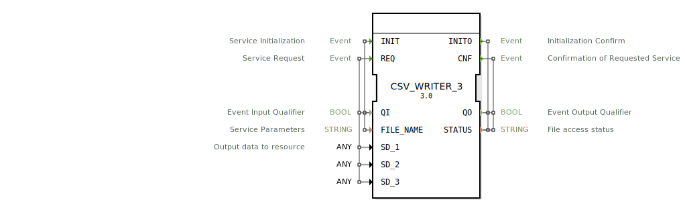

# CSV_WRITER_3

```{index} single: CSV_WRITER_3
```


* * * * * * * * * *
## Einleitung
Der CSV_WRITER_3 ist ein Funktionsblock, der dazu dient, Daten in eine CSV-Datei zu schreiben. Er unterstützt das Schreiben von bis zu drei verschiedenen Datenfeldern in eine Datei, die über den Parameter `FILE_NAME` angegeben wird. Der Funktionsblock ist besonders nützlich für die Protokollierung und Datenspeicherung in Automatisierungssystemen.



## Schnittstellenstruktur

### **Ereignis-Eingänge**
- **INIT**: Initialisiert den Funktionsblock. Wird mit den Daten `QI` (Qualifier Input) und `FILE_NAME` (Dateiname) ausgelöst.
- **REQ**: Startet den Schreibvorgang. Wird mit den Daten `QI`, `SD_1`, `SD_2` und `SD_3` (die zu schreibenden Daten) ausgelöst.

### **Ereignis-Ausgänge**
- **INITO**: Bestätigt die Initialisierung. Gibt `QO` (Qualifier Output) und `STATUS` (Status der Initialisierung) zurück.
- **CNF**: Bestätigt den Abschluss des Schreibvorgangs. Gibt `QO` und `STATUS` zurück.

### **Daten-Eingänge**
- **QI**: Boolescher Wert, der die Qualität des Ereigniseingangs angibt.
- **FILE_NAME**: String, der den Namen der CSV-Datei angibt.
- **SD_1**, **SD_2**, **SD_3**: Datenfelder vom Typ `ANY`, die in die CSV-Datei geschrieben werden.

### **Daten-Ausgänge**
- **QO**: Boolescher Wert, der die Qualität des Ereignisausgangs angibt.
- **STATUS**: String, der den Status des Dateizugriffs angibt.

### **Adapter**
Keine Adapter vorhanden.

## Funktionsweise
Der Funktionsblock initialisiert sich beim Empfang des `INIT`-Ereignis und bestätigt dies mit `INITO`. Beim Empfang des `REQ`-Ereignis werden die Daten `SD_1`, `SD_2` und `SD_3` in die angegebene CSV-Datei geschrieben. Der Status des Schreibvorgangs wird über `CNF` zurückgemeldet.

## Technische Besonderheiten
- Unterstützt das Schreiben von bis zu drei verschiedenen Datenfeldern.
- Der Datentyp der zu schreibenden Daten ist `ANY`, was eine hohe Flexibilität ermöglicht.
- Der Status des Dateizugriffs wird detailliert zurückgemeldet.

## Zustandsübersicht
1. **Initialisierungszustand**: Wartet auf `INIT`-Ereignis.
2. **Bereit-Zustand**: Nach erfolgreicher Initialisierung, wartet auf `REQ`-Ereignis.
3. **Schreibzustand**: Schreibt Daten in die CSV-Datei und meldet den Status zurück.

## Anwendungsszenarien
- Protokollierung von Sensordaten in einer CSV-Datei.
- Speicherung von Prozessdaten für spätere Analysen.
- Datenaustausch mit anderen Systemen über CSV-Dateien.

## Vergleich mit ähnlichen Bausteinen
- Im Vergleich zu einfacheren CSV-Writer-Funktionsblöcken unterstützt `CSV_WRITER_3` das Schreiben von mehreren Datenfeldern (`SD_1`, `SD_2`, `SD_3`).
- Andere Funktionsblöcke könnten auf bestimmte Datentypen beschränkt sein, während `CSV_WRITER_3` den `ANY`-Typ verwendet.

## Fazit
Der `CSV_WRITER_3` ist ein flexibler und leistungsfähiger Funktionsblock für die Datenspeicherung in CSV-Dateien. Seine Unterstützung für mehrere Datenfelder und den `ANY`-Datentyp macht ihn besonders vielseitig einsetzbar.