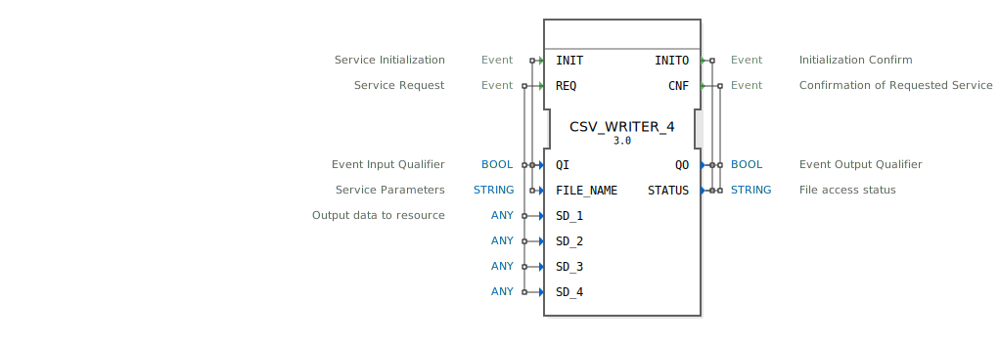

# CSV_WRITER_4

```{index} single: CSV_WRITER_4
```


* * * * * * * * * *
## Einleitung
Der CSV_WRITER_4 Funktionsblock dient zum Schreiben von Daten in eine CSV-Datei. Er unterstützt das Speichern von bis zu vier verschiedenen Datenwerten in einem strukturierten Format. Der FB ist besonders nützlich für Datenerfassung und -protokollierung in Automatisierungsanwendungen.



## Schnittstellenstruktur

### **Ereignis-Eingänge**
- **INIT**: Initialisiert den Funktionsblock und konfiguriert die Ausgabedatei. Wird mit `QI` und `FILE_NAME` Daten verknüpft.
- **REQ**: Löst den Schreibvorgang aus. Wird mit `QI` und den Datenwerten `SD_1` bis `SD_4` verknüpft.

### **Ereignis-Ausgänge**
- **INITO**: Bestätigt die Initialisierung. Liefert `QO` und `STATUS`.
- **CNF**: Bestätigt den abgeschlossenen Schreibvorgang. Liefert `QO` und `STATUS`.

### **Daten-Eingänge**
- **QI** (BOOL): Qualifiziert die Ereignisse INIT und REQ.
- **FILE_NAME** (STRING): Name der CSV-Datei.
- **SD_1** bis **SD_4** (ANY): Die zu schreibenden Datenwerte (bis zu 4 verschiedene).

### **Daten-Ausgänge**
- **QO** (BOOL): Qualifiziert die Ausgangsereignisse.
- **STATUS** (STRING): Statusmeldung über den Dateizugriff.

### **Adapter**
Keine Adapter vorhanden.

## Funktionsweise
1. **Initialisierung**: Durch das INIT-Ereignis mit aktivem `QI` wird die CSV-Datei mit dem angegebenen `FILE_NAME` vorbereitet.
2. **Daten schreiben**: Das REQ-Ereignis mit aktivem `QI` löst den Schreibvorgang aus. Die Werte von `SD_1` bis `SD_4` werden in die Datei geschrieben.
3. **Bestätigung**: Nach jedem Vorgang (INIT oder REQ) wird der Status über `INITO` bzw. `CNF` gemeldet.

## Technische Besonderheiten
- Unterstützt generische Datentypen (ANY) für die zu schreibenden Daten.
- Der FB ist Teil des `eclipse4diac::utils` Pakets.
- Die generische Klasse ist als `GEN_CSV_WRITER` definiert.

## Zustandsübersicht
1. **Inaktiv**: Wartet auf Initialisierung.
2. **Initialisiert**: Datei ist bereit, wartet auf Schreibanfragen.
3. **Schreibend**: Verarbeitet eine Schreibanfrage.

## Anwendungsszenarien
- Protokollierung von Prozessdaten.
- Datenerfassung für Analysezwecke.
- Export von Messwerten in ein standardisiertes Format.

## ⚖️ Vergleich mit ähnlichen Bausteinen
- Im Vergleich zu einfacheren Schreib-FBs bietet CSV_WRITER_4 die Möglichkeit, mehrere Datenwerte gleichzeitig zu speichern.
- Die Verwendung von ANY-Typen macht ihn flexibler als FBs mit festen Datentypen.

## Fazit
CSV_WRITER_4 ist ein vielseitiger Funktionsblock für die Datenerfassung, der sich besonders für Anwendungen eignet, bei denen strukturierte Daten protokolliert werden müssen. Seine Flexibilität und einfache Integration machen ihn zu einer praktischen Lösung für viele Automatisierungsaufgaben.