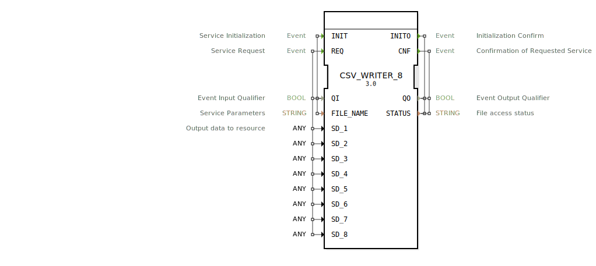

# CSV_WRITER_8

```{index} single: CSV_WRITER_8
```


* * * * * * * * * *
## Einleitung
Der CSV_WRITER_8 ist ein Funktionsblock zur Ausgabe von Daten in eine CSV-Datei. Er ermöglicht das Schreiben von bis zu 8 verschiedenen Datenwerten in eine spezifizierte Datei. Der Funktionsblock ist Teil der eclipse4diac::utils-Paketfamilie und eignet sich besonders für Datenerfassungs- und Protokollierungsaufgaben.



## Schnittstellenstruktur
### **Ereignis-Eingänge**
- **INIT**: Initialisiert den Funktionsblock. Wird mit den Variablen QI (Qualifier) und FILE_NAME (Dateiname) verwendet.
- **REQ**: Löst einen Schreibvorgang aus. Verwendet QI sowie die Datenvariablen SD_1 bis SD_8.

### **Ereignis-Ausgänge**
- **INITO**: Bestätigt die Initialisierung. Gibt QO (Qualifier) und STATUS (Zustandsmeldung) zurück.
- **CNF**: Bestätigt den abgeschlossenen Schreibvorgang. Gibt ebenfalls QO und STATUS zurück.

### **Daten-Eingänge**
- **QI**: Boolescher Qualifier für Ereignisse.
- **FILE_NAME**: String, der den Pfad und Namen der CSV-Datei angibt.
- **SD_1 bis SD_8**: Datenvariablen vom Typ ANY, die in die CSV-Datei geschrieben werden.

### **Daten-Ausgänge**
- **QO**: Boolescher Qualifier für Ausgangsereignisse.
- **STATUS**: String, der den Status des Dateizugriffs beschreibt.

## Funktionsweise
Der Funktionsblock initialisiert sich beim Empfang des INIT-Ereignisses und bestätigt dies mit INITO. Beim REQ-Ereignis werden die aktuellen Werte von SD_1 bis SD_8 in die angegebene CSV-Datei geschrieben. Nach Abschluss des Schreibvorgangs wird das CNF-Ereignis ausgelöst.

## Technische Besonderheiten
- Unterstützt generische Datentypen (ANY) für die Ausgabedaten.
- Bietet Statusmeldungen für erfolgreiche und fehlgeschlagene Operationen.
- Teil des eclipse4diac::utils-Pakets.

## Zustandsübersicht
1. **Initialisierungszustand**: Wartet auf INIT-Ereignis.
2. **Bereit**: Nach erfolgreicher Initialisierung.
3. **Schreibvorgang**: Aktiv bei REQ-Ereignis.
4. **Bestätigung**: Sendet CNF nach Abschluss.

## Anwendungsszenarien
- Protokollierung von Prozessdaten.
- Datenerfassung für Analysezwecke.
- Export von Steuerungsdaten in CSV-Format.

## ⚖️ Vergleich mit ähnlichen Bausteinen
Im Vergleich zu einfacheren CSV-Writer-Blöcken bietet CSV_WRITER_8 die Möglichkeit, bis zu 8 verschiedene Datenwerte gleichzeitig zu schreiben und generische Datentypen zu verarbeiten.

## Fazit
Der CSV_WRITER_8 ist ein leistungsfähiger Funktionsblock für die Datenerfassung und -protokollierung in CSV-Dateien. Seine Flexibilität bei der Datenverarbeitung und die detaillierten Statusmeldungen machen ihn zu einer guten Wahl für komplexe Anwendungen.