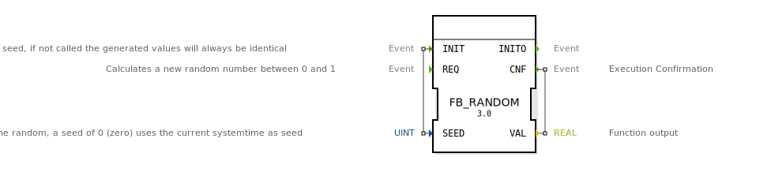

# FB_RANDOM

```{index} single: FB_RANDOM
```

* * * * * * * * * *

## Einleitung
Der Funktionsblock FB_RANDOM generiert eine zufällige REAL-Zahl zwischen 0 und 1.



## Schnittstellenstruktur

### **Ereignis-Eingänge**
- **INIT**: Initialisiert den Zufallsgenerator mit einem Seed.
- **REQ**: Berechnet eine neue Zufallszahl.

### **Ereignis-Ausgänge**
- **INITO**: Initialisierung abgeschlossen.
- **CNF**: Berechnung abgeschlossen, neuer Wert verfügbar.

### **Daten-Eingänge**
- **SEED** (UINT): Der Startwert (Seed) für den Zufallsgenerator. Ein Wert von 0 verwendet die aktuelle Systemzeit.

### **Daten-Ausgänge**
- **VAL** (REAL): Die generierte Zufallszahl.

## Metadaten
| Attribut | Wert |
| :--- | :--- |
| Copyright | (c) 2012 Profactor GmbH |
| Lizenz | EPL-2.0 |
| Version | 3.0 (2025-04-14, Patrick Aigner) |
| 4diac-Paket | eclipse4diac::utils |