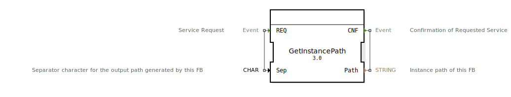

# GetInstancePath

```{index} single: GetInstancePath
```


* * * * * * * * * *
## Einleitung
Der Funktionsblock `GetInstancePath` dient dazu, den Instanzpfad des eigenen Funktionsblocks innerhalb der 4diac-IDE zu ermitteln. Dieser Pfad kann beispielsweise für Diagnosezwecke oder zur dynamischen Konfiguration verwendet werden. Der FB ist besonders nützlich in komplexen Anwendungen, wo eine genaue Identifikation der Instanzposition erforderlich ist.



## Schnittstellenstruktur

### **Ereignis-Eingänge**
- **REQ**: Service-Anfrage. Löst die Ermittlung des Instanzpfads aus.

### **Ereignis-Ausgänge**
- **CNF**: Bestätigung der Service-Anfrage. Signalisiert die erfolgreiche Ermittlung des Instanzpfads.

### **Daten-Eingänge**
- **Sep**: Separator-Zeichen (CHAR) für den generierten Pfad. Standardwert ist `'/'`.

### **Daten-Ausgänge**
- **Path**: Der ermittelte Instanzpfad als STRING.

### **Adapter**
Keine Adapter vorhanden.

## Funktionsweise
1. Bei Empfang des `REQ`-Ereignisses beginnt der FB mit der Ermittlung des eigenen Instanzpfads.
2. Der Pfad wird mit dem angegebenen Separatorzeichen (`Sep`) formatiert.
3. Das `CNF`-Ereignis wird ausgelöst und der ermittelte Pfad über den `Path`-Ausgang ausgegeben.

## Technische Besonderheiten
- Der FB nutzt eine Service-Schnittstelle zur Kommunikation mit der Ressourcenebene.
- Der Standard-Separator ist `'/'`, kann jedoch durch den Benutzer angepasst werden.

## Zustandsübersicht
- **Idle**: Wartet auf eine `REQ`-Anfrage.
- **Processing**: Ermittelt den Instanzpfad und gibt ihn über `CNF` aus.

## Anwendungsszenarien
- Diagnose und Logging: Identifikation der genauen Position einer FB-Instanz in einer komplexen Anwendung.
- Dynamische Konfiguration: Verwendung des Pfads zur dynamischen Anpassung von Parametern oder Verhaltensweisen.

## ⚖️ Vergleich mit ähnlichen Bausteinen
- Im Gegensatz zu statischen Pfadangaben ermöglicht `GetInstancePath` eine dynamische Ermittlung des Pfads, was besonders in wiederverwendbaren oder verschachtelten Komponenten vorteilhaft ist.

## Fazit
Der `GetInstancePath`-FB ist ein nützliches Werkzeug zur dynamischen Ermittlung des eigenen Instanzpfads in 4diac-Anwendungen. Seine einfache Schnittstelle und flexible Konfiguration machen ihn ideal für Diagnose- und Konfigurationszwecke.