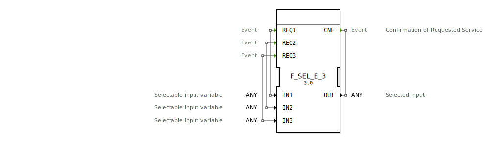

# F_SEL_E_3

```{index} single: F_SEL_E_3
```


* * * * * * * * * *
## Einleitung
Der Funktionsblock `F_SEL_E_3` ist ein ereignisbasierter Selektor, der eine von drei Eingangsvariablen basierend auf dem auslösenden Ereignis auswählt und an den Ausgang weiterleitet. Er ist Teil des `eclipse4diac::utils::selection` Pakets und entspricht dem IEC 61131-3 Standard für Standard-Selektionsfunktionen.



## Schnittstellenstruktur

### **Ereignis-Eingänge**
- `REQ0`: Wählt die Eingangsvariable `IN0` aus
- `REQ1`: Wählt die Eingangsvariable `IN1` aus
- `REQ2`: Wählt die Eingangsvariable `IN2` aus

### **Ereignis-Ausgänge**
- `CNF`: Bestätigt die Ausführung der Selektion und liefert den ausgewählten Wert

### **Daten-Eingänge**
- `IN0`: Erste selektierbare Eingangsvariable (Typ: ANY)
- `IN1`: Zweite selektierbare Eingangsvariable (Typ: ANY)
- `IN2`: Dritte selektierbare Eingangsvariable (Typ: ANY)

### **Daten-Ausgänge**
- `OUT`: Ausgewählte Eingangsvariable (Typ: ANY)

### **Adapter**
Keine Adapter vorhanden.

## Funktionsweise
Der Funktionsblock wartet auf ein eingehendes Ereignis (`REQ0`, `REQ1` oder `REQ2`). Beim Eintreffen eines solchen Ereignisses wird die entsprechende Eingangsvariable (`IN0`, `IN1` bzw. `IN2`) ausgewählt und an den Ausgang `OUT` weitergeleitet. Gleichzeitig wird das Bestätigungsereignis `CNF` ausgelöst.

## Technische Besonderheiten
- Unterstützt den Datentyp ANY für maximale Flexibilität
- Ereignisbasierte Auslösung für deterministisches Verhalten
- Einfache und direkte Selektion ohne zusätzliche Logik

## Zustandsübersicht
1. Wartezustand: Kein aktives Ereignis
2. Auswahlzustand: Ereignis empfangen, entsprechender Eingang ausgewählt
3. Bestätigungszustand: Ausgang aktualisiert und CNF-Ereignis ausgelöst

## Anwendungsszenarien
- Auswahl zwischen verschiedenen Sensordatenströmen
- Umschaltung zwischen Betriebsmodi
- Multiplexing von Datenquellen in Steuerungssystemen
- Implementierung von Prioritätslogik

## Vergleich mit ähnlichen Bausteinen
- Im Gegensatz zu `F_SEL_E_2` bietet dieser Baustein drei statt zwei Eingänge
- Ähnlich zu `F_MUX`, aber mit ereignisbasierter statt datengesteuerter Auswahl
- Komplexer als einfache Gatter, aber spezialisierter für Selektionsaufgaben


## Zugehörige Übungen

* [Uebung_015a](../../../../training1/Ventilsteuerung/4diacIDE-workspace/test_B/Uebungen_doc/Uebung_015a.md)
* [Uebung_016a](../../../../training1/Ventilsteuerung/4diacIDE-workspace/test_B/Uebungen_doc/Uebung_016a.md)

## Fazit
Der `F_SEL_E_3` ist ein effizienter und flexibler Baustein für Anwendungen, bei denen zwischen drei verschiedenen Datenquellen ereignisgesteuert gewechselt werden muss. Seine einfache Schnittstelle und Unterstützung für beliebige Datentypen machen ihn zu einem vielseitigen Werkzeug in der Automatisierungstechnik.