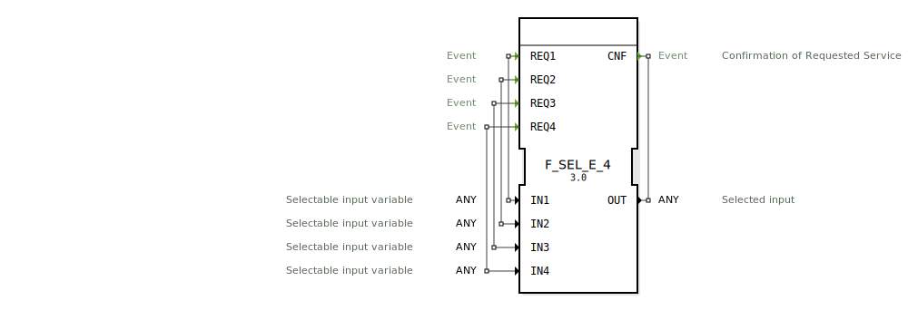

# F_SEL_E_4

```{index} single: F_SEL_E_4
```


* * * * * * * * * *
## Einleitung
Der Funktionsblock F_SEL_E_4 ist ein ereignisbasierter Selektor, der aus bis zu vier Eingängen einen auswählt und an den Ausgang weiterleitet. Er ist gemäß der Norm IEC 61131-3 klassifiziert und dient als Standard-Selektionsfunktion in Automatisierungssystemen.



## Schnittstellenstruktur

### **Ereignis-Eingänge**
- **REQ0**: Ereignis, das den Wert von IN0 auswählt.
- **REQ1**: Ereignis, das den Wert von IN1 auswählt.
- **REQ2**: Ereignis, das den Wert von IN2 auswählt.
- **REQ3**: Ereignis, das den Wert von IN3 auswählt.

### **Ereignis-Ausgänge**
- **CNF**: Bestätigungsereignis, das ausgelöst wird, sobald ein Eingang ausgewählt und der Wert an OUT weitergeleitet wurde.

### **Daten-Eingänge**
- **IN0**: Erster selektierbarer Eingang (Typ: ANY).
- **IN1**: Zweiter selektierbarer Eingang (Typ: ANY).
- **IN2**: Dritter selektierbarer Eingang (Typ: ANY).
- **IN3**: Vierter selektierbarer Eingang (Typ: ANY).

### **Daten-Ausgänge**
- **OUT**: Ausgewählter Eingang (Typ: ANY).

### **Adapter**
Keine Adapter vorhanden.

## Funktionsweise
Der F_SEL_E_4 wählt basierend auf dem auslösenden Ereignis (REQ0 bis REQ3) den entsprechenden Eingang (IN0 bis IN3) aus und gibt den Wert an OUT weiter. Das CNF-Ereignis bestätigt die erfolgreiche Auswahl und Weitergabe.

## Technische Besonderheiten
- Unterstützt den Datentyp ANY, was eine flexible Verwendung mit verschiedenen Datentypen ermöglicht.
- Ereignisbasierte Auswahl, die eine präzise Steuerung ermöglicht.

## Zustandsübersicht
Der Funktionsblock hat keine internen Zustände. Die Auswahl und Weitergabe erfolgt unmittelbar bei Eintreffen des entsprechenden REQ-Ereignisses.

## Anwendungsszenarien
- Auswahl zwischen verschiedenen Sensordaten in einer Steuerung.
- Multiplexing von Steuersignalen in Automatisierungssystemen.
- Flexible Datenweiterleitung in Abhängigkeit von externen Ereignissen.

## Vergleich mit ähnlichen Bausteinen
- Im Vergleich zu anderen Selektoren bietet F_SEL_E_4 eine ereignisbasierte Steuerung, was eine präzisere Auswahl ermöglicht als zeit- oder zustandsbasierte Alternativen.
- Die Unterstützung des ANY-Datentyps macht ihn flexibler als typenspezifische Selektoren.


## Zugehörige Übungen

* [Uebung_019a](../../../../training1/Ventilsteuerung/4diacIDE-workspace/test_B/Uebungen_doc/Uebung_019a.md)
* [Uebung_019b](../../../../training1/Ventilsteuerung/4diacIDE-workspace/test_B/Uebungen_doc/Uebung_019b.md)
* [Uebung_019c](../../../../training1/Ventilsteuerung/4diacIDE-workspace/test_B/Uebungen_doc/Uebung_019c.md)

## Fazit
Der F_SEL_E_4 ist ein vielseitiger und flexibler Funktionsblock für die ereignisbasierte Auswahl von Daten in Automatisierungssystemen. Seine einfache Schnittstelle und die Unterstützung verschiedener Datentypen machen ihn zu einer praktischen Lösung für viele Anwendungsfälle.