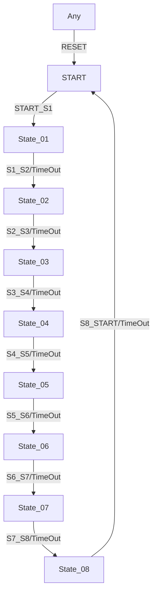

# sequence_ET_08


* * * * * * * * * *

## Einleitung
Der **sequence_ET_08** ist ein erweiterter IEC 61499-Funktionsbaustein mit 8 Arbeitszuständen und kombinierter Ereignis-/Zeitsteuerung.
Entwickelt unter EPL-2.0 Lizenz, ermöglicht er komplexe mehrstufige Prozesssteuerungen in industriellen Automatisierungssystemen.

## Schnittstellenstruktur

### **Ereignis-Eingänge**
| Event | Triggerziel | Besonderheit |
|-------|-------------|--------------|
| `START_S1` | START → State_01 | Initialisiert alle 8 Zeitparameter |
| `S1_S2`-`S7_S8` | Manuelle Zustandsübergänge | Direkter Trigger zwischen benachbarten Zuständen |
| `S8_START` | State_08 → START | Kompletter Zyklusende |
| `RESET` | Globaler Reset | Sofortiger STOP aller Zustände |

### **Ereignis-Ausgänge**
| Event | Auslöser | Daten |
|-------|----------|-------|
| `CNF` | Jeder Zustandswechsel | STATE_NR (0-8) |
| `EO_S1`-`EO_S8` | Zustandseintritt | Entsprechendes DO_Sx (BOOL) |

### **Daten-Eingänge**
- `DT_S1_S2`-`DT_S8_START` (TIME):
  - Individuelle Zeitintervalle pro Übergang (1ms-49d)
  - `NO_TIME` = Zeitsteuerung deaktiviert

### **Daten-Ausgänge**
| Variable | Typ | Wertebereich |
|----------|-----|-------------|
| `STATE_NR` | SINT | 0=START, 1-8=State_01-08 |
| `DO_S1`-`DO_S8` | BOOL | Zustandsaktivierung (0/1) |

### **Adapter**
- `timeOut` (ATimeOut): Zentrale Zeitsteuerung aller Übergänge

## Funktionsweise

### **Zustandsautomat**


### **Zustandslogik pro Schritt**
1. **Eintrittsaktion**:
   - Aktiviert DO_Sx = TRUE
   - Startet Timer mit DT_Sx_Sy
   - Sendet CNF mit STATE_NR

2. **Austrittsaktion**:
   - Deaktiviert DO_Sx = FALSE
   - Stoppt Timer

3. **Übergangsoptionen**:
   - Zeitsteuerung (wenn DT ≠ NO_TIME) **oder**
   - Manuelles Trigger-Event

## Technische Besonderheiten

✔ **Erweiterte Zustandslogik**: 8 klar getrennte Arbeitsphasen  
✔ **Hybride Steuerung**: Parallele Nutzung von Time- und Event-Triggers  
✔ **Deterministisch**: Garantierte Zustandsreihenfolge  
✔ **Robuste Initialisierung**: Expliziter START-Zustand  

## Zustandsübersicht

| Zustand | STATE_NR | Aktiver Ausgang | Timer-Parameter |
|---------|----------|-----------------|-----------------|
| START   | 0        | -               | -               |
| State_01| 1        | DO_S1           | DT_S1_S2        |
| State_02| 2        | DO_S2           | DT_S2_S3        |
| State_03| 3        | DO_S3           | DT_S3_S4        |
| State_04| 4        | DO_S4           | DT_S4_S5        |
| State_05| 5        | DO_S5           | DT_S5_S6        |
| State_06| 6        | DO_S6           | DT_S6_S7        |
| State_07| 7        | DO_S7           | DT_S7_S8        |
| State_08| 8        | DO_S8           | DT_S8_START     |

## Anwendungsszenarien

- **Komplexe Fertigungslinien**:
  ```
  1. Materialzufuhr → 2. Vorbereitung → 3. Bearbeitung → 4. Qualitätskontrolle
  5. Nacharbeit → 6. Verpackung → 7. Etikettierung → 8. Auslieferung
  ```
- **Mehrstufige Testsequenzen**:
  ```
  1. Systemcheck → 2. Sensorcalibrierung → 3. Funktionstest → 4. Belastungstest
  5. Datenprotokoll → 6. Ergebnisbewertung → 7. Reportgenerierung → 8. Reset
  ```
- **Industrielle Prozessketten**:
  ```
  1. Befüllung → 2. Erwärmung → 3. Reaktion → 4. Kühlung
  5. Filtration → 6. Trocknung → 7. Verpackung → 8. Reinigung
  ```

## Vergleich mit ähnlichen Bausteinen

| Feature          | sequence_ET_08 | sequence_ET_05 | SFC-Editor |
|------------------|----------------|----------------|------------|
| Max. Zustände    | 8              | 5              | Unbegrenzt |
| Zeitsteuerung    | Pro Schritt    | Pro Schritt    | Global     |
| Reset-Verhalten  | Vollständig    | Vollständig    | Teilweise  |
| Echtzeitfähigkeit| ✔              | ✔              | ✖          |

## Fazit

Der sequence_ET_08-Baustein ist die optimale Lösung für:

1. **Hochkomplexe Prozesse**: Bis zu 8 klar definierte Arbeitsphasen  
2. **Flexible Steuerung**: Individuelle Zeitparameter pro Schritt  
3. **Industrielle Robustheit**: Vollständiger Reset aus jedem Zustand  

*Empfohlene Einsatzgebiete*:  
- Mehrstufige Produktionssysteme  
- Validierte Testautomation  
- Prozessketten mit strengen Phasentrennungen  

*Hinweis*: Für einfachere Prozesse können sequence_ET_04/05 ausreichend sein.
