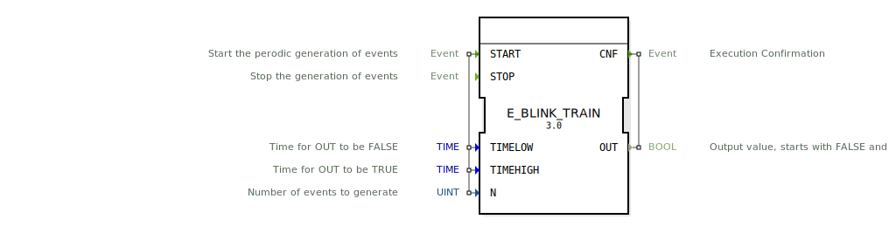

# E_BLINK_TRAIN

```{index} single: E_BLINK_TRAIN
```


* * * * * * * * * *
## Einleitung
Der Funktionsblock `E_BLINK_TRAIN` simuliert ein blinkendes Signal, das für bestimmte Zeitintervalle ein- und ausgeschaltet wird. Die Anzahl der Blinkzyklen kann begrenzt werden. Im Gegensatz zu ähnlichen Blink-Funktionsblöcken kehrt dieser FB beim Stoppen immer auf den Zustand `FALSE` zurück.



## Schnittstellenstruktur

### **Ereignis-Eingänge**
- `START`: Startet die periodische Generierung von Ereignissen. Verknüpft mit den Daten-Eingängen `TIMELOW`, `TIMEHIGH` und `N`.
- `STOP`: Stoppt die Generierung von Ereignissen.

### **Ereignis-Ausgänge**
- `CNF`: Bestätigt die Ausführung und liefert den aktuellen Ausgabewert `OUT`.

### **Daten-Eingänge**
- `TIMELOW` (TIME): Zeit, während der `OUT` den Wert `FALSE` hat.
- `TIMEHIGH` (TIME): Zeit, während der `OUT` den Wert `TRUE` hat.
- `N` (UINT): Anzahl der zu generierenden Blinkzyklen.

### **Daten-Ausgänge**
- `OUT` (BOOL): Ausgabewert, der zwischen `TRUE` und `FALSE` wechselt. Startet mit `FALSE`.

## Funktionsweise
1. Bei einem `START`-Ereignis wird die Summe aus `TIMELOW` und `TIMEHIGH` berechnet und als Periodendauer für den Blinkzyklus verwendet.
2. Der FB generiert `N` Blinkzyklen, wobei `OUT` für `TIMEHIGH` auf `TRUE` und für `TIMELOW` auf `FALSE` gesetzt wird.
3. Bei einem `STOP`-Ereignis wird die Generierung beendet und `OUT` auf `FALSE` zurückgesetzt.
4. Jeder Zustandswechsel wird über das `CNF`-Ereignis bestätigt.

## Technische Besonderheiten
- Verwendet interne Funktionsblöcke `E_PULSE` (für die Zeitsteuerung) und `E_TRAIN` (für die Begrenzung der Zyklen).
- Die Periodendauer wird durch Addition von `TIMELOW` und `TIMEHIGH` bestimmt.
- Im Gegensatz zu einigen anderen Blink-FBs wird beim Stoppen immer `FALSE` ausgegeben.

## Zustandsübersicht
1. **Inaktiv**: `OUT` = `FALSE` (Initialzustand oder nach `STOP`).
2. **Aktiv**: Generiert Blinkzyklen gemäß den eingestellten Zeiten und der Zyklenanzahl.
   - `OUT` wechselt zwischen `TRUE` (`TIMEHIGH`) und `FALSE` (`TIMELOW`).

## Anwendungsszenarien
- Anzeige von Warn- oder Statuslichten mit definierter Blinkfrequenz.
- Steuerung von periodischen Signalen in industriellen Automatisierungsprozessen.
- Simulation von Blinkmustern für Testzwecke.

## Vergleich mit ähnlichen Bausteinen
- **CODESYS BLINK-FB**: Behält den letzten Zustand bei Stopp bei, während `E_BLINK_TRAIN` immer auf `FALSE` zurückkehrt.
- **Einfache Timer-FBs**: Bieten keine integrierte Begrenzung der Zyklenanzahl (`N`).

## Fazit
Der `E_BLINK_TRAIN` ist ein vielseitiger Funktionsblock für die Erzeugung von blinkenden Signalen mit konfigurierbaren Zeiten und einer begrenzten Anzahl von Zyklen. Seine Besonderheit liegt in der Rückkehr zu `FALSE` beim Stoppen, was ihn für sicherheitsrelevante Anwendungen prädestiniert. Die klare Schnittstellenstruktur und die interne Verwendung bewährter Timer-FBs machen ihn zuverlässig und einfach einzusetzen.