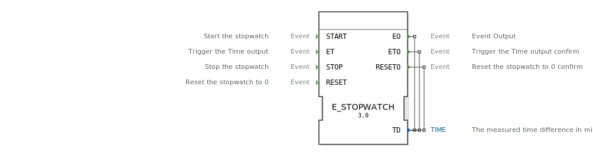
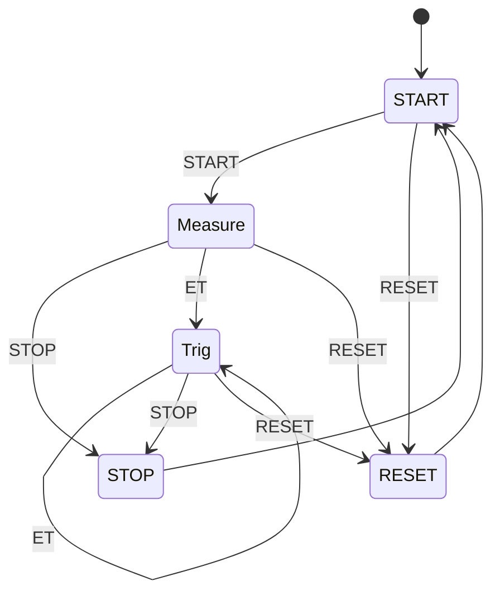

# E_STOPWATCH

```{index} single: E_STOPWATCH
```


* * * * * * * * * *

## Einleitung
Der **E_STOPWATCH**-Funktionsbaustein ist ein hochpräziser Zeitmessbaustein nach IEC 61499-2 Standard, entwickelt unter EPL-2.0 Lizenz.
Der Baustein ermöglicht millisekundengenaue Zeitmessungen zwischen Ereignissen in Echtzeitsystemen.



## Schnittstellenstruktur

### **Ereignis-Eingänge**
- `START`: Startet die Zeitmessung
- `ET`: Trigger für Zwischenausgabe der gemessenen Zeit
- `STOP`: Beendet die Zeitmessung und gibt Ergebnis aus
- `RESET`: Setzt die Stoppuhr zurück

### **Ereignis-Ausgänge**
- `EO`: Zeitdifferenzausgabe nach STOP
- `ETO`: Zeitdifferenzausgabe nach ET-Trigger
- `RESETO`: Bestätigung des Reset-Vorgangs

### **Daten-Ausgänge**
| Parameter | Typ | Beschreibung | Genauigkeit |
|-----------|-----|--------------|-------------|
| `TD` | TIME | Gemessene Zeitdifferenz | 1 ms |

## Funktionsweise

1. **Startphase**:
   - `START` initialisiert die Zeitmessung
   - Monotone Systemzeit wird erfasst (`NOW_MONOTONIC`)

2. **Messphase**:
   - `ET` liefert Zwischenergebnisse ohne Messung zu stoppen
   - Mehrfache Triggers möglich

3. **Abschlussphase**:
   - `STOP` beendet Messung und gibt Endergebnis aus
   - `RESET` setzt alle Werte zurück

## Technische Besonderheiten

✔ **IEC 61499-2 konform**
✔ **Monotone Zeitmessung** (keine Systemzeitanpassungen)
✔ **Millisekundengenau**
✔ **Mehrfach triggerbar** während der Messung
✔ **Eclipse 4diac Integration** (Package: eclipse4diac::utils::timing)

## Zustandsautomat (ECC)



## Anwendungsszenarien

- **Leistungsmessung**: Algorithmen-Laufzeiten
- **Prozesssteuerung**: Zeitkritische Abläufe
- **Systemdiagnose**: Reaktionszeiten
- **Produktion**: Taktzeiterfassung

## Beispielwerte

| Operation | Ergebnis (TD) |
|-----------|---------------|
| START -> STOP nach 1,5s | T#1s500ms |
| START -> ET nach 750ms -> STOP nach 1,5s | T#750ms (ETO), T#1s500ms (EO) |
| RESET während Messung | T#0s |

## Vergleich mit ähnlichen Bausteinen

| Feature | E_STOPWATCH | Standard-Timer | High-Res-Timer |
|---------|-------------|----------------|----------------|
| Genauigkeit | 1ms | 10ms | 1μs |
| Trigger während Lauf | Ja | Nein | Ja |
| Monotone Zeit | Ja | Nein | Ja |
| Reset-Funktion | Ja | Teilweise | Ja |

## Fazit

Der E_STOPWATCH-Baustein ist das präzise Instrument für Zeitmessungen:

- **Zuverlässig**: Monotone Zeitbasis verhindert Fehlmessungen
- **Flexibel**: Zwischenausgaben ohne Messunterbrechung
- **Einfach**: Intuitive Bedienung mit Start/Stop/Reset

Idealer Einsatz bei:
- Performance-Optimierungen
- Echtzeit-Systemen
- Prozessanalysen
- Benchmark-Tests

*Die präzise Stoppuhr für industrielle Steuerungssysteme*