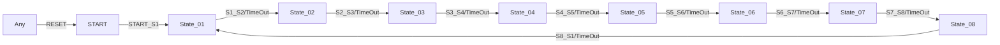

# sequence_ET_08_loop


-------

## Einleitung
Der **sequence_ET_08_loop** ist ein zyklischer 8-Zustands-Automat nach IEC 61499, der endlose Prozessketten mit kombinierter Ereignis- und Zeitsteuerung ermöglicht.
Entwickelt unter EPL-2.0 Lizenz, bietet er maximale Flexibilität für komplexe Automatisierungsaufgaben.

## Key Features
- **8 Arbeitszustände** mit individuell konfigurierbaren Übergängen
- **Zyklischer Betrieb**: Automatischer Neustart von State_08 zu State_01
- **Duale Triggerung**: Zeit- UND Ereignisgesteuerte Zustandsübergänge
- **Vollständiger Reset**: Aus jedem Zustand zurück in START-Position

## Schnittstellenstruktur

### Eingänge
| Typ       | Name       | Beschreibung                          | Datentyp |
|-----------|------------|---------------------------------------|----------|
| Event     | START_S1   | Startet Sequenz (mit Zeitparametern)  | -        |
| Event     | S1_S2-S7_S8| Manuelle Zustandsübergänge            | -        |
| Event     | S8_S1      | Manueller Zyklusneustart              | -        |
| Event     | RESET      | Globaler Reset                        | -        |
| Variable  | DT_S1_S2-DT_S8_S1 | Zeitintervalle pro Übergang [1ms-49d] | TIME     |

### Ausgänge
| Typ       | Name       | Beschreibung                  | Datentyp |
|-----------|------------|-------------------------------|----------|
| Event     | CNF        | Zustandswechselbestätigung    | -        |
| Event     | EO_S1-EO_S8| Zustandsaktivierungs-Signale  | -        |
| Variable  | STATE_NR   | Aktueller Zustand [0-8]       | SINT     |
| Variable  | DO_S1-DO_S8| Zustandsausgänge              | BOOL     |

## Funktionsweise

### Zustandsautomat


### Zustandslogik
1. **Initialisierung**:
   - Start mit `START_S1`-Event
   - Alle DO_Sx = FALSE

2. **Zustandsübergänge**:
   - Pro Schritt:
     - Exit-Aktion: DO_Sx-1 = FALSE
     - Entry-Aktion: DO_Sx = TRUE
     - Timer-Start mit DT_Sx_Sy

3. **Zyklusende**:
   - Automatischer Übergang State_08 → State_01
   - Optionale manuelle Triggerung

## Technische Spezifikationen

| Parameter         | Wert                 |
|-------------------|----------------------|
| Zustandsanzahl    | 8 + START            |
| Zeitauflösung     | 1ms - 49 Tage        |
| Triggeroptionen   | Event + TimeOut      |
| Reset-Tiefe       | Vollständig          |
| Echtzeitfähig     | Ja                   |

## Anwendungsbeispiele

1. **Komplette Produktionslinie**:
   ```
   1. Zuführung → 2. Montage → 3. Qualitätskontrolle → 4. Lackierung
   5. Trocknung → 6. Verpackung → 7. Palettierung → 8. Versand
   ```

2. **Testautomation**:
   ```
   1. Systeminit → 2. Selbsttest → 3. Kalibrierung → 4. Funktionstest
   5. Belastungstest → 6. Datenauswertung → 7. Protokollierung → 8. Reset
   ```

## Vergleich mit ähnlichen Bausteinen

| Feature          | sequence_ET_08_loop | sequence_ET_08 | sequence_ET_05_loop |
|------------------|------------|-------|------------|
| Zustände         | 8          | 8     | 5          |
| Zyklusende       | State_01   | START | State_01   |
| Zeitsteuerung    | Pro Schritt| Pro Schritt | Pro Schritt |
| Flexibilität     | ★★★★★     | ★★★★☆ | ★★★★☆      |

## Best Practices
1. **Konfiguration**:
   ```iecst
   DT_S1_S2 := T#5s;  // 5 Sekunden für Schritt 1→2
   DT_S2_S3 := NO_TIME; // Manueller Übergang 2→3
   ```

2. **Sicherheit**:
   - Immer RESET-Event für Notstopps vorsehen
   - Kritische Zustände mit kurzen TimeOuts absichern

## Fazit
Der sequence_ET_08_loop ist die ideale Lösung für:
- Komplexe zyklische Prozesse
- Flexible Produktionssteuerungen
- Hochautomatisierte Testsysteme

*Empfehlung*: Für Prozesse mit weniger als 5 Zuständen kann sequence_ET_05_loop ausreichend sein.
