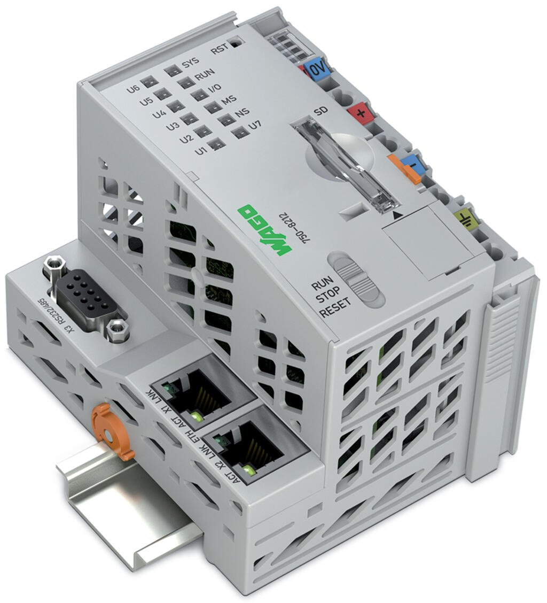

# PFC200

## Übersicht
Der WAGO PFC200 (Bestellnummer 750-8212) ist ein kompakter, leistungsstarker Industrie-PLC Controller, der als Target-Device für 4diac IDE Anwendungen eingesetzt werden kann.

## Technische Spezifikationen
- **Prozessor**: 600 MHz ARM® Cortex-A8
- **Memory**: 128MB DDR3 RAM
- **Storage**: 128MB NAND Flash + microSD Slot
- **Connectivity**:
  - 2x Ethernet (10/100/1000)
  - USB 2.0 Host Port
  - Optional: WiFi, Bluetooth, GSM
- **Fieldbus**: integrierte Feldbus-Schnittstelle (PROFIBUS, CANopen, DeviceNet)
- **Digital I/Os**: 24V DC, je nach Modulkonfiguration
- **Analog I/Os**: 0-10V, 0/4-20mA, je nach Modulkonfiguration
- **Power**: 24V DC (19.2-28.8V)

### Voraussetzungen
- https://github.com/eclipse-4diac/4diac-documentation/blob/main/src/installation/wago.adoc
- Netzwerkverbindung zum Entwicklungssystem

### I/O Mapping
Die Ein- und Ausgänge können direkt in 4diac konfiguriert werden:

| 4diac Interface | PFC200 Adresse |
|-----------------|----------------|
| %IX0.0          | Eingang 1       |
| %QX0.0          | Ausgang 1       |
| %IW0            | Analog In 1     |
| %QW0            | Analog Out 1    |
