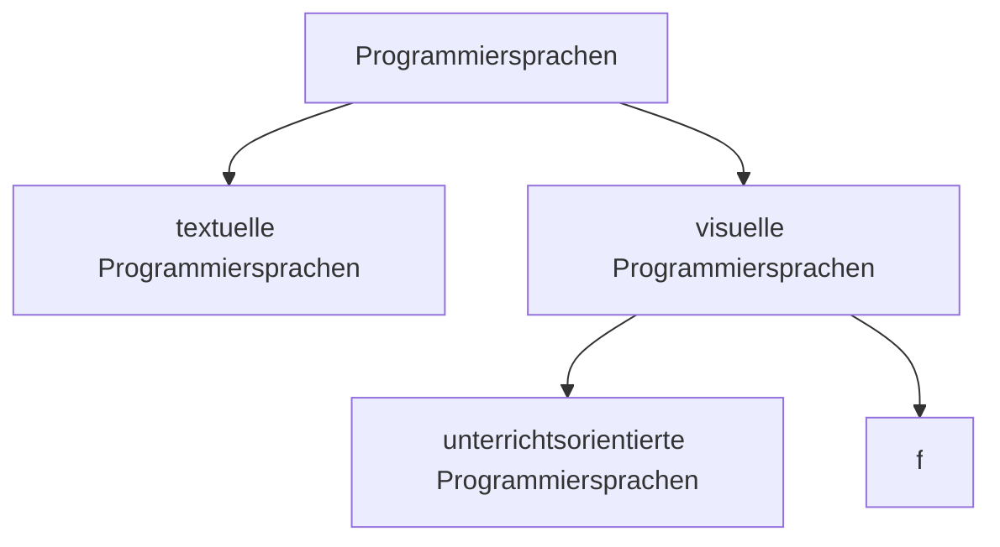

```mermaid
flowchart TB
A["Programmiersprachen"] --> B["textuelle Programmiersprachen"]
A--> C["visuelle Programmiersprachen"]
C -->D["unterrichtsorientierte Programmiersprachen"]
C -->E["f"]
```

# Diagramm
