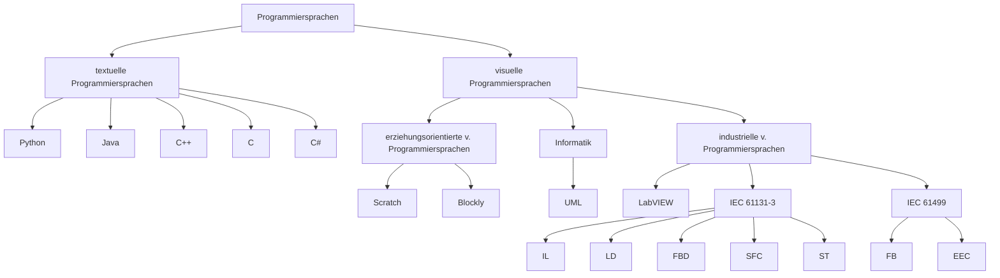

# Diagramm

Das Diagramm hakt an einer Stelle:

ST ist eine Textuelle Programmiersprache, genauso wie IL.

```mermaid
flowchart TB
A["Programmiersprachen"] --> B["textuelle Programmiersprachen"]
B --> Python
B --> Java
B --> C++
B --> C
B --> C#
A--> CL["visuelle Programmiersprachen"]
CL -->D["erziehungsorientierte v. Programmiersprachen"]
D --> Scratch
D --> Blockly
CL -->E["industrielle v. Programmiersprachen"]
CL -->Informatik
Informatik --> UML
E --> H["LabVIEW"]
E --> F["IEC 61131-3"]
E --> G["IEC 61499"]
F --> IL
F --> LD
F --> FBD
F --> SFC
F --> ST
G --> FB
G --> EEC
```
