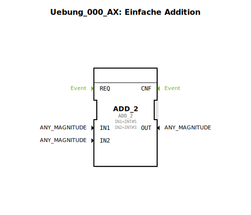

# Uebung_000_AX: Einfache Addition

Dieser Artikel beschreibt die logiBUS®-Übung `Uebung_000_AX`, das absolute Basisbeispiel für Berechnungen.

----

## Ziel der Übung

Das Ziel ist die Platzierung und Parametrierung eines Standard-Bausteins der IEC 61131-Bibliothek innerhalb eines IEC 61499 Netzwerks.

-----

## Beschreibung und Komponenten

[cite_start]Die Subapplikation `Uebung_000_AX.SUB` enthält lediglich einen Rechenbaustein[cite: 1].

### Funktionsbausteine (FBs)

  * **`ADD_2`**: Typ `iec61131::arithmetic::ADD_2`. [cite_start]Addiert zwei Ganzzahlen (`IN1` und `IN2`)[cite: 1].

-----

## Funktionsweise

Der Baustein ist fest mit den Werten 5 und 3 beschaltet. Das Ergebnis (8) liegt am Ausgang `OUT` an. Da es sich um einen reinen Datenbaustein ohne Event-Eingang handelt (Simple FB), wird das Ergebnis berechnet, sobald sich die Eingangsdaten ändern.

-----

## Anwendungsbeispiel

Grundlage für jede Form von **Zählern, Offsets oder Skalierungen** in einer Steuerung.