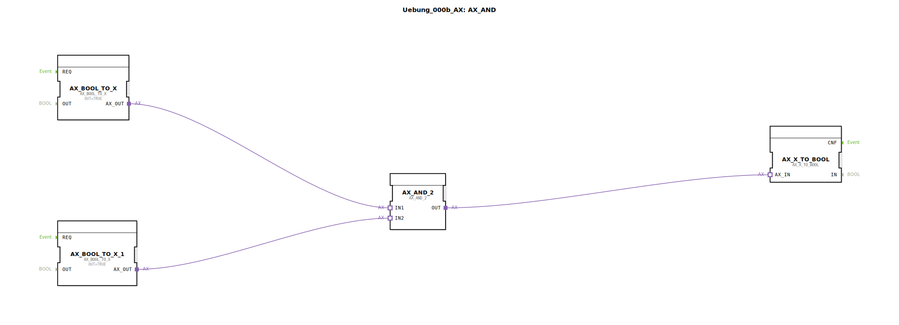

# Uebung_000b_AX: AX_AND

* * * * * * * * * *
## Einleitung

Diese Übung demonstriert die Verwendung von **Adapter-Funktionsbausteinen** zur Realisierung einer logischen UND-Verknüpfung. Innerhalb der SubApp werden Boolesche Werte über Adapterverbindungen zwischen Konvertierungsbausteinen und einem logischen UND-Baustein ausgetauscht. Sie lernen die grundlegende Struktur von Adaptern und deren Zusammenspiel in einer SubApp kennen.

Die Übung bildet eine einfache UND-Logik ab, bei der zwei konstante **TRUE**-Werte über den `AX_AND_2`-Baustein verknüpft werden. Das Ergebnis wird über einen weiteren Konverter ausgegeben.

## Verwendete Funktionsbausteine (FBs)

Die SubApp besteht aus drei internen Funktionsbausteinen:

### AX_BOOL_TO_X (zweimal instanziiert)
- **Typ**: `adapter::conversion::unidirectional::AX_BOOL_TO_X`
- **Parameter**:  
  - `OUT` = `TRUE` (setzt den Ausgang auf den Wert **TRUE**)
- **Funktion**: Konvertiert einen Booleschen Wert (über Parameter oder Eingang) in den Adapter-Datentyp `X`. In dieser Übung wird der Ausgang direkt auf `TRUE` gesetzt, sodass der Baustein als Konstantengeber fungiert.
- **Verbindungen**:  
  - `AX_BOOL_TO_X.AX_OUT` → `AX_AND_2.IN1`  
  - `AX_BOOL_TO_X_1.AX_OUT` → `AX_AND_2.IN2`

### AX_AND_2
- **Typ**: `adapter::booleanOperators::AX_AND_2`
- **Parameter**: Keine
- **Funktion**: Führt eine logische UND-Verknüpfung der beiden Eingänge (`IN1`, `IN2`) durch. Der Ausgang (`OUT`) wird nach Ausführung der UND-Operation gesetzt.
- **Verbindungen**:  
  - Eingänge: von `AX_BOOL_TO_X` (IN1) und `AX_BOOL_TO_X_1` (IN2)  
  - Ausgang (`OUT`) → `AX_X_TO_BOOL.AX_IN`

### AX_X_TO_BOOL
- **Typ**: `adapter::conversion::unidirectional::AX_X_TO_BOOL`
- **Parameter**: Keine
- **Funktion**: Konvertiert einen Wert des Adapter-Datentyps `X` zurück in einen Booleschen Wert. Dies stellt den Ausgang der Gesamtschaltung dar.
- **Verbindungen**:  
  - Eingang (`AX_IN`) von `AX_AND_2.OUT`

## Programmablauf und Verbindungen

Die SubApp besitzt keine eigenen externen Schnittstellen (keine Ein-/Ausgänge auf SubApp-Ebene). Die gesamte Logik ist intern fest verdrahtet:

1. Zwei `AX_BOOL_TO_X`-Bausteine liefern konstant den Wert **TRUE**.
2. Diese Werte werden über Adapter-Verbindungen an die beiden Eingänge des `AX_AND_2`-Bausteins übergeben.
3. Der `AX_AND_2`-Baustein berechnet die UND-Verknüpfung: `TRUE AND TRUE = TRUE`.
4. Das Ergebnis wird über eine Adapter-Verbindung zum `AX_X_TO_BOOL`-Baustein weitergeleitet, der den Wert zurück in einen Booleschen Wert wandelt.

Da alle Eingangswerte `TRUE` sind, liegt am Ausgang des `AX_X_TO_BOOL`-Bausteins stets **TRUE** an. In einer erweiterten Anwendung könnten die konstanten Werte durch externe Signale ersetzt werden, indem die SubApp mit entsprechenden Adapter-Schnittstellen ergänzt wird.

**Lernziele**:
- Verständnis des Zusammenspiels von Adaptern in 4diac.
- Unterschied zwischen Datenflüssen und Adapterverbindungen.
- Grundlagen der Booleschen Logik mit `AX_AND_2`.

**Schwierigkeitsgrad**: Einfach

**Benötigte Vorkenntnisse**: Grundlegende Bedienung der 4diac IDE, Kenntnis der Baustein-Typen „Adapter“ und „Funktionsbaustein“.

**Ausführung**: Die Übung kann ohne externe Signale in einer Simulation getestet werden – der Ausgang bleibt konstant TRUE. Um dynamische Werte zu verarbeiten, müssten die konstanten `AX_BOOL_TO_X`-Bausteine durch Adapter-Eingänge ersetzt werden.

## Zusammenfassung

Die Übung `Uebung_000b_AX` zeigt eine einfache UND-Logik, die ausschließlich mit Adapter-Funktionsbausteinen realisiert wird. Sie verdeutlicht die Notwendigkeit von Datentyp-Konvertierungen (`AX_BOOL_TO_X` und `AX_X_TO_BOOL`) und die direkte Verbindung von Adapterausgängen mit Adaptereingängen. Durch die Verwendung von konstanten Werten wird das prinzipielle Verhalten demonstriert, das später durch dynamische Signale erweitert werden kann.