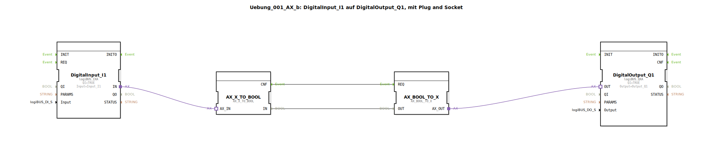

# Uebung_001_AX_b: DigitalInput_I1 auf DigitalOutput_Q1, mit Plug and Socket


[](https://notebooklm.google.com/notebook/041f4df4-b729-484d-b786-b6dcdf151961)

Dieser Artikel beschreibt die logiBUS®-Übung `Uebung_001_AX_b`, bei der ein digitaler Eingang über eine Signalwandlung mit einem digitalen Ausgang verbunden wird. Im Gegensatz zur direkten Adapterverbindung wird hier der Adapter-Zustand explizit in einen booleschen Wert und wieder zurück gewandelt.

----


## Ziel der Übung

Das Hauptziel dieser Übung ist es, die Wandlung zwischen Adapter-Schnittstellen ("Plug and Socket") und klassischen booleschen Datenverbindungen zu demonstrieren. Dies ist eine grundlegende Technik in der IEC 61499, um Signale, die über Adapter übertragen werden, für logische Operationen (wie AND, OR, NOT) zugänglich zu machen, die auf elementaren Datentypen operieren.

-----

## Beschreibung und Komponenten

[cite_start]Die Übung basiert auf der Subapplikation `Uebung_001_AX_b.SUB`, die den Signalfluss von einem digitalen Eingang zu einem digitalen Ausgang über zwei zwischengeschaltete Wandler-Bausteine realisiert[cite: 1].

### Funktionsbausteine (FBs)

In der Subapplikation werden vier Funktionsbausteine instanziiert:




  * **`DigitalInput_I1`**: Eine Instanz des Typs `logiBUS_IXA`. [cite_start]Dieser Baustein liest den Zustand des physischen Eingangs `Input_I1` und stellt ihn über seinen Adapter-Anschluss `IN` bereit[cite: 1].
  * **`DigitalOutput_Q1`**: Eine Instanz des Typs `logiBUS_QXA`. [cite_start]Dieser Baustein empfängt Signale an seinem Adapter-Anschluss `OUT` und setzt entsprechend den physischen Ausgang `Output_Q1`[cite: 1].
  * **`AX_X_TO_BOOL`**: [cite_start]Ein Wandler-Baustein, der ein am Adapter-Eingang `AX_IN` (Socket) empfangenes Signal in ein Ereignis `CNF` und einen booleschen Datenwert `IN` zerlegt[cite: 1].
  * **`AX_BOOL_TO_X`**: [cite_start]Ein Wandler-Baustein, der aus einem Ereignis `REQ` und einem booleschen Datenwert `OUT` wieder ein Adapter-Signal am Ausgang `AX_OUT` (Plug) zusammensetzt[cite: 1].

### Adapter-Schnittstelle: `AX.adp`

[cite_start]Wie in der Basisübung dient auch hier der Adapter-Typ `AX` als Schnittstelle, der das Ereignis `E1` und den booleschen Wert `D1` überträgt[cite: 2].

-----

## Funktionsweise

Die Logik wird durch die Verknüpfung von Adapter-, Ereignis- und Datenverbindungen realisiert. Der Signalweg ist in der Datei `Uebung_001_AX_b.SUB` wie folgt definiert:

```xml
<EventConnections>
    <Connection Source="AX_X_TO_BOOL.CNF" Destination="AX_BOOL_TO_X.REQ"/>
</EventConnections>
<DataConnections>
    <Connection Source="AX_X_TO_BOOL.IN" Destination="AX_BOOL_TO_X.OUT"/>
</DataConnections>
<AdapterConnections>
    <Connection Source="DigitalInput_I1.IN" Destination="AX_X_TO_BOOL.AX_IN"/>
    <Connection Source="AX_BOOL_TO_X.AX_OUT" Destination="DigitalOutput_Q1.OUT"/>
</AdapterConnections>
```

[cite_start][cite: 1]

Der Ablauf gestaltet sich wie folgt:
1.  Ändert sich der Zustand am Eingang `I1`, sendet `DigitalInput_I1` ein Adapter-Ereignis.
2.  Der Baustein `AX_X_TO_BOOL` empfängt dieses, gibt den aktuellen Zustand am Datenausgang `IN` aus und signalisiert dies durch das Ereignis `CNF`.
3.  Das Ereignis `CNF` triggert den `REQ`-Eingang von `AX_BOOL_TO_X`, welcher daraufhin den Wert von `OUT` übernimmt.
4.  `AX_BOOL_TO_X` sendet ein neues Adapter-Ereignis an `DigitalOutput_Q1`, welcher schließlich den Ausgang `Q1` schaltet.

-----

## Anwendungsbeispiel

Diese Konfiguration dient als Vorbereitung für komplexere Steuerungsaufgaben. Ein praktisches Beispiel wäre die **Invertierung eines Signals**:

Möchte man, dass die Lampe an `Q1` leuchtet, wenn der Schalter an `I1` *nicht* betätigt ist, kann man zwischen den Wandler-Bausteinen einfach einen `NOT`-Funktionsbaustein einfügen. Das boolesche Signal von `AX_X_TO_BOOL.IN` wird invertiert und dann an `AX_BOOL_TO_X.OUT` übergeben. Dies zeigt die Flexibilität, die durch die Wandlung von Adaptern in elementare Datentypen gewonnen wird.