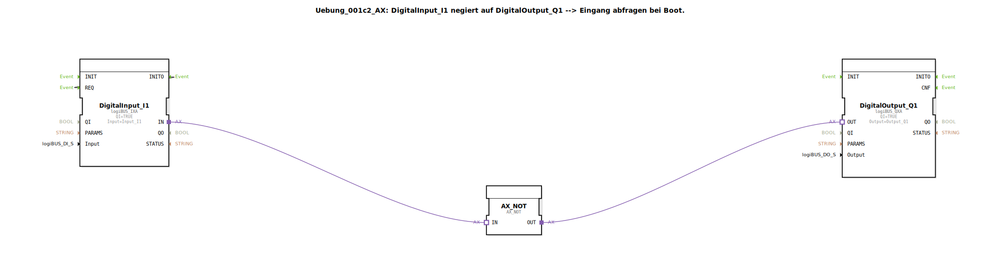

# Uebung_001c2_AX: DigitalInput_I1 negiert auf DigitalOutput_Q1 --&gt; Eingang abfragen bei Boot.

* * * * * * * * * *
## Einleitung

Diese Übung demonstriert die Negation eines digitalen Eingangssignals auf einen digitalen Ausgang mithilfe eines logischen Negationsadapters. Ein besonderer Fokus liegt auf dem initialen Verhalten nach dem Booten der Steuerung: durch eine Event-Rückkopplung wird sichergestellt, dass der Ausgang sofort den korrekten negierten Zustand des Eingangs annimmt.

## Verwendete Funktionsbausteine (FBs)

- **DigitalInput_I1** (Typ: `logiBUS::io::DI::logiBUS_IXA`):  
  Liest den physischen digitalen Eingang `Input_I1` aus.  
  *Parameter*: `QI = TRUE` (Initialisierung aktiv), `Input = "Input_I1"`.

- **DigitalOutput_Q1** (Typ: `logiBUS::io::DQ::logiBUS_QXA`):  
  Setzt den physischen digitalen Ausgang `Output_Q1`.  
  *Parameter*: `QI = TRUE`, `Output = "Output_Q1"`.

- **AX_NOT** (Typ: `adapter::booleanOperators::AX_NOT`):  
  Ein Adapter-Funktionsbaustein, der den an seinem `IN`-Adapter anliegenden Booleschen Wert negiert und am `OUT`-Adapter ausgibt.

## Programmablauf und Verbindungen

Der Datenfluss ist auf Adapterebene realisiert:

1. Der digitale Eingang `DigitalInput_I1` liefert den Status des physischen Eingangs als Adaptersignal an seinem `OUT`-Anschluss.
2. Dieses Signal wird direkt an den `IN`-Adapter des Negationsbausteins `AX_NOT` weitergeleitet.
3. Der negierte Wert verlässt `AX_NOT` über den `OUT`-Adapter und wird an den `OUT`-Adapter des Ausgangsbausteins `DigitalOutput_Q1` übergeben.
4. `DigitalOutput_Q1` setzt den physischen Ausgang entsprechend.

**Besonderheit – Initialisierungsverhalten (Boot):**  
Eine Eventverbindung zwischen dem Ereignisausgang `INITO` von `DigitalInput_I1` und dem Ereigniseingang `REQ` desselben Bausteins sorgt dafür, dass der Eingang sofort nach der Initialisierung (beim Booten) einmal abgefragt wird. Ohne diese Verbindung wäre der Ausgang nach dem Start zunächst `FALSE`, da die Ereigniskette erst durch ein externes Ereignis ausgelöst werden müsste. Mit der Rückkopplung wird der aktuelle Eingangswert gelesen und der Ausgang korrekt gesetzt.

**Lernziele:**  
- Verständnis der Ereignissteuerung in 4diac (Ereignisrückkopplung zur Initialisierung).  
- Anwendung von Adapterbausteinen zur Signalverarbeitung (Negation).  
- Einfaches Zusammenspiel von digitalen Ein- und Ausgängen.

## Zusammenfassung

Die Übung `Uebung_001c2_AX` zeigt eine grundlegende Schaltung zur Negation eines digitalen Eingangs auf einen Ausgang. Durch die geschickte Nutzung einer Ereignisrückkopplung wird der Ausgang bereits beim Start der Steuerung mit dem korrekten Wert belegt, was die Robustheit der Applikation erhöht. Die verwendeten Bausteine (digitaler Eingang, Negationsadapter, digitaler Ausgang) sind typische Komponenten der logiBUS-Bibliothek und lassen sich flexibel in komplexere Automatisierungslösungen einbetten.