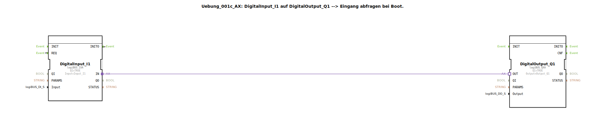

# Uebung_001c_AX: DigitalInput_I1 auf DigitalOutput_Q1 --&gt; Eingang abfragen bei Boot.


[](https://notebooklm.google.com/notebook/041f4df4-b729-484d-b786-b6dcdf151961)

Dieser Artikel beschreibt die logiBUS®-Übung `Uebung_001c_AX`. Hier wird demonstriert, wie ein digitaler Eingang unmittelbar nach dem Systemstart (Boot-Vorgang) abgefragt wird, um den initialen Zustand an einen digitalen Ausgang zu übertragen.

----


## Ziel der Übung

Das Hauptziel dieser Übung ist das Verständnis des Initialisierungsvorgangs in der IEC 61499. In vielen Automatisierungsszenarien reicht es nicht aus, nur auf Zustandsänderungen zu reagieren; das System muss auch beim Start den aktuellen Ist-Zustand der Hardware erfassen, um eine definierte Ausgangslage zu gewährleisten.

-----

## Beschreibung und Komponenten

[cite_start]Die Übung nutzt die Subapplikation `Uebung_001c_AX.SUB`, um eine Verbindung zwischen einem digitalen Eingang und einem Ausgang herzustellen, ergänzt um eine Selbst-Triggerung für den Systemstart[cite: 1].

### Funktionsbausteine (FBs)

In der Subapplikation werden zwei zentrale Bausteine verwendet:




  * **`DigitalInput_I1`**: Eine Instanz des Typs `logiBUS_IXA`. [cite_start]Zusätzlich zur Standardfunktion wird hier der Ereignisausgang `INITO` (Initialization Output) genutzt, um eine einmalige Abfrage beim Start auszulösen[cite: 1].
  * **`DigitalOutput_Q1`**: Eine Instanz des Typs `logiBUS_QXA`. [cite_start]Dieser Baustein empfängt den initial abgefragten Wert über die Adapterverbindung und setzt den Ausgang `Output_Q1` entsprechend[cite: 1].

### Adapter-Schnittstelle: `AX.adp`

[cite_start]Die Kommunikation zwischen den Bausteinen erfolgt über den bekannten Adapter-Typ `AX`, der das Ereignis `E1` und den Datenwert `D1` überträgt[cite: 2].

-----

## Funktionsweise

Die Besonderheit dieser Übung liegt in der Ereignisverbindung, die eine Rückkopplung für den Initialisierungsprozess schafft. Der Aufbau in der Datei `Uebung_001c_AX.SUB` sieht wie folgt aus:

```xml
<EventConnections>
    <Connection Source="DigitalInput_I1.INITO" Destination="DigitalInput_I1.REQ"/>
</EventConnections>
<AdapterConnections>
    <Connection Source="DigitalInput_I1.IN" Destination="DigitalOutput_Q1.OUT"/>
</AdapterConnections>
```

[cite_start][cite: 1]

Der funktionale Ablauf ist wie folgt:
1.  **Systemstart**: Beim Hochfahren der 4diac-Laufzeitumgebung wird der Baustein `DigitalInput_I1` initialisiert.
2.  **Initialisierungs-Event**: Nach erfolgreicher Initialisierung sendet der Baustein ein `INITO`-Ereignis aus.
3.  **Selbst-Triggerung**: Da `INITO` mit dem eigenen `REQ`-Eingang verbunden ist, wird der Baustein sofort aufgefordert, den physischen Zustand des Eingangs `Input_I1` zu lesen.
4.  **Signalweiterleitung**: Der gelesene Wert wird über den Adapter `IN` an `DigitalOutput_Q1` gesendet, welcher den Ausgang `Q1` bereits beim Booten auf den korrekten Stand bringt.

Ohne diese `INITO -> REQ` Verbindung würde der Ausgang erst dann aktualisiert, wenn sich der Zustand des Eingangs zum ersten Mal *nach* dem Start ändert.

-----

## Anwendungsbeispiel

Ein praktisches Beispiel ist die **Zustandssynchronisation nach einem Stromausfall**:

Stellen Sie sich vor, eine Steuerung steuert eine Lüftungsklappe basierend auf der Position eines Schalters. Wenn die Steuerung neu startet, muss sie sofort wissen, in welcher Position der Schalter steht, um die Klappe korrekt anzusteuern, noch bevor der Bediener den Schalter erneut betätigt. Die Boot-Abfrage stellt sicher, dass Software-Zustand und Hardware-Realität von der ersten Sekunde an synchron sind.