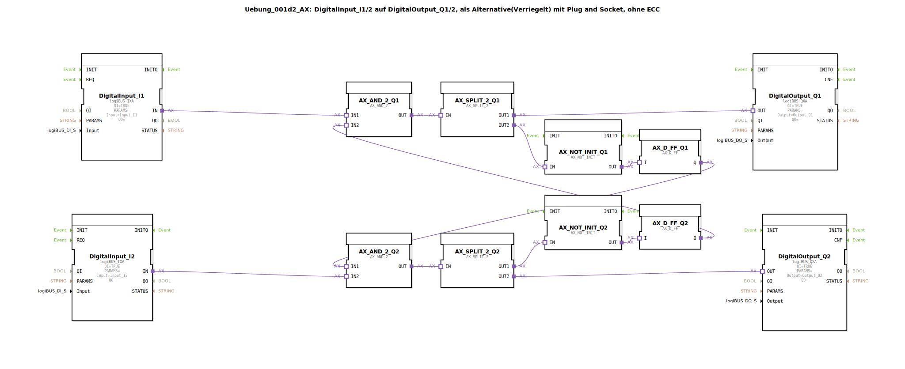

# Uebung_001d2_AX: DigitalInput_I1/2 auf DigitalOutput_Q1/2, als Alternative(Verriegelt) mit Plug and Socket, ohne ECC

* * * * * * * * * *
## Einleitung

Diese Übung realisiert eine alternative, verschaltete Ansteuerung zweier Digitalausgänge (Q1, Q2) durch zwei Digitaleingänge (I1, I2). Die Schaltung bildet eine verriegelte (gegenseitig ausschließende) Zuordnung mit Hilfe von Logikgattern und Flip-Flops, jedoch ohne Verwendung eines expliziten ECC (Execution Control Chart). Sie dient als Beispiel für eine komplexere Kopplung von Eingangs- und Ausgangssignalen basierend auf dem logiBUS-IO-System.

Die Schaltung verarbeitet die Eingänge so, dass immer nur einer der beiden Ausgänge aktiv werden kann. Welcher Eingang den Ausgang steuert, wird durch die interne Logik festgelegt, wobei die Rückkopplung der Flip-Flop-Zustände eine wechselseitige Sperre realisiert.

## Verwendete Funktionsbausteine (FBs)

- **DigitalInput_I1**, **DigitalInput_I2**:  
  Typ: `logiBUS::io::DI::logiBUS_IXA`  
  Parametrisierung:  
  - `QI` = TRUE (aktiviert)  
  - `Input` = `Input_I1` bzw. `Input_I2` (logiBUS-Kanal)  
  Diese Bausteine stellen die physikalischen Digitaleingänge (z. B. von einem Taster oder Sensor) als boolesche Signale im System bereit.

- **DigitalOutput_Q1**, **DigitalOutput_Q2**:  
  Typ: `logiBUS::io::DQ::logiBUS_QXA`  
  Parametrisierung:  
  - `QI` = TRUE  
  - `Output` = `Output_Q1` bzw. `Output_Q2`  
  Sie steuern die physikalischen Digitalausgänge (z. B. Lampen oder Relais).

- **AX_AND_2_Q1**, **AX_AND_2_Q2**:  
  Typ: `adapter::booleanOperators::AX_AND_2`  
  Parameter: keine (Standardkonfiguration)  
  Realisiert eine logische UND-Verknüpfung mit zwei Eingängen (IN1, IN2) und einem Ausgang (OUT).

- **AX_SPLIT_2_Q1**, **AX_SPLIT_2_Q2**:  
  Typ: `adapter::events::unidirectional::AX_SPLIT_2`  
  Ein Ereignis-Splitter, der ein eingehendes Ereignis (IN) auf zwei Ausgänge (OUT1, OUT2) verteilt. Dient zur gleichzeitigen Bereitstellung eines Signals für zwei nachfolgende Bausteine.

- **AX_NOT_INIT_Q1**, **AX_NOT_INIT_Q2**:  
  Typ: `adapter::booleanOperators::AX_NOT_INIT`  
  Eine logische Negation (NOT), deren Ausgangszustand beim Start initialisiert werden muss. Wandelt ein logisches Signal in sein Gegenteil um.

- **AX_D_FF_Q1**, **AX_D_FF_Q2**:  
  Typ: `adapter::events::unidirectional::AX_D_FF`  
  Ein D-Flip-Flop (Data Flip-Flop). Es speichert den Wert am Dateneingang (I) bei einem aktiven Takt-Ereignis und gibt ihn am Ausgang (Q) aus. Verwendet zur Zustandsspeicherung innerhalb der Verriegelung.

## Programmablauf und Verbindungen

Die Schaltung arbeitet nach folgendem Prinzip:

1. **Signalaufbereitung**  
   Die Eingänge I1 und I2 werden über die `logiBUS_IXA`-Bausteine eingelesen und als boolesche Signale an die nachfolgende Logik weitergegeben.

2. **UND-Verknüpfung mit Rückkopplung**  
   - Der Ausgang von DigitalInput_I1 wird auf den ersten Eingang (IN1) von `AX_AND_2_Q1` geführt.  
   - Der Ausgang von DigitalInput_I2 wird auf den zweiten Eingang (IN2) von `AX_AND_2_Q2` geführt.  
   - Die UND-Gatter erhalten jeweils den zweiten Eingang aus dem *Ausgang des anderen* D-Flip-Flops:  
     * `AX_AND_2_Q1.IN2` ist mit dem Ausgang `Q` von `AX_D_FF_Q2` verbunden.  
     * `AX_AND_2_Q2.IN1` ist mit dem Ausgang `Q` von `AX_D_FF_Q1` verbunden.  

   Diese Kreuzverschaltung bewirkt: Ausgang Q1 kann nur aktiv werden, wenn das Flip-Flop Q2 nicht aktiv ist (und umgekehrt). Damit wird eine gegenseitige Verriegelung realisiert.

3. **Signalverteilung und Negation**  
   - Die Ausgänge der UND-Gatter werden durch die `AX_SPLIT_2`-Bausteine auf zwei Pfade aufgeteilt:  
     * Ein Pfad geht direkt zu den Digitalausgängen:  
       `AX_SPLIT_2_Q1.OUT1` → `DigitalOutput_Q1.OUT`  
       `AX_SPLIT_2_Q2.OUT2` → `DigitalOutput_Q2.OUT`  
     * Der andere Pfad geht über die Negation (`AX_NOT_INIT`) zu den D-Flip-Flops:  
       `AX_SPLIT_2_Q1.OUT2` → `AX_NOT_INIT_Q1.IN` → `AX_D_FF_Q1.I`  
       `AX_SPLIT_2_Q2.OUT1` → `AX_NOT_INIT_Q2.IN` → `AX_D_FF_Q2.I`  

   Die Negation stellt sicher, dass das Flip-Flop beim nächsten Takt den invertierten Wert des UND-Ausgangs speichert, sodass eine wechselseitige Abstimmung möglich wird.

4. **Zustandsspeicherung**  
   Die D-Flip-Flops speichern den negierten Zustand der jeweiligen UND-Verknüpfung und stellen ihn als Rückmeldesignal für die UND-Gatter der anderen Seite bereit.

5. **Ergebnis**  
   Insgesamt ergibt sich ein System, bei dem nur einer der beiden Ausgänge (Q1 oder Q2) gleichzeitig aktiv sein kann. Ein Wechsel des aktiven Ausgangs erfolgt, sobald der zugehörige Eingang gesetzt und der andere Eingang zurückgesetzt wird – die interne Logik sorgt für die Umschaltung durch die Flip-Flop-Zustände.

## Zusammenfassung

Die Übung zeigt eine komplexere Lösung für die verriegelte Ansteuerung von zwei Ausgängen durch zwei Eingänge unter Verwendung von UND-Gattern, Splittern, Negatoren und D-Flip-Flops. Sie demonstriert, wie mit einfachen Logikbausteinen eine gegenseitige Ausschließlichkeit realisiert werden kann, ohne auf einen dedizierten Verriegelungsbaustein (wie ILOCK) zurückzugreifen.

Der Kommentar im Quellcode (`Kompliziert. BESSER: ILOCK-Baustein`) weist darauf hin, dass ein spezialisierter ILOCK-Funktionsbaustein diese Aufgabe wesentlich einfacher lösen würde. Die Übung eignet sich daher gut, um die Funktionsweise von Flip-Flop-basierten Verriegelungen zu verstehen sowie die händische Implementierung mit Standardbausteinen zu erlernen. Sie setzt Grundkenntnisse der logiBUS-IO-Anbindung und der booleschen Logik voraus.