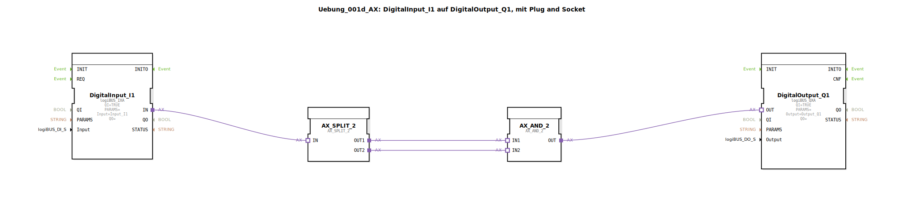

# Uebung_001d_AX: DigitalInput_I1 auf DigitalOutput_Q1, mit Plug and Socket

* * * * * * * * * *
## Einleitung

Diese Übung demonstriert das Durchschalten eines digitalen Eingangssignals (Input_I1) auf einen digitalen Ausgang (Output_Q1).  
Dabei kommen **Adapterbausteine** (Plug-and-Socket) zum Einsatz, um die Ereignis- und Datenflüsse zwischen den Funktionsbausteinen zu koppeln.  
Das Ziel ist es, die grundlegende Verwendung von Adapterverbindungen in der 4diac-IDE zu verstehen.

## Verwendete Funktionsbausteine (FBs)

### DigitalInput_I1
- **Typ**: `logiBUS::io::DI::logiBUS_IXA`
- **Verwendete Parameter**:
  - `QI` = `TRUE` (Freigabe aktiv)
  - `Input` = `Input_I1` (physischer Eingang)
- **Funktionsweise**:  
  Der Baustein liest den Zustand des angeschlossenen digitalen Eingangs **Input_I1**. Bei einer Signaländerung wird ein Ereignis über den **Adapterausgang `IN`** ausgegeben. Der Parameter `QI` muss gesetzt sein, damit der Baustein arbeitet.

### DigitalOutput_Q1
- **Typ**: `logiBUS::io::DQ::logiBUS_QXA`
- **Verwendete Parameter**:
  - `QI` = `TRUE` (Freigabe aktiv)
  - `Output` = `Output_Q1` (physischer Ausgang)
- **Funktionsweise**:  
  Der Baustein empfängt ein Ereignis über den **Adaptereingang `OUT`** und setzt den angeschlossenen digitalen Ausgang **Output_Q1** entsprechend. Der Ausgang wird aktiv, sobald ein Ereignis eintrifft.

### AX_SPLIT_2
- **Typ**: `adapter::events::unidirectional::AX_SPLIT_2`
- **Funktionsweise**:  
  Dieser Adapterbaustein verteilt ein eingehendes Ereignis auf **zwei identische Ausgänge** (`OUT1` und `OUT2`). Er dient als **Splitte**r, um das Signal parallel an mehrere nachfolgende Bausteine weiterzuleiten.

### AX_AND_2
- **Typ**: `adapter::booleanOperators::AX_AND_2`
- **Funktionsweise**:  
  Dieser Adapterbaustein führt eine **logische UND-Verknüpfung** auf zwei Ereigniseingängen (`IN1`, `IN2`) durch. Nur wenn an beiden Eingängen gleichzeitig ein Ereignis anliegt, wird ein Ereignis am Ausgang `OUT` ausgegeben.

## Programmablauf und Verbindungen

Der Signalfluss in der Sub-Applikation erfolgt ausschließlich über **Adapterverbindungen** (Plug and Socket):

1. Der Digitaleingang **DigitalInput_I1** erkennt eine Änderung an `Input_I1` und sendet ein Ereignis auf seinem Adapterausgang `IN`.
2. Dieses Ereignis wird zum **AX_SPLIT_2**-Baustein geleitet, der es auf seine beiden Ausgänge `OUT1` und `OUT2` vervielfältigt.
3. Beide Ausgänge sind mit den Eingängen des **AX_AND_2**-Bausteins verbunden (`IN1` und `IN2`).  
   Da beide Eingänge dasselbe Ereignis gleichzeitig erhalten, führt die UND-Verknüpfung immer zu einem Ereignis am Ausgang `OUT`.
4. Das Ausgangsereignis von `AX_AND_2` wird an den Adaptereingang `OUT` des **DigitalOutput_Q1**-Bausteins übertragen, der daraufhin den physischen Ausgang **Output_Q1** setzt.

Im Ergebnis wird der Digitaleingang **I1** direkt auf den Digitalausgang **Q1** abgebildet. Die Zwischenschaltung von `AX_SPLIT_2` und `AX_AND_2` dient lediglich der Demonstration von Adapterverknüpfungen und hat keine logische Auswirkung auf das Durchschaltverhalten.

## Zusammenfassung

Die Übung `Uebung_001d_AX` zeigt, wie man mit **Plug-and-Socket-Verbindungen** (Adapterbausteine) Ereignisse zwischen Funktionsbausteinen koppelt, ohne direkte Datenleitungen zu verwenden.  
Durch die Kombination von Splitter- (`AX_SPLIT_2`) und UND-Baustein (`AX_AND_2`) wird ein einfaches Durchschalten realisiert. Dies vermittelt ein grundlegendes Verständnis für die ereignisgesteuerte Kommunikation in der 4diac-IDE und die Verwendung von Adaptern in der Automatisierungstechnik.