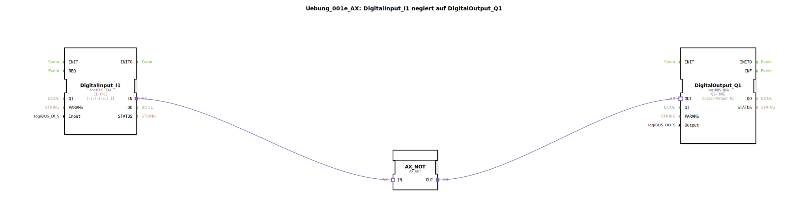

# Uebung_001e_AX: DigitalInput_I1 negiert auf DigitalOutput_Q1

* * * * * * * * * *
## Einleitung

Diese Übung realisiert eine einfache boolesche Negation: Der Zustand des digitalen Eingangs **Input_I1** wird negiert und auf den digitalen Ausgang **Output_Q1** ausgegeben. Sie dient als Einstieg in die Signalverarbeitung mit 4diac und zeigt die grundlegende Verschaltung eines Eingangsmoduls, eines logischen Negationsbausteins und eines Ausgangsmoduls über Adapterverbindungen.

## Verwendete Funktionsbausteine (FBs)

Die Übung verwendet drei konkrete Funktionsbausteine aus der Bibliothek:

- **DigitalInput_I1**  
  - **Typ**: `logiBUS::io::DI::logiBUS_IXA`  
  - **Parameter**:  
    - `QI` = `TRUE` (Eingang aktiviert)  
    - `Input` = `Input_I1` (physikalischer Eingang)  
  - **Funktion**: Liest den digitalen Zustand des angeschlossenen Sensors (z. B. Taster oder Schalter) am Eingang I1.

- **DigitalOutput_Q1**  
  - **Typ**: `logiBUS::io::DQ::logiBUS_QXA`  
  - **Parameter**:  
    - `QI` = `TRUE` (Ausgang aktiviert)  
    - `Output` = `Output_Q1` (physikalischer Ausgang)  
  - **Funktion**: Gibt den empfangenen logischen Wert auf den digitalen Ausgang Q1 aus (z. B. zur Ansteuerung einer LED).

- **AX_NOT**  
  - **Typ**: `adapter::booleanOperators::AX_NOT`  
  - **Parameter**: Keine  
  - **Funktion**: Führt eine boolesche Negation (NOT‑Operation) auf den eingehenden Adapter‑Datenwert durch. Der Ausgang `OUT` liefert den invertierten Wert des Eingangs `IN`.

## Programmablauf und Verbindungen

Der Datenfluss erfolgt über drei **Adapter‑Verbindungen** (im XML als `<AdapterConnections>` definiert):

1. `DigitalInput_I1.IN` → `AX_NOT.IN`  
   Der gelesene Zustand des Eingangs I1 wird an den Negationsbaustein weitergeleitet.

2. `AX_NOT.OUT` → `DigitalOutput_Q1.OUT`  
   Der negierte Wert wird an den Ausgangsbaustein übergeben.

Dadurch ergibt sich folgende Logik:  
- Wenn **Input_I1** `TRUE` (z. B. Taster gedrückt) → `AX_NOT` liefert `FALSE` → **Output_Q1** wird `FALSE` (LED aus).  
- Wenn **Input_I1** `FALSE` (Taster nicht gedrückt) → `AX_NOT` liefert `TRUE` → **Output_Q1** wird `TRUE` (LED an).

Die Parameter `QI = TRUE` bei Ein‑ und Ausgangsbaustein aktivieren diese dauerhaft. Es sind keine weiteren Verschaltungen oder Ereignissteuerungen erforderlich.

## Zusammenfassung

Die Übung **Uebung_001e_AX** vermittelt die Grundlagen der Adapter‑basierten Kommunikation in 4diac. Sie zeigt, wie ein digitales Eingangssignal mit einem einfachen Logikbaustein (NOT) verarbeitet und auf einen physikalischen Ausgang gelegt wird. Dieses Verständnis ist die Basis für komplexere Verknüpfungen und Steuerungsaufgaben in der Automatisierungstechnik.