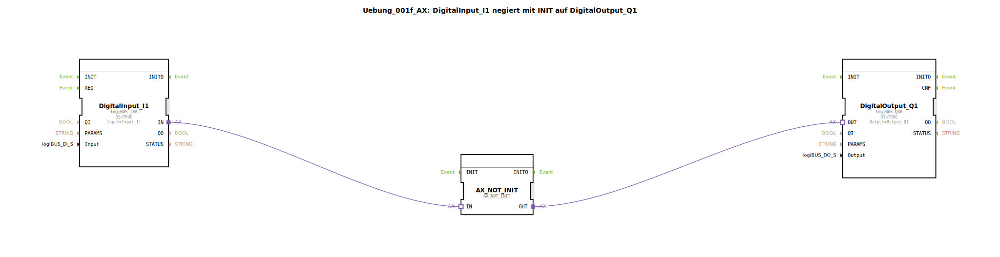

# Uebung_001f_AX: DigitalInput_I1 negiert mit INIT auf DigitalOutput_Q1

* * * * * * * * * *

## Einleitung

Diese Übung demonstriert die Negation eines digitalen Eingangssignals unter Verwendung des Funktionsbausteins `AX_NOT_INIT`. Das negierte Signal wird auf einen digitalen Ausgang gegeben. Ein besonderer Effekt tritt beim Start (BOOT) auf: Da der Eingang I1 beim Systemstart nicht abgefragt wird, liefert `AX_NOT_INIT` zu Beginn einen `TRUE`-Wert, unabhängig vom tatsächlichen Eingangszustand.

## Verwendete Funktionsbausteine (FBs)

Die Übung setzt sich aus drei Funktionsbausteinen zusammen, die im Netzwerk der SubApp miteinander verbunden sind.

### Sub-Bausteine: DigitalInput_I1

- **Typ**: `logiBUS::io::DI::logiBUS_IXA`
- **Verwendete interne FBs**: keine
- **Parameter**:
    - `QI` = TRUE
    - `Input` = `Input_I1`
- **Ereignisausgang/-eingang**: keine (rein datengetrieben über Adapter)
- **Datenausgang/-eingang**: `IN` (Adapter-Ausgang, liefert den digitalen Eingangswert)
- **Funktionsweise**: Der Baustein liest den Zustand des digitalen Eingangs `Input_I1` und stellt ihn über den Adapterausgang `IN` bereit.

### Sub-Bausteine: DigitalOutput_Q1

- **Typ**: `logiBUS::io::DQ::logiBUS_QXA`
- **Verwendete interne FBs**: keine
- **Parameter**:
    - `QI` = TRUE
    - `Output` = `Output_Q1`
- **Ereignisausgang/-eingang**: keine
- **Datenausgang/-eingang**: `OUT` (Adapter-Eingang, nimmt den zu setzenden Ausgangswert entgegen)
- **Funktionsweise**: Der Baustein setzt den digitalen Ausgang `Output_Q1` auf den Wert, der am Adaptereingang `OUT` anliegt.

### Sub-Bausteine: AX_NOT_INIT

- **Typ**: `adapter::booleanOperators::AX_NOT_INIT`
- **Verwendete interne FBs**: keine
- **Parameter**: keine
- **Ereignisausgang/-eingang**: keine
- **Datenausgang/-eingang**:
    - `IN` (Adapter-Eingang, zu negierender Wert)
    - `OUT` (Adapter-Ausgang, negierter Wert)
- **Funktionsweise**: Der Baustein negiert den am Eingang `IN` anliegenden booleschen Wert. Bei Systemstart (BOOT) wird der Ausgang `OUT` auf `TRUE` gesetzt, selbst wenn der Eingang noch nicht gelesen wurde. Dieses Verhalten wird durch den Namenszusatz `_INIT` gekennzeichnet.

## Programmablauf und Verbindungen

Die Verbindungen im SubApp-Netzwerk sind als Adapterverbindungen realisiert:

1. Der Adapterausgang `IN` von `DigitalInput_I1` wird mit dem Adaptereingang `IN` von `AX_NOT_INIT` verbunden.
2. Der Adapterausgang `OUT` von `AX_NOT_INIT` wird mit dem Adaptereingang `OUT` von `DigitalOutput_Q1` verbunden.

**Ablauf**:
- Der digitale Eingangswert wird ständig aktualisiert und an `AX_NOT_INIT` weitergegeben.
- `AX_NOT_INIT` negiert den Wert und gibt das Ergebnis an `DigitalOutput_Q1` weiter.
- Der Ausgangsbaustein setzt den physikalischen Ausgang entsprechend.

**Besonderheit beim Start**: Während der Initialisierungsphase (BOOT) hat `AX_NOT_INIT` noch keinen gültigen Eingangswert empfangen. Daher gibt er seinen vordefinierten Startwert `TRUE` aus. Dies führt dazu, dass der Ausgang kurzzeitig `TRUE` wird, auch wenn der Eingang eigentlich `FALSE` ist.

**Lernziele**:
- Verständnis der Negation boolescher Signale in 4diac.
- Kennenlernen des Startverhaltens initialisierter Funktionsbausteine (`INIT`-Bausteine).
- Umgang mit Adapterverbindungen zwischen einzelnen Funktionsbausteinen.

**Schwierigkeitsgrad**: Einfach – geeignet für Einsteiger, die grundlegende Signalverarbeitung und das Verhalten von Bausteinen in 4diac nachvollziehen möchten.

## Zusammenfassung

Die Übung `Uebung_001f_AX` veranschaulicht die Negation eines digitalen Eingangssignals unter Verwendung des speziellen Bausteins `AX_NOT_INIT`. Die Besonderheit liegt im initialen Ausgangszustand beim Systemstart, der unabhängig vom Eingang `TRUE` ist. Die Übung wird mit dem Kommentar ergänzt: *„obwohl I1 nicht abgefragt wird beim BOOT, wird AX_NOT hier TRUE ausgeben.“* Damit wird der Lerneffekt zum Startverhalten initialisierter Bausteine unterstrichen.