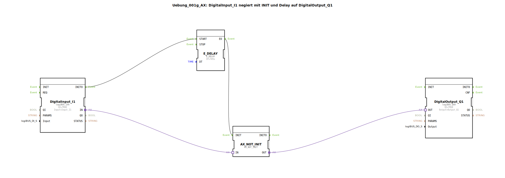

# Uebung_001g_AX: DigitalInput_I1 negiert mit INIT und Delay auf DigitalOutput_Q1

* * * * * * * * * *
## Einleitung

Diese Übung demonstriert die Verarbeitung eines digitalen Eingangssignals (I1) unter Verwendung einer Negation und einer zeitlichen Verzögerung. Der Eingangswert wird nach einem initialen Ereignis und einer definierten Verzögerung negiert auf einen digitalen Ausgang (Q1) ausgegeben. Ein besonderer Fokus liegt auf dem Verhalten des Negationsbausteins, der auch dann einen gültigen Wert (TRUE) liefert, wenn der Eingang beim Systemstart noch nicht abgefragt wurde.

## Verwendete Funktionsbausteine (FBs)

### Sub-Bausteine: `DigitalInput_I1`
- **Typ**: `logiBUS::io::DI::logiBUS_IXA`
- **Verwendete interne FBs**: Keine
- **Parameter**:
    - `QI` = `TRUE`
    - `Input` = `Input_I1`
- **Ereignisausgang**: `INITO` (wird beim Abschluss der Initialisierung ausgelöst)
- **Datenausgang**: `IN` (liefert den aktuellen digitalen Eingangswert)

### Sub-Baustein: `AX_NOT_INIT`
- **Typ**: `adapter::booleanOperators::AX_NOT_INIT`
- **Verwendete interne FBs**: Keine
- **Ereigniseingang**: `INIT` (löst die Berechnung aus)
- **Adaptereingang**: `IN` (erwartet einen booleschen Wert über einen Adapter)
- **Adapterausgang**: `OUT` (liefert den negierten Wert des Eingangs)

### Sub-Baustein: `E_DELAY`
- **Typ**: `iec61499::events::E_DELAY`
- **Verwendete interne FBs**: Keine
- **Parameter**:
    - `DT` = `T#3s` (Verzögerungszeit von 3 Sekunden)
- **Ereigniseingang**: `START` (startet den Timer)
- **Ereignisausgang**: `EO` (wird nach Ablauf der Verzögerungszeit ausgelöst)

### Sub-Baustein: `DigitalOutput_Q1`
- **Typ**: `logiBUS::io::DQ::logiBUS_QXA`
- **Verwendete interne FBs**: Keine
- **Parameter**:
    - `QI` = `TRUE`
    - `Output` = `Output_Q1`
- **Adaptereingang**: `OUT` (erwartet den zu setzenden digitalen Wert)

## Programmablauf und Verbindungen

Der Ablauf ist ereignisgesteuert und folgt dieser Reihenfolge:

1. **Initialisierung**: Der Baustein `DigitalInput_I1` führt beim Systemstart seine Initialisierung durch. Nach erfolgreicher Initialisierung wird das Ereignis `INITO` ausgelöst.
2. **Verzögerung starten**: Das Ereignis `INITO` wird über eine **Event-Verbindung** an den Eingang `START` des Bausteins `E_DELAY` weitergeleitet. Dieser startet einen Timer mit einer Verzögerungszeit von 3 Sekunden (`DT = T#3s`).
3. **Negation auslösen**: Nach Ablauf der 3 Sekunden sendet `E_DELAY` das Ereignis `EO` an den Eingang `INIT` des Bausteins `AX_NOT_INIT`. Dadurch wird die Negation des aktuell anliegenden Eingangswertes berechnet.
4. **Wertübergabe**: Der aktuelle digitale Eingangswert von `DigitalInput_I1` wird über eine **Adapter-Verbindung** (`IN`) an den Baustein `AX_NOT_INIT` übergeben. Dessen Ausgang `OUT` liefert den negierten Wert (`NOT`).
5. **Ausgabe**: Der negierte Wert wird über eine weitere **Adapter-Verbindung** an den Eingang `OUT` des Bausteins `DigitalOutput_Q1` übergeben und damit auf den Ausgang `Output_Q1` geschrieben.

**Hinweis aus dem Kommentar**: Da der Eingang `I1` beim Bootvorgang nicht sofort abgefragt wird, gibt der Baustein `AX_NOT_INIT` in der Zwischenzeit den Wert `TRUE` aus, bis der erste gültige Eingangswert verarbeitet wurde.

**Lernziele und Vorkenntnisse**:
- **Schwierigkeitsgrad**: Einsteiger
- **Vorkenntnisse**: Grundlegendes Verständnis der 4diac-IDE, Ereignis‑ und Datenverbindungen.
- **Lernziele**: 
  - Umgang mit digitalen Ein‑ und Ausgängen.
  - Verwendung von Verzögerungsbausteinen (`E_DELAY`).
  - Anwendung von Negationsbausteinen mit Initialisierungssteuerung (`AX_NOT_INIT`).
  - Verständnis des Initialisierungsverhaltens und der Ereignisverkettung.

**Start der Übung**: Importieren Sie die SubApp in ein 4diac-Projekt, weisen Sie die Ein‑ und Ausgänge den entsprechenden Hardware‑ oder Simulationsressourcen zu und führen Sie die Konfiguration aus.

## Zusammenfassung

Die Übung `Uebung_001g_AX` zeigt, wie ein digitales Eingangssignal nach einer definierten Verzögerung von 3 Sekunden negiert auf einen digitalen Ausgang gegeben wird. Dabei wird das Initialisierungsereignis des Eingangs genutzt, um den Timer zu starten, und der spezielle Negationsbaustein `AX_NOT_INIT` stellt sicher, dass auch beim Fehlen eines initialen Eingangswertes ein definierter Ausgangszustand (`TRUE`) ausgegeben wird. Dies ist ein grundlegendes Beispiel für die ereignisgesteuerte Signalverarbeitung in 4diac.