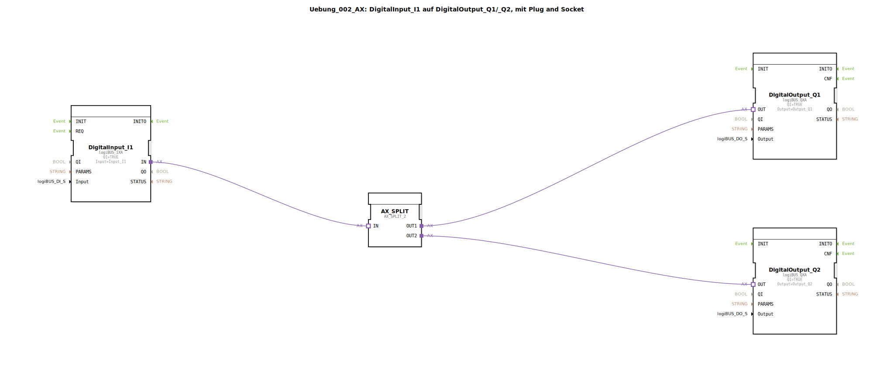

# Uebung_002_AX: DigitalInput_I1 auf DigitalOutput_Q1/_Q2, mit Plug and Socket 


[](https://notebooklm.google.com/notebook/041f4df4-b729-484d-b786-b6dcdf151961)

Dieser Artikel beschreibt die logiBUS®-Übung `Uebung_002_AX`, bei der ein einzelnes digitales Eingangssignal auf zwei verschiedene digitale Ausgänge verteilt wird. Hierbei kommt das Konzept der Adapter-Verzweigung zum Einsatz.

----


## Ziel der Übung

Das Hauptziel dieser Übung ist es, zu zeigen, wie Adapterverbindungen in der IEC 61499 verzweigt werden können. Da ein "Plug" (Ausgang eines Adapters) in 4diac oft nur mit einer "Socket" (Eingang eines Adapters) verbunden werden kann (je nach Version und Konfiguration), wird hier ein spezieller Splitter-Baustein verwendet, um ein Signal sauber auf mehrere Empfänger zu verteilen.

-----

## Beschreibung und Komponenten

[cite_start]In der Subapplikation `Uebung_002_AX.SUB` wird ein digitaler Eingang eingelesen und über einen Adapter-Splitter an zwei digitale Ausgänge weitergereicht[cite: 1].

### Funktionsbausteine (FBs)

Folgende Bausteine kommen zum Einsatz:




  * **`DigitalInput_I1`**: Eine Instanz des Typs `logiBUS_IXA`. [cite_start]Dieser Baustein liest den Hardware-Eingang `Input_I1`[cite: 1].
  * **`AX_SPLIT`**: Eine Instanz des Typs `AX_SPLIT_2`. [cite_start]Dieser Baustein verfügt über einen Adapter-Eingang (`IN`) und zwei identische Adapter-Ausgänge (`OUT1`, `OUT2`) und fungiert somit als Signalvervielfältiger[cite: 1].
  * **`DigitalOutput_Q1`** & **`DigitalOutput_Q2`**: Instanzen des Typs `logiBUS_QXA`. [cite_start]Diese repräsentieren die physischen Ausgänge `Output_Q1` und `Output_Q2`[cite: 1].

### Adapter-Schnittstelle: `AX.adp`

[cite_start]Auch in dieser Übung wird der unidirektionale Adapter-Typ `AX` verwendet, der Ereignisse und Datenwerte für die Übertragung bündelt[cite: 2].

-----

## Funktionsweise

Die Signalverteilung wird durch die zentrale Position des `AX_SPLIT`-Bausteins im Netzwerk erreicht. Der Aufbau in `Uebung_002_AX.SUB` ist wie folgt definiert:

```xml
<AdapterConnections>
    <Connection Source="DigitalInput_I1.IN" Destination="AX_SPLIT.IN"/>
    <Connection Source="AX_SPLIT.OUT1" Destination="DigitalOutput_Q1.OUT"/>
    <Connection Source="AX_SPLIT.OUT2" Destination="DigitalOutput_Q2.OUT"/>
</AdapterConnections>
```

[cite_start][cite: 1]

Der Signalweg verläuft dabei in folgenden Schritten:
1.  Der Baustein `DigitalInput_I1` detektiert eine Änderung am physischen Eingang.
2.  Ein Adapter-Ereignis wird an den `AX_SPLIT`-Baustein gesendet.
3.  Der `AX_SPLIT`-Baustein repliziert dieses Ereignis und den dazugehörigen Datenwert (`D1`) unmittelbar an seine beiden Ausgänge `OUT1` und `OUT2`.
4.  Beide Ausgangsbausteine (`DigitalOutput_Q1` und `DigitalOutput_Q2`) empfangen das Signal zeitgleich und schalten ihre jeweiligen Hardware-Ausgänge.

Im Ergebnis schalten beide Ausgänge synchron zum Zustand des Eingangs `I1`.

-----

## Anwendungsbeispiel

Ein typisches Anwendungsbeispiel ist die **parallele Statusanzeige**:

Ein Sensor an einer Maschine (`I1`) soll nicht nur die interne Logik steuern, sondern gleichzeitig eine lokale Kontrollleuchte (`Q1`) und eine Signallampe an einem entfernten Bedienpult (`Q2`) aktivieren. Durch den Einsatz des Splitters wird sichergestellt, dass beide Anzeigen immer den identischen Zustand des Sensors widerspiegeln, ohne dass die Logik für jeden Ausgang separat implementiert werden muss.