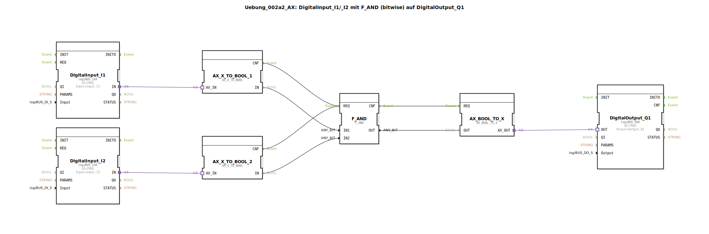

# Uebung_002a2_AX: DigitalInput_I1/_I2 mit F_AND (bitwise) auf DigitalOutput_Q1

Dieser Artikel beschreibt die logiBUS®-Übung `Uebung_002a2_AX`. Hier wird gezeigt, wie Adapter-Signale in boolesche Werte gewandelt werden, um sie mit Standard-Logikbausteinen zu verarbeiten.

----

## Ziel der Übung

Das Hauptziel ist die Demonstration der Interoperabilität. Während spezialisierte Bausteine wie `AX_AND_2` direkt auf Adaptern arbeiten, benötigen viele Standard-Bibliotheken (wie die bitweisen Operatoren der IEC 61131) elementare Datentypen (BOOL). Diese Übung zeigt den Weg von der Hardware-Abstraktion zur klassischen Logik und zurück.

-----

## Beschreibung und Komponenten

[cite_start]Die Subapplikation `Uebung_002a2_AX.SUB` nutzt Konvertierungsbausteine, um zwei Eingangs-Adapter für ein UND-Gatter aufzubereiten[cite: 1].

### Funktionsbausteine (FBs)

  * **`AX_X_TO_BOOL_1` & `_2`**: Wandeln das Adapter-Signal (`Event + Data`) in ein explizites Ereignis `CNF` und einen booleschen Wert `IN` um.
  * **`F_AND`**: Ein klassisches bitweises UND-Gatter aus der IEC 61131 Bibliothek.
  * **`AX_BOOL_TO_X`**: Wandelt das Ergebnis der Logik wieder in ein Adapter-Signal um.
  * **`DigitalInput_I1` & `I2`**: Eingänge.
  * **`DigitalOutput_Q1`**: Ausgang.

-----

## Funktionsweise

1.  **Erfassung**: Die Adapter-Eingänge liefern bei jeder Änderung ein Signal.
2.  **Wandlung**: Die `TO_BOOL` Bausteine extrahieren den Zustand.
3.  **Verarbeitung**: Das `F_AND` Gatter prüft: Sind beide Eingänge `TRUE`?
4.  **Rückwandlung**: Das Ergebnis wird wieder in die Adapter-Struktur verpackt.
5.  **Ausgabe**: Der Ausgang `Q1` schaltet entsprechend.

Diese Methode ist zwar aufwendiger als die Nutzung von `AX_AND_2`, ermöglicht aber den Einsatz jeder beliebigen Logikbibliothek.

-----

## Anwendungsbeispiel

**Zustandsüberwachung mit Standard-FBs**: Wenn Sie komplexe mathematische oder logische Funktionen nutzen möchten, die nur für `BOOL` oder `INT` Datentypen existieren, ist diese Form der Wandlung der Standardweg.