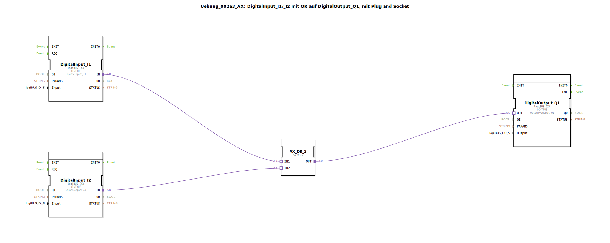

# Uebung_002a3_AX: DigitalInput_I1/_I2 mit OR auf DigitalOutput_Q1, mit Plug and Socket


[](https://notebooklm.google.com/notebook/041f4df4-b729-484d-b786-b6dcdf151961)

Dieser Artikel beschreibt die logiBUS®-Übung `Uebung_002a3_AX`. In dieser Übung wird eine logische ODER-Verknüpfung (OR) implementiert, bei der ein digitaler Ausgang aktiviert wird, sobald mindestens einer von zwei digitalen Eingängen den Zustand "Wahr" (HIGH) einnimmt.

----


## Ziel der Übung

Das Hauptziel dieser Übung ist es, die Funktionsweise einer ODER-Verknüpfung in der Automatisierungstechnik zu demonstrieren. Sie zeigt, wie alternative Bedingungen (Eingänge) genutzt werden können, um dieselbe Aktion (Ausgang) auszulösen. Dies ist eine Standardanforderung für Systeme, die von mehreren Stellen aus bedienbar sein müssen.

-----

## Beschreibung und Komponenten

[cite_start]Die Subapplikation `Uebung_002a3_AX.SUB` führt zwei digitale Eingangssignale über einen ODER-Logik-Baustein zusammen[cite: 1].

### Funktionsbausteine (FBs)

Folgende Bausteine werden verwendet:




  * **`DigitalInput_I1` & `DigitalInput_I2`**: Instanzen des Typs `logiBUS_IXA`. [cite_start]Diese Bausteine erfassen die Zustände der physischen Eingänge `Input_I1` und `Input_I2`[cite: 1].
  * **`AX_OR_2`**: Eine Instanz des Typs `AX_OR_2`. [cite_start]Dieser Baustein führt die logische ODER-Operation auf Adapter-Ebene aus. Er besitzt zwei Adapter-Eingänge (`IN1`, `IN2`) und einen Adapter-Ausgang (`OUT`)[cite: 1].
  * **`DigitalOutput_Q1`**: Eine Instanz des Typs `logiBUS_QXA`. [cite_start]Dieser Baustein setzt den physischen Ausgang `Output_Q1` basierend auf dem Ergebnis der ODER-Verknüpfung[cite: 1].

### Adapter-Schnittstelle: `AX.adp`

[cite_start]Durch die Verwendung des Adapter-Typs `AX` werden die Zustandsänderungen (Events) und die booleschen Werte (Daten) gemeinsam durch die Logikbausteine gereicht[cite: 2].

-----

## Funktionsweise

Die Logik wird durch die Verschaltung der Adapter-Anschlüsse in der Subapplikation definiert. Der Aufbau in `Uebung_002a3_AX.SUB` ist wie folgt:

```xml
<AdapterConnections>
    <Connection Source="DigitalInput_I1.IN" Destination="AX_OR_2.IN1"/>
    <Connection Source="DigitalInput_I2.IN" Destination="AX_OR_2.IN2"/>
    <Connection Source="AX_OR_2.OUT" Destination="DigitalOutput_Q1.OUT"/>
</AdapterConnections>
```

[cite_start][cite: 1]

Der Prozess folgt dieser Logik:
1.  Der Baustein `AX_OR_2` überwacht beide Adapter-Eingänge.
2.  Wenn mindestens ein Eingang (`IN1` OR `IN2`) den Datenwert `D1 = TRUE` führt, setzt der Baustein seinen Ausgang `OUT` ebenfalls auf `TRUE` und sendet ein Ereignis.
3.  Nur wenn beide Eingänge auf `FALSE` stehen, geht auch der Ausgang auf `FALSE`.
4.  Der Baustein `DigitalOutput_Q1` aktualisiert den physischen Ausgang `Q1` bei jeder Änderung am Ausgang des ODER-Bausteins.

-----

## Anwendungsbeispiel

Ein typisches Anwendungsbeispiel ist die **Flurbeleuchtung mit zwei Schaltern**:

In einem langen Flur gibt es an beiden Enden einen Schalter (`I1` und `I2`). Die Lampe (`Q1`) soll leuchten, wenn Schalter 1 betätigt wird ODER wenn Schalter 2 betätigt wird. Diese "Entweder-Oder"-Logik (bzw. "Mindestens-Eins"-Logik) wird durch den `AX_OR_2`-Baustein perfekt abgebildet, sodass man die Beleuchtung von beiden Stellen aus unabhängig voneinander einschalten kann.