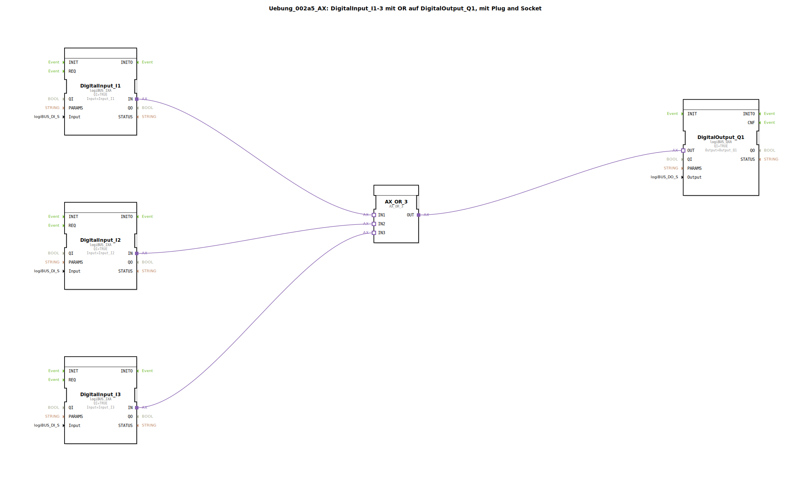

# Uebung_002a5_AX: DigitalInput_I1-3 mit OR auf DigitalOutput_Q1, mit Plug and Socket


[](https://notebooklm.google.com/notebook/041f4df4-b729-484d-b786-b6dcdf151961)

Dieser Artikel beschreibt die logiBUS®-Übung `Uebung_002a5_AX`. In dieser Übung wird eine logische ODER-Verknüpfung (OR) mit drei Eingängen realisiert. Der digitale Ausgang wird aktiviert, sobald mindestens einer der drei überwachten Eingänge ein Signal führt.

----


## Ziel der Übung

Das Hauptziel dieser Übung ist die Erweiterung der logischen Grundfunktionen auf mehr als zwei Eingangssignale. Sie verdeutlicht die Skalierbarkeit von Logikbausteinen in der IEC 61499 und zeigt, wie mehrere alternative Schaltbedingungen effizient in einer Steuerung zusammengefasst werden können.

-----

## Beschreibung und Komponenten

[cite_start]Die Subapplikation `Uebung_002a5_AX.SUB` implementiert eine 3-fach-ODER-Logik unter Verwendung von Adapterverbindungen[cite: 1].

### Funktionsbausteine (FBs)

In dieser Konfiguration werden folgende Bausteine eingesetzt:




  * **`DigitalInput_I1`, `I2`, `I3`**: Drei Instanzen des Typs `logiBUS_IXA`. [cite_start]Diese erfassen die Zustände der Hardware-Eingänge `Input_I1` bis `Input_I3`[cite: 1].
  * **`AX_OR_3`**: Eine Instanz des Typs `AX_OR_3`. [cite_start]Dieser Baustein führt eine ODER-Verknüpfung für drei Adapter-Eingänge (`IN1`, `IN2`, `IN3`) aus und stellt das Ergebnis am Adapter-Ausgang `OUT` bereit[cite: 1].
  * **`DigitalOutput_Q1`**: Eine Instanz des Typs `logiBUS_QXA`. [cite_start]Dieser Baustein steuert den Hardware-Ausgang `Output_Q1`[cite: 1].

### Adapter-Schnittstelle: `AX.adp`

[cite_start]Wie bei den vorangegangenen Übungen wird der Adapter-Typ `AX` für die nahtlose Übertragung von Ereignissen und Daten verwendet[cite: 2].

-----

## Funktionsweise

Die Logik wird durch die Verschaltung der drei Eingänge mit dem Logik-Baustein in der Subapplikation realisiert. Der Aufbau in `Uebung_002a5_AX.SUB` ist wie folgt definiert:

```xml
<AdapterConnections>
    <Connection Source="DigitalInput_I1.IN" Destination="AX_OR_3.IN1"/>
    <Connection Source="DigitalInput_I2.IN" Destination="AX_OR_3.IN2"/>
    <Connection Source="DigitalInput_I3.IN" Destination="AX_OR_3.IN3"/>
    <Connection Source="AX_OR_3.OUT" Destination="DigitalOutput_Q1.OUT"/>
</AdapterConnections>
```

[cite_start][cite: 1]

Der funktionale Ablauf:
1.  Der Baustein `AX_OR_3` überwacht kontinuierlich alle drei Adapter-Eingänge auf Zustandsänderungen.
2.  Wenn mindestens ein Eingang den Zustand `TRUE` einnimmt, schaltet der Ausgang `OUT` auf `TRUE`.
3.  Nur wenn alle drei Eingänge (`I1` UND `I2` UND `I3`) den Zustand `FALSE` haben, wird auch der Ausgang deaktiviert.
4.  Der Ausgangsbaustein `DigitalOutput_Q1` folgt dem logischen Ergebnis des ODER-Bausteins in Echtzeit.

-----

## Anwendungsbeispiel

Ein typisches Anwendungsbeispiel ist eine **Sammelstörmeldung**:

Drei verschiedene Sensoren an einer Maschine (z.B. Übertemperatur `I1`, Ölmangel `I2` und Not-Halt `I3`) sollen eine gemeinsame Warnlampe (`Q1`) oder eine Hupe aktivieren. Sobald auch nur einer der Sensoren eine Störung meldet, wird der Bediener über den gemeinsamen Ausgang gewarnt. Dies reduziert den Verdrahtungsaufwand und bündelt wichtige Statusinformationen.