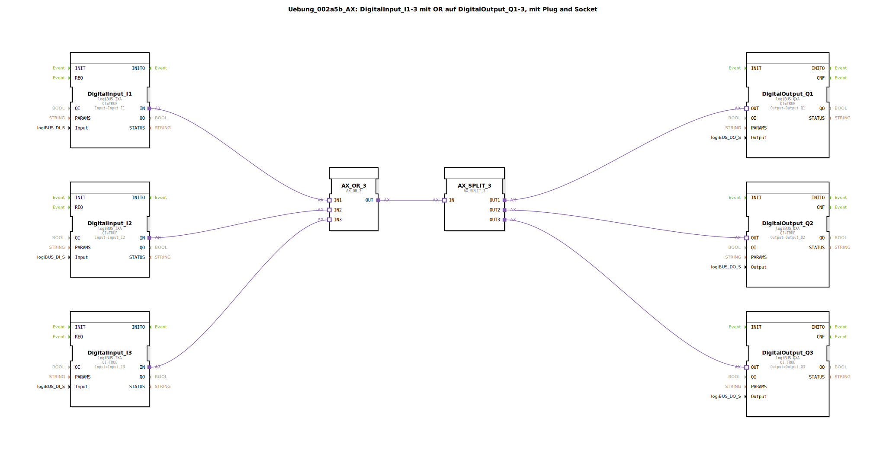

```markdown
# Uebung_002a5b_AX: DigitalInput_I1-3 mit OR auf DigitalOutput_Q1-3, mit Plug and Socket


<!-- Bild der Übung, falls vorhanden -->




* * * * * * * * * *
## Einleitung
Diese Übung demonstriert die grundlegende Verknüpfung von mehreren digitalen Eingängen mit mehreren digitalen Ausgängen. Dabei wird eine logische OR-Operation eingesetzt, um die Zustände der Eingänge zu verknüpfen. Das Ergebnis dieser Verknüpfung wird anschließend über einen Signalverteiler auf verschiedene digitale Ausgänge verteilt. Die Implementierung nutzt dabei das Konzept von Adapter-Funktionsbausteinen, um die boolesche Logik und die Signalverteilung zu realisieren.

## Verwendete Funktionsbausteine (FBs)
Die Übung `Uebung_002a5b_AX` verwendet eine Kombination aus spezifischen I/O-Bausteinen und generischen Logik- sowie Signalverteilungs-Bausteinen.

### Sub-Bausteine: logiBUS_IXA
- **Typ**: `logiBUS::io::DI::logiBUS_IXA` (repräsentiert durch Instanzen wie `DigitalInput_I1`, `DigitalInput_I2`, `DigitalInput_I3`)
- **Verwendete interne FBs**: Keine internen FBs in der bereitgestellten Definition sichtbar.
    - **Bausteinname**: DigitalInput_I1 (Beispielhafte Instanz)
        - Parameter: QI = TRUE
        - Parameter: Input = Input_I1
        - Ereignisausgang/-eingang: Wird intern für die Verarbeitung des Eingangsstatus genutzt; sendet typischerweise ein Datenereignis bei Wertänderung.
        - Datenausgang/-eingang: IN (Datenausgang, der den logischen Zustand des digitalen Eingangs liefert)
- **Funktionsweise**: Dieser Funktionsbaustein dient zum Einlesen des logischen Zustands eines spezifischen digitalen Eingangs. Er überwacht den zugewiesenen physikalischen Eingang (z.B. `Input_I1`) und stellt dessen aktuellen Status als booleschen Wert an seinem Datenausgang `IN` bereit.

### Sub-Bausteine: logiBUS_QXA
- **Typ**: `logiBUS::io::DQ::logiBUS_QXA` (repräsentiert durch Instanzen wie `DigitalOutput_Q1`, `DigitalOutput_Q2`, `DigitalOutput_Q3`)
- **Verwendete interne FBs**: Keine internen FBs in der bereitgestellten Definition sichtbar.
    - **Bausteinname**: DigitalOutput_Q1 (Beispielhafte Instanz)
        - Parameter: QI = TRUE
        - Parameter: Output = Output_Q1
        - Ereignisausgang/-eingang: Wird intern für die Verarbeitung des Ausgangsstatus genutzt; empfängt typischerweise ein Datenereignis zur Aktualisierung des Ausgangs.
        - Datenausgang/-eingang: OUT (Dateneingang, der den logischen Zustand zum Setzen des digitalen Ausgangs empfängt)
- **Funktionsweise**: Dieser Funktionsbaustein dient zur Ansteuerung eines spezifischen digitalen Ausgangs. Er setzt den Zustand des zugewiesenen physikalischen Ausgangs (z.B. `Output_Q1`) basierend auf dem booleschen Wert, der an seinem Dateneingang `OUT` anliegt.

### Sub-Bausteine: AX_OR_3
- **Typ**: `adapter::booleanOperators::AX_OR_3` (repräsentiert durch die Instanz `AX_OR_3`)
- **Verwendete interne FBs**: Keine internen FBs in der bereitgestellten Definition sichtbar.
    - **Bausteinname**: AX_OR_3
        - Parameter: Keine spezifischen Parameter für diese Instanz in der Definition vorhanden.
        - Ereignisausgang/-eingang: Überträgt Ereignisse synchron mit den Daten (Plug and Socket Adapter).
        - Datenausgang/-eingang: IN1, IN2, IN3 (Dateneingänge), OUT (Datenausgang)
- **Funktionsweise**: Dieser Baustein implementiert eine logische OR-Verknüpfung mit drei Eingängen. Der Datenausgang `OUT` wird `TRUE`, wenn mindestens einer der drei Dateneingänge (`IN1`, `IN2`, `IN3`) den Wert `TRUE` hat. Andernfalls ist der Ausgang `FALSE`.

### Sub-Bausteine: AX_SPLIT_3
- **Typ**: `adapter::events::unidirectional::AX_SPLIT_3` (repräsentiert durch die Instanz `AX_SPLIT_3`)
- **Verwendete interne FBs**: Keine internen FBs in der bereitgestellten Definition sichtbar.
    - **Bausteinname**: AX_SPLIT_3
        - Parameter: Keine spezifischen Parameter für diese Instanz in der Definition vorhanden.
        - Ereignisausgang/-eingang: Überträgt Ereignisse synchron mit den Daten (Plug and Socket Adapter).
        - Datenausgang/-eingang: IN (Dateneingang), OUT1, OUT2, OUT3 (Datenausgänge)
- **Funktionsweise**: Dieser Baustein dient als Signalverteiler. Er nimmt ein einzelnes Eingangssignal am Dateneingang `IN` entgegen und leitet es identisch und gleichzeitig an drei separate Datenausgänge (`OUT1`, `OUT2`, `OUT3`) weiter.

## Programmablauf und Verbindungen
Die Übung `Uebung_002a5b_AX` realisiert eine Steuerungslogik, bei der die Zustände von drei digitalen Eingängen über eine OR-Verknüpfung ausgewertet und das Ergebnis auf drei digitale Ausgänge verteilt wird.

1.  **Erfassung der Eingänge**: Die Funktionsbausteine `DigitalInput_I1`, `DigitalInput_I2` und `DigitalInput_I3` lesen kontinuierlich die Zustände der physikalischen Eingänge `Input_I1`, `Input_I2` und `Input_I3` ein. Ihre jeweiligen Datenausgänge (`DigitalInput_I1.IN`, `DigitalInput_I2.IN`, `DigitalInput_I3.IN`) stellen diese Zustände bereit.
2.  **Logische OR-Verknüpfung**: Die Datenausgänge der drei Eingangsbausteine werden direkt mit den Dateneingängen des OR-Bausteins `AX_OR_3` verbunden:
    *   `DigitalInput_I1.IN` ist mit `AX_OR_3.IN1` verbunden.
    *   `DigitalInput_I2.IN` ist mit `AX_OR_3.IN2` verbunden.
    *   `DigitalInput_I3.IN` ist mit `AX_OR_3.IN3` verbunden.
    Der `AX_OR_3` Baustein verknüpft diese drei booleschen Werte logisch. Das Ergebnis (`TRUE`, wenn I1 ODER I2 ODER I3 `TRUE` ist) wird an seinem Datenausgang `AX_OR_3.OUT` zur Verfügung gestellt.
3.  **Signalverteilung**: Der Datenausgang des OR-Bausteins (`AX_OR_3.OUT`) wird an den Dateneingang des Signalverteilers `AX_SPLIT_3` (`AX_SPLIT_3.IN`) angeschlossen. Der `AX_SPLIT_3` Baustein dupliziert dieses einzelne Steuersignal und leitet es an seine drei Datenausgänge (`AX_SPLIT_3.OUT1`, `AX_SPLIT_3.OUT2`, `AX_SPLIT_3.OUT3`) weiter.
4.  **Ansteuerung der Ausgänge**: Die Ausgänge des Signalverteilers sind jeweils mit den Eingängen der digitalen Ausgangsbausteine verbunden:
    *   `AX_SPLIT_3.OUT1` ist mit `DigitalOutput_Q1.OUT` verbunden.
    *   `AX_SPLIT_3.OUT2` ist mit `DigitalOutput_Q2.OUT` verbunden.
    *   `AX_SPLIT_3.OUT3` ist mit `DigitalOutput_Q3.OUT` verbunden.
    Dies bedeutet, dass alle drei digitalen Ausgänge `Output_Q1`, `Output_Q2` und `Output_Q3` den gleichen Zustand annehmen, der dem Ergebnis der OR-Verknüpfung der drei Eingänge entspricht.

**Lernziele**:
*   Verständnis und Anwendung von digitalen Eingangs- und Ausgangsbausteinen.
*   Implementierung grundlegender logischer Operationen (OR) in 4diac-IDE.
*   Nutzung von Signalverteilern (Splittern) zur effizienten Ansteuerung mehrerer Komponenten von einem einzigen Steuersignal.
*   Kennenlernen des Konzepts von Adapter-Bausteinen für flexible Verbindungen.

**Schwierigkeitsgrad**: Mittel. Grundkenntnisse in digitaler Logik und der Bedienung der 4diac-IDE sind von Vorteil.

**Benötigte Vorkenntnisse**: Vertrautheit mit den Grundlagen der Automatisierungstechnik und der Entwicklung von Anwendungen in der 4diac-IDE.

**Start der Übung**: Laden Sie die Applikation `Uebung_002a5b_AX` auf eine 4diac-kompatible Steuerung (SPS oder Laufzeitumgebung). Beobachten Sie das Verhalten der Ausgänge Q1, Q2 und Q3, wenn Sie die digitalen Eingänge I1, I2 oder I3 manuell schalten.

## Zusammenfassung
Die Übung `Uebung_002a5b_AX` bietet eine praktische Einführung in die Verknüpfung von digitalen I/O-Signalen. Sie demonstriert, wie mithilfe einer logischen OR-Operation mehrere Eingänge zu einem einzigen Steuersignal zusammengefasst werden können. Dieses Signal wird anschließend gesplittet, um eine synchronisierte Ansteuerung von mehreren Ausgängen zu ermöglichen. Das Kernprinzip ist, dass alle drei Ausgänge (Q1, Q2, Q3) aktiv werden, sobald mindestens einer der drei Eingänge (I1, I2, I3) aktiv ist. Diese Art der Gruppensteuerung ist eine grundlegende Funktion in vielen Automatisierungsanwendungen.
```