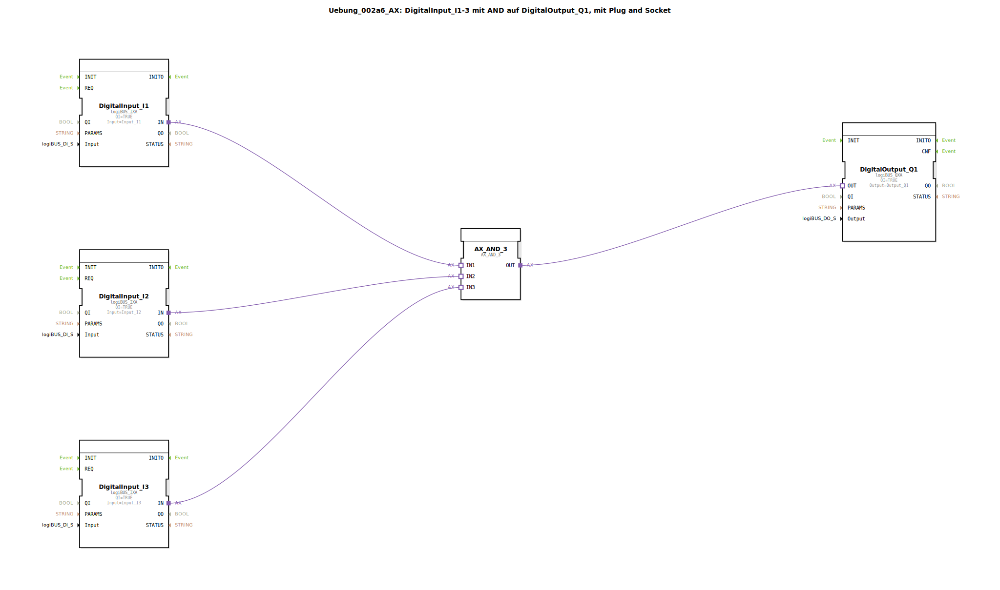

# Uebung_002a6_AX: DigitalInput_I1-3 mit AND auf DigitalOutput_Q1, mit Plug and Socket


[](https://notebooklm.google.com/notebook/041f4df4-b729-484d-b786-b6dcdf151961)

Dieser Artikel beschreibt die logiBUS®-Übung `Uebung_002a6_AX`. In dieser Übung wird eine logische UND-Verknüpfung (AND) mit drei Eingängen implementiert. Der digitale Ausgang wird nur dann aktiviert, wenn alle drei überwachten Eingänge gleichzeitig den Zustand "Wahr" (HIGH) führen.

----


## Ziel der Übung

Das Hauptziel dieser Übung ist die Umsetzung einer komplexeren Bedingungslogik. Es wird demonstriert, wie mehrere Sicherheits- oder Betriebsparameter kombiniert werden können, um eine Freigabe für einen Aktor zu erteilen. Dies ist eine typische Anforderung in der industriellen Steuerungstechnik, um sicherzustellen, dass mehrere Voraussetzungen erfüllt sind, bevor eine Aktion ausgeführt wird.

-----

## Beschreibung und Komponenten

[cite_start]Die Subapplikation `Uebung_002a6_AX.SUB` nutzt einen 3-fach-UND-Baustein, um drei digitale Eingänge mit einem Ausgang zu verknüpfen[cite: 1].

### Funktionsbausteine (FBs)

Folgende Bausteine werden verwendet:




  * **`DigitalInput_I1`, `I2`, `I3`**: Drei Instanzen des Typs `logiBUS_IXA`. [cite_start]Diese erfassen die Zustände der physischen Eingänge `Input_I1` bis `Input_I3`[cite: 1].
  * **`AX_AND_3`**: Eine Instanz des Typs `AX_AND_3`. [cite_start]Dieser Baustein führt die logische UND-Operation für drei Adapter-Eingänge (`IN1`, `IN2`, `IN3`) aus und stellt das Ergebnis am Adapter-Ausgang `OUT` bereit[cite: 1].
  * **`DigitalOutput_Q1`**: Eine Instanz des Typs `logiBUS_QXA`. [cite_start]Dieser Baustein steuert den Hardware-Ausgang `Output_Q1`[cite: 1].

### Adapter-Schnittstelle: `AX.adp`

[cite_start]Wie in den vorherigen Übungen wird der Adapter-Typ `AX` verwendet, um Ereignisse und Datenwerte gekapselt durch die Logik zu leiten[cite: 2].

-----

## Funktionsweise

Die Logik wird durch die Verschaltung der drei Eingangsbausteine mit dem UND-Logik-Baustein in der Subapplikation realisiert. Der Aufbau in `Uebung_002a6_AX.SUB` ist wie folgt definiert:

```xml
<AdapterConnections>
    <Connection Source="DigitalInput_I1.IN" Destination="AX_AND_3.IN1"/>
    <Connection Source="DigitalInput_I2.IN" Destination="AX_AND_3.IN2"/>
    <Connection Source="DigitalInput_I3.IN" Destination="AX_AND_3.IN3"/>
    <Connection Source="AX_AND_3.OUT" Destination="DigitalOutput_Q1.OUT"/>
</AdapterConnections>
```

[cite_start][cite: 1]

Der funktionale Ablauf:
1.  Der Baustein `AX_AND_3` überwacht alle drei Adapter-Eingänge auf Zustandsänderungen.
2.  Nur wenn alle drei Eingänge (`I1` AND `I2` AND `I3`) gleichzeitig den Datenwert `D1 = TRUE` führen, wird der Ausgang `OUT` ebenfalls auf `TRUE` gesetzt.
3.  Sobald auch nur einer der drei Eingänge auf `FALSE` geht, wird der Ausgang sofort deaktiviert.
4.  Der Baustein `DigitalOutput_Q1` schaltet den physischen Ausgang `Q1` entsprechend dem logischen Ergebnis.

-----

## Anwendungsbeispiel

Ein typisches Anwendungsbeispiel ist eine **Maschinenfreigabe mit mehreren Sicherheitsbedingungen**:

Damit eine Maschine (`Q1`) starten darf, müssen drei Bedingungen erfüllt sein: Die Schutztür muss geschlossen sein (`I1`), der Not-Halt muss entriegelt sein (`I2`) und der Bediener muss den Starttaster drücken (`I3`). Erst wenn alle drei Signale gleichzeitig "Wahr" sind, gibt die Steuerung den Betrieb frei. Dies gewährleistet ein Höchstmaß an Sicherheit für Mensch und Maschine.