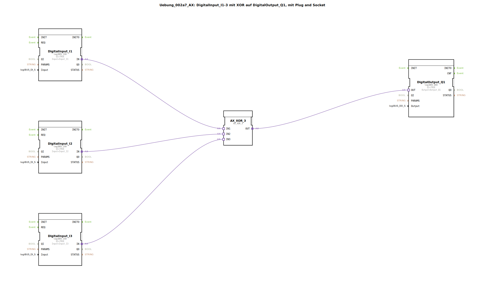

# Uebung_002a7_AX: DigitalInput_I1-3 mit XOR auf DigitalOutput_Q1, mit Plug and Socket


[](https://notebooklm.google.com/notebook/041f4df4-b729-484d-b786-b6dcdf151961)

Dieser Artikel beschreibt die logiBUS®-Übung `Uebung_002a7_AX`. In dieser Übung wird eine exklusive ODER-Verknüpfung (XOR) mit drei Eingängen realisiert. Der Ausgang wird aktiviert, wenn eine ungerade Anzahl von Eingängen aktiv ist.

----


## Ziel der Übung




Das Hauptziel dieser Übung ist die Demonstration der XOR-Logik bei mehr als zwei Eingängen. Im Gegensatz zur normalen ODER-Verknüpfung, bei der der Ausgang bei *mindestens* einem aktiven Eingang einschaltet, reagiert die XOR-Logik auf die Parität der Eingangssignale. Dies wird oft für Wechselschaltungen oder Paritätsprüfungen verwendet.

-----

## Beschreibung und Komponenten

[cite_start]Die Subapplikation `Uebung_002a7_AX.SUB` nutzt einen 3-fach-XOR-Baustein, um drei digitale Eingänge mit einem Ausgang zu verknüpfen[cite: 1].

### Funktionsbausteine (FBs)

Folgende Bausteine werden eingesetzt:

  * **`DigitalInput_I1`, `I2`, `I3`**: Drei Instanzen des Typs `logiBUS_IXA`. [cite_start]Diese erfassen die Hardware-Eingänge `Input_I1` bis `Input_I3`[cite: 1].
  * **`AX_XOR_3`**: Eine Instanz des Typs `AX_XOR_3`. [cite_start]Dieser Baustein führt die exklusive ODER-Operation auf drei Adapter-Eingängen (`IN1`, `IN2`, `IN3`) aus und stellt das Ergebnis am Adapter-Ausgang `OUT` bereit[cite: 1].
  * **`DigitalOutput_Q1`**: Eine Instanz des Typs `logiBUS_QXA`. [cite_start]Dieser Baustein steuert den Hardware-Ausgang `Output_Q1`[cite: 1].

### Adapter-Schnittstelle: `AX.adp`

[cite_start]Der Adapter-Typ `AX` bündelt auch hier Ereignis und Datenwert für eine effiziente Logikverarbeitung[cite: 2].

-----

## Funktionsweise

Die Logik wird durch die Verschaltung der Eingangsbausteine mit dem XOR-Logik-Baustein in der Subapplikation definiert. Der Aufbau in `Uebung_002a7_AX.SUB` sieht wie folgt aus:

```xml
<AdapterConnections>
    <Connection Source="DigitalInput_I1.IN" Destination="AX_XOR_3.IN1"/>
    <Connection Source="DigitalInput_I2.IN" Destination="AX_XOR_3.IN2"/>
    <Connection Source="DigitalInput_I3.IN" Destination="AX_XOR_3.IN3"/>
    <Connection Source="AX_XOR_3.OUT" Destination="DigitalOutput_Q1.OUT"/>
</AdapterConnections>
```

[cite_start][cite: 1]

Die XOR-Logik mit drei Eingängen verhält sich wie folgt:
*   Der Ausgang ist **TRUE**, wenn genau **ein** Eingang aktiv ist.
*   Der Ausgang ist **TRUE**, wenn alle **drei** Eingänge aktiv sind.
*   Der Ausgang ist **FALSE**, wenn kein Eingang oder genau zwei Eingänge aktiv sind.

Dies entspricht der mathematischen Definition der XOR-Verknüpfung als ungerade Parität.

-----

## Anwendungsbeispiel

Ein klassisches Anwendungsbeispiel ist eine **Kreuzschaltung mit drei Schaltern**:

In einem Raum mit drei Türen gibt es an jeder Tür einen Schalter (`I1`, `I2`, `I3`). Das Licht (`Q1`) soll von jeder Tür aus ein- und ausgeschaltet werden können, unabhängig vom Zustand der anderen Schalter. Jede Betätigung eines beliebigen Schalters ändert den Zustand des Lichts (von An zu Aus oder umgekehrt). Dies wird durch die Paritätslogik der XOR-Verknüpfung perfekt realisiert.