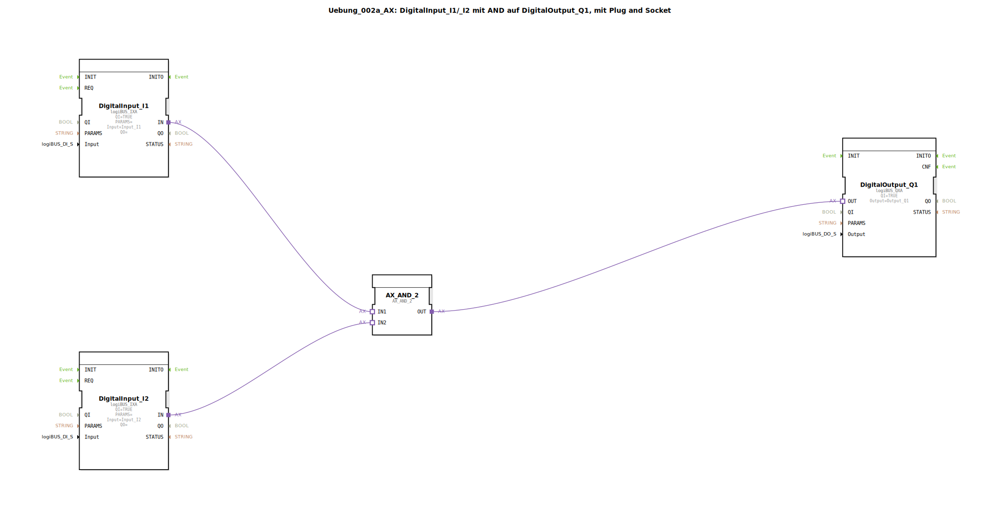

# Uebung_002a_AX: DigitalInput_I1/_I2 mit AND auf DigitalOutput_Q1, mit Plug and Socket


[](https://notebooklm.google.com/notebook/041f4df4-b729-484d-b786-b6dcdf151961)

Dieser Artikel beschreibt die logiBUS®-Übung `Uebung_002a_AX`. In dieser Übung wird eine klassische UND-Verknüpfung (AND) realisiert, bei der ein digitaler Ausgang nur dann aktiviert wird, wenn zwei digitale Eingänge gleichzeitig den Zustand "Wahr" (HIGH) führen.

----


## Ziel der Übung

Das Hauptziel dieser Übung ist die Implementierung einer grundlegenden logischen Entscheidungsstruktur. Es wird gezeigt, wie Signale von mehreren Sensoren (Eingängen) kombiniert werden können, um eine Aktion an einem Aktor (Ausgang) auszulösen. Dies ist ein fundamentaler Baustein jeder Steuerungsprogrammierung.

-----

## Beschreibung und Komponenten

[cite_start]Die Subapplikation `Uebung_002a_AX.SUB` verknüpft zwei digitale Eingänge über einen Logik-Baustein mit einem digitalen Ausgang[cite: 1].

### Funktionsbausteine (FBs)

Folgende Bausteine werden verwendet:




  * **`DigitalInput_I1` & `DigitalInput_I2`**: Instanzen des Typs `logiBUS_IXA`. [cite_start]Diese repräsentieren die beiden Hardware-Eingänge, die überwacht werden[cite: 1].
  * **`AX_AND_2`**: Eine Instanz des Typs `AX_AND_2`. [cite_start]Dieser Baustein führt die logische UND-Operation direkt auf den Adapter-Schnittstellen aus. Er besitzt zwei Adapter-Eingänge (`IN1`, `IN2`) und einen Adapter-Ausgang (`OUT`)[cite: 1].
  * **`DigitalOutput_Q1`**: Eine Instanz des Typs `logiBUS_QXA`. [cite_start]Dieser Baustein steuert den Hardware-Ausgang `Output_Q1` basierend auf dem Ergebnis der Logik[cite: 1].

### Adapter-Schnittstelle: `AX.adp`

[cite_start]Die gesamte Signalverarbeitung erfolgt über den Adapter-Typ `AX`, wodurch Ereignisse und Datenwerte effizient durch das Netzwerk geleitet werden[cite: 2].

-----

## Funktionsweise

Die Logik wird durch die Verschaltung der Adapter-Anschlüsse in der Subapplikation festgelegt. Der Aufbau in `Uebung_002a_AX.SUB` ist wie folgt definiert:

```xml
<AdapterConnections>
    <Connection Source="DigitalInput_I1.IN" Destination="AX_AND_2.IN1"/>
    <Connection Source="DigitalInput_I2.IN" Destination="AX_AND_2.IN2"/>
    <Connection Source="AX_AND_2.OUT" Destination="DigitalOutput_Q1.OUT"/>
</AdapterConnections>
```

[cite_start][cite: 1]

Der Prozess folgt dieser Logik:
1.  Der Baustein `AX_AND_2` überwacht beide Adapter-Eingänge.
2.  Nur wenn beide Eingänge (`IN1` AND `IN2`) den Datenwert `D1 = TRUE` führen, setzt der Baustein seinen Ausgang `OUT` ebenfalls auf `TRUE` und sendet ein Ereignis.
3.  Sobald einer der Eingänge auf `FALSE` geht, wird auch der Ausgang sofort auf `FALSE` gesetzt.
4.  Der Baustein `DigitalOutput_Q1` reagiert unmittelbar auf die Zustandsänderungen am Ausgang des Logik-Bausteins.

-----

## Anwendungsbeispiel

Ein klassisches Anwendungsbeispiel ist die **Zweihandbedienung zur Sicherheit**:

Um eine gefährliche Maschine (z.B. eine Presse) zu starten, muss der Bediener zwei räumlich getrennte Taster (`I1` und `I2`) gleichzeitig drücken. Dies stellt sicher, dass sich beide Hände des Bedieners außerhalb des Gefahrenbereichs befinden. Nur wenn beide Taster aktiv sind, gibt der `AX_AND_2`-Baustein das Signal an den Ausgang `Q1` (den Motor der Presse) frei.