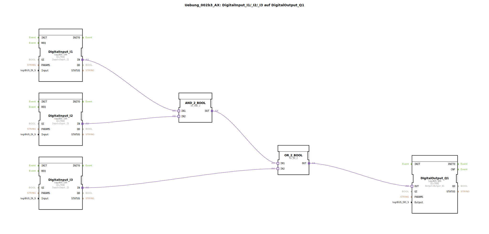

# Uebung_002b3_AX: DigitalInput_I1/_I2/_I3 auf DigitalOutput_Q1


[](https://notebooklm.google.com/notebook/041f4df4-b729-484d-b786-b6dcdf151961)

Dieser Artikel beschreibt die logiBUS®-Übung `Uebung_002b3_AX`. In dieser Übung wird eine kombinatorische Logikschaltung implementiert, die zwei Grundoperationen (UND und ODER) miteinander verknüpft, um eine komplexere Schaltbedingung zu erfüllen.

----


## Ziel der Übung

Das Hauptziel dieser Übung ist die hierarchische Verknüpfung von Logikbausteinen. Es wird gezeigt, wie Teilergebnisse einer logischen Operation (hier ein AND) als Eingangsgröße für eine weitere Operation (hier ein OR) dienen können. Dies ermöglicht die Abbildung beliebig komplexer logischer Ausdrücke in der Steuerungstechnik.

-----

## Beschreibung und Komponenten

[cite_start]Die Subapplikation `Uebung_002b3_AX.SUB` realisiert die logische Funktion `Q1 = (I1 AND I2) OR I3` unter Verwendung von Adapter-Logikbausteinen[cite: 1].

### Funktionsbausteine (FBs)

In der Subapplikation werden folgende Komponenten instanziiert:




  * **`DigitalInput_I1`, `I2`, `I3`**: Instanzen des Typs `logiBUS_IXA`. [cite_start]Sie liefern die Eingangssignale für die Logikkette[cite: 1].
  * **`AND_2_BOOL`**: Eine Instanz des Typs `AX_AND_2`. [cite_start]Verknüpft die Eingänge `I1` und `I2`[cite: 1].
  * **`OR_2_BOOL`**: Eine Instanz des Typs `AX_OR_2`. [cite_start]Verknüpft das Ergebnis des UND-Bausteins mit dem dritten Eingang `I3`[cite: 1].
  * **`DigitalOutput_Q1`**: Eine Instanz des Typs `logiBUS_QXA`. [cite_start]Gibt das Endergebnis der kombinatorischen Logik an den Hardware-Ausgang aus[cite: 1].

### Adapter-Schnittstelle: `AX.adp`

[cite_start]Durch die konsequente Verwendung von Adapter-Bausteinen kann auf explizite Event-Daten-Konverter (wie `F_MOVE`) verzichtet werden, da die `AX`-Bausteine beides intern handhaben[cite: 1].

-----

## Funktionsweise

Die hierarchische Struktur der Logik wird durch die Verschaltung der Adapter-Verbindungen in der Subapplikation `Uebung_002b3_AX.SUB` deutlich:

```xml
<AdapterConnections>
    <Connection Source="DigitalInput_I1.IN" Destination="AND_2_BOOL.IN1"/>
    <Connection Source="DigitalInput_I2.IN" Destination="AND_2_BOOL.IN2"/>
    <Connection Source="AND_2_BOOL.OUT" Destination="OR_2_BOOL.IN1"/>
    <Connection Source="DigitalInput_I3.IN" Destination="OR_2_BOOL.IN2"/>
    <Connection Source="OR_2_BOOL.OUT" Destination="DigitalOutput_Q1.OUT"/>
</AdapterConnections>
```

[cite_start][cite: 1]

Der funktionale Ablauf:
1.  Das System berechnet zuerst das Teilergebnis der UND-Verknüpfung von `I1` und `I2`.
2.  Dieses Teilergebnis wird an den ersten Eingang des ODER-Bausteins gereicht.
3.  Der ODER-Baustein vergleicht dieses Teilergebnis mit dem direkten Signal von `I3`.
4.  Der Ausgang `Q1` wird aktiviert, wenn entweder beide ersten Eingänge (`I1` AND `I2`) aktiv sind ODER wenn der dritte Eingang (`I3`) aktiv ist.

-----

## Anwendungsbeispiel

Ein typisches Anwendungsbeispiel ist eine **Anlagenfreigabe mit Überbrückung**:

Ein Motor (`Q1`) soll normalerweise nur laufen, wenn zwei Sensoren (`I1` und `I2`) gleichzeitig grünes Licht geben (z.B. Öldruck erreicht UND Temperatur ok). Für Wartungszwecke oder im Notbetrieb soll der Motor jedoch auch dann gestartet werden können, wenn ein spezieller Schlüsselschalter (`I3`) betätigt wird, der die normale Logik überbrückt (Bypass). Diese Anforderung wird durch die `(I1 AND I2) OR I3` Logik exakt erfüllt.