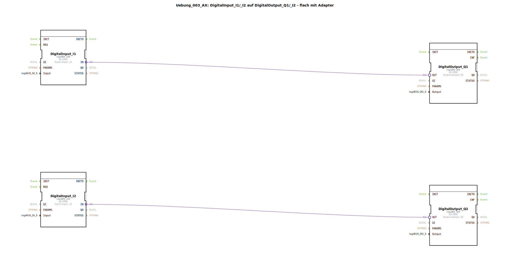

# Uebung_003_AX: DigitalInput_I1/_I2 auf DigitalOutput_Q1/_I2 - flach mit Adapter


[](https://notebooklm.google.com/notebook/041f4df4-b729-484d-b786-b6dcdf151961)

Dieser Artikel beschreibt die logiBUS®-Übung `Uebung_003_AX`. In dieser Übung werden zwei voneinander unabhängige Signalpfade realisiert, bei denen jeweils ein digitaler Eingang direkt einen zugeordneten digitalen Ausgang steuert.

----


## Ziel der Übung

Das Hauptziel dieser Übung ist es, die parallele Verarbeitung von Signalen in der IEC 61499 zu demonstrieren. Anders als in sequenziellen Programmiermodellen (wie z.B. klassischen SPS-Zyklen in AWL), arbeiten die Funktionsbausteine in 4diac ereignisbasiert und unabhängig voneinander. Dies ermöglicht es, mehrere Steuerungsaufgaben gleichzeitig und ohne gegenseitige Beeinflussung in einer einzigen Subapplikation abzubilden.

-----

## Beschreibung und Komponenten

[cite_start]Die Subapplikation `Uebung_003_AX.SUB` definiert zwei separate "Stränge" der Signalverarbeitung, die parallel existieren[cite: 1].

### Funktionsbausteine (FBs)

Es werden zwei Paare von Ein- und Ausgangsbausteinen verwendet:




  * **`DigitalInput_I1` & `DigitalOutput_Q1`**: Das erste Paar (Kanal 1). [cite_start]Verbindet Hardware-Eingang `I1` mit Hardware-Ausgang `Q1`[cite: 1].
  * **`DigitalInput_I2` & `DigitalOutput_Q2`**: Das zweite Paar (Kanal 2). [cite_start]Verbindet Hardware-Eingang `I2` mit Hardware-Ausgang `Q2`[cite: 1].

### Adapter-Schnittstelle: `AX.adp`

[cite_start]Beide Verbindungen nutzen die standardisierte Adapter-Schnittstelle `AX` für die Kommunikation[cite: 1].

-----

## Funktionsweise

Die Unabhängigkeit der beiden Kanäle wird durch die getrennten Adapter-Verbindungen in der Subapplikation `Uebung_003_AX.SUB` sichergestellt:

```xml
<AdapterConnections>
    <Connection Source="DigitalInput_I1.IN" Destination="DigitalOutput_Q1.OUT"/>
    <Connection Source="DigitalInput_I2.IN" Destination="DigitalOutput_Q2.OUT"/>
</AdapterConnections>
```

[cite_start][cite: 1]

Der funktionale Ablauf:
1.  Ändert sich der Zustand von `I1`, sendet `DigitalInput_I1` ein Ereignis direkt an `DigitalOutput_Q1`. Der Ausgang `Q1` schaltet.
2.  Ändert sich der Zustand von `I2`, sendet `DigitalInput_I2` ein Ereignis direkt an `DigitalOutput_Q2`. Der Ausgang `Q2` schaltet.

Diese beiden Prozesse laufen völlig asynchron ab. Eine hohe Schaltfrequenz auf Kanal 1 hat keinen Einfluss auf die Reaktionszeit oder Funktion von Kanal 2.

-----

## Anwendungsbeispiel

Ein einfaches Anwendungsbeispiel ist die **Steuerung von zwei unabhängigen Pumpen**:

In einem Pumpwerk gibt es zwei identische Pumpen, die jeweils über einen eigenen Vor-Ort-Schalter bedient werden. Schalter 1 (`I1`) startet Pumpe 1 (`Q1`), und Schalter 2 (`I2`) startet Pumpe 2 (`Q2`). Obwohl beide Steuerungen in demselben Steuerungsprogramm laufen, operieren sie logisch völlig getrennt voneinander. Fällt ein Sensor aus, bleibt der andere Kreis voll funktionsfähig.