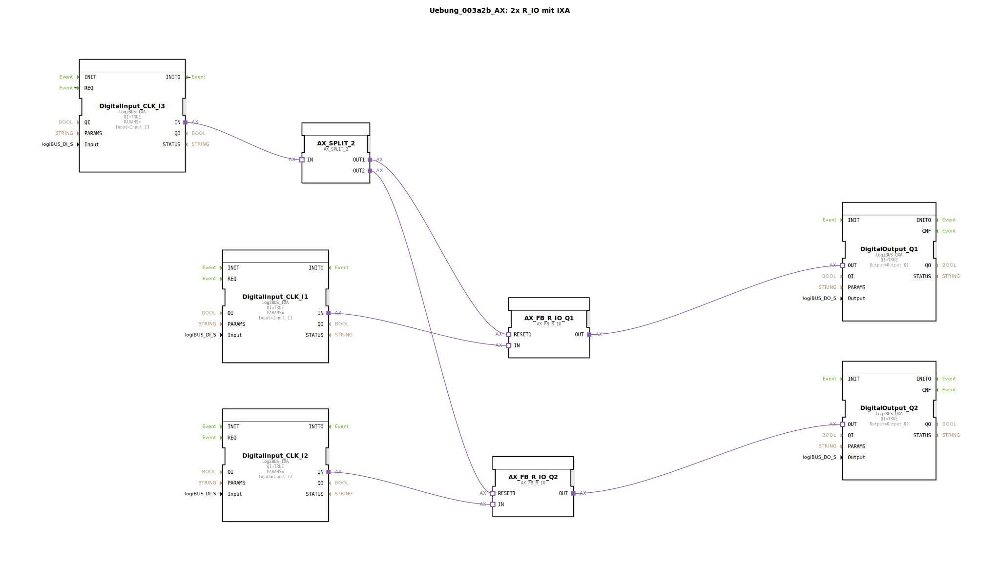

# Uebung_003a2b_AX: 2x R_IO mit IXA

* * * * * * * * * *

## Einleitung

Diese Übung demonstriert die Steuerung von zwei digitalen Ausgängen (Q1 und Q2) über jeweils einen Rücksetz-Set-Funktionsbaustein (AX_FB_R_IO). Die Rücksetzeingänge beider Bausteine werden gemeinsam über einen dritten Digitaleingang (I3) gesteuert, der als „Hausmeister-Aus“ fungiert. Ein AX_SPLIT_2 verteilt das Rücksetzsignal auf beide Kanäle.

Ziel ist es, das Zusammenspiel von monostabilen Elementen (R_IO) mit Hardware-Ein- und Ausgängen sowie die Realisierung einer gemeinsamen Rücksetzfunktion zu verstehen.

## Verwendete Funktionsbausteine (FBs)

### Sub-Bausteine: logiBUS-IXA (Digitaleingänge)

- **Typ**: `logiBUS::io::DI::logiBUS_IXA`
- **Verwendet als**: 
  - `DigitalInput_CLK_I1` – Eingang I1 (Set für Q1)
  - `DigitalInput_CLK_I2` – Eingang I2 (Set für Q2)
  - `DigitalInput_CLK_I3` – Eingang I3 (gemeinsames Reset)
- **Parameter**: 
  - `QI` = `TRUE` (aktiviert)
  - `Input` = `Input_I1`, `Input_I2`, `Input_I3` (Hardware-Kanäle)
  - `PARAMS` = leer (nicht sichtbar)
- **Funktionsweise**: Wandelt ein physikalisches Digitalsignal (z. B. Taster oder Schalter) in ein logisches Adaptersignal um. Der Ausgang `IN` gibt den aktuellen Zustand des Eingangs weiter.

### Sub-Bausteine: logiBUS-QXA (Digitalausgänge)

- **Typ**: `logiBUS::io::DQ::logiBUS_QXA`
- **Verwendet als**: 
  - `DigitalOutput_Q1` – Ausgang Q1
  - `DigitalOutput_Q2` – Ausgang Q2
- **Parameter**: 
  - `QI` = `TRUE` (freigegeben)
  - `Output` = `Output_Q1`, `Output_Q2` (Hardware-Kanäle)
- **Funktionsweise**: Setzt einen physikalischen Ausgang (z. B. Lampe, Relais) entsprechend dem anliegenden Adaptersignal am Adaptereingang `OUT`.

### Sub-Baustein: AX_FB_R_IO (monostabiles Element mit Reset)

- **Typ**: `adapter::monostableElements::AX_FB_R_IO`
- **Verwendet als**: 
  - `AX_FB_R_IO_Q1` – für Q1
  - `AX_FB_R_IO_Q2` – für Q2
- **Verwendete interne FBs**: Keine weiteren sichtbaren internen FBs – es handelt sich um einen vorgefertigten Baustein.
- **Adapter**:
  - **Eingang `IN`**: Set-Signal (aktiviert Ausgang)
  - **Eingang `RESET1`**: Rücksetzsignal (deaktiviert Ausgang)
  - **Ausgang `OUT`**: gesteuerter Zustand (1 = gesetzt, 0 = zurückgesetzt)
- **Funktionsweise**: Der Ausgang `OUT` wird gesetzt, sobald ein positiver Flanke am Eingang `IN` anliegt. Er bleibt gesetzt, bis ein Signal am `RESET1`-Eingang (aktiv high) eintrifft. Dies realisiert ein einfaches RS-Flipflop. Der Kommentar im Netzwerk weist darauf hin: „wird an RESET1 nichts angeschlossen: ist der Baustein Funktionsfähig.“ Das bedeutet, ohne Reset bleibt der Ausgang nach einmaligem Setzen dauerhaft an.

### Sub-Baustein: AX_SPLIT_2 (Signalverteiler)

- **Typ**: `adapter::events::unidirectional::AX_SPLIT_2`
- **Verwendet als**: `AX_SPLIT_2`
- **Adapter**:
  - **Eingang `IN`**: eingehendes Signal
  - **Ausgang `OUT1`**, **Ausgang `OUT2`**: zwei identische Ausgänge
- **Funktionsweise**: Verteilt das ankommende Adaptersignal unverändert auf zwei Ausgänge. Hier wird das Rücksetzsignal von I3 auf beide `AX_FB_R_IO`-Bausteine aufgeteilt.

## Programmablauf und Verbindungen

1. **Signalfluss**:  
   - Die Taster an `Input_I1` und `Input_I2` steuern jeweils einen `AX_FB_R_IO`-Baustein (Set).  
   - Die Ausgänge dieser Bausteine verbinden die Digitalausgänge `Output_Q1` und `Output_Q2`.  
   - Der dritte Taster an `Input_I3` dient als gemeinsames Rücksetzsignal: Er wird über `AX_SPLIT_2` gleichzeitig auf die `RESET1`-Eingänge beider `AX_FB_R_IO`-Bausteine verteilt.

2. **Funktionsweise**:  
   - Durch Drücken von I1 oder I2 wird der zugehörige Ausgang eingeschaltet und bleibt an (self‑holding).  
   - Durch Drücken von I3 werden beide Ausgänge ausgeschaltet („Hausmeister-Aus“).  
   - Im Netzwerk ist vermerkt, dass I3 ein **rastender** Schalter sein sollte, da sonst der Ausgang nur während des Tastendrucks aus ist. Alternativ könnte man durch eine AND‑Verknüpfung einen Zustimmschalter realisieren (siehe Kommentare).

3. **Besonderheiten**:  
   - Die logiBUS‑Bausteine benötigen ein `QI`-Signal (`TRUE`), um aktiv zu sein.  
   - Der `AX_FB_R_IO` kann auch ohne angeschlossenen Reset betrieben werden – dann bleibt der Ausgang nach einmaligem Setzen dauerhaft an (wie ein RS‑Flipflop ohne Reset).

**Lernziele**:  
- Verständnis von Rücksetz‑Set‑Funktionsbausteinen (`AX_FB_R_IO`)  
- Umgang mit Hardware‑Ein‑/Ausgangsbausteinen (logiBUS)  
- Signalverteilung mit `AX_SPLIT_2`  
- Einfache Verknüpfung von digitalen Signalen zu einer Steuerung

**Schwierigkeitsgrad**: Mittel – grundlegende Kenntnisse der 4diac-IDE und des IEC 61499-Modells werden vorausgesetzt.

**Übung starten**:  
Laden Sie die Datei `Uebung_003a2b_AX.fbt` in die 4diac-IDE. Die übrigen Bausteine (logiBUS‑Treiber, `AX_FB_R_IO`, `AX_SPLIT_2`) müssen im Projekt vorhanden sein. Verbinden Sie die Hardware-Kanäle entsprechend der Parameter (I1, I2, I3, Q1, Q2).

## Zusammenfassung

Die Übung zeigt eine robuste Schaltung zur Steuerung zweier Ausgänge mit einem gemeinsamen Rücksetzsignal. Der Vorteil des verwendeten `AX_FB_R_IO`-Bausteins liegt in seiner einfachen Handhabung: Ohne angeschlossenen Reset verhält er sich wie ein RS‑Flipflop, mit Reset als dominantem Rücksetzeingang. Die Aufteilung des Rücksetzsignals über `AX_SPLIT_2` macht die Schaltung übersichtlich und erweiterbar. Die „Hausmeister-Aus“-Funktion ist ein praxisnahes Beispiel für eine Sicherheitsabschaltung.