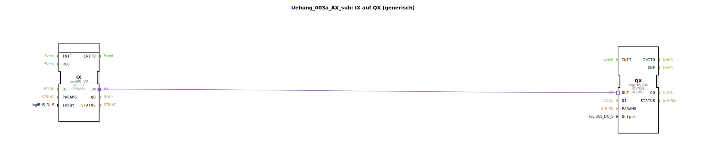

Hier ist die Dokumentation für die Übung basierend auf den bereitgestellten XML-Daten:

# Uebung_003a_AX_sub: IX auf QX (generisch)

* * * * * * * * * *

## Einleitung
Diese Übung behandelt eine Sub-Application (`SubAppType`), die eine generische Verbindung zwischen einem logiBUS-Eingang und einem logiBUS-Ausgang herstellt. Der Baustein dient dazu, ein Signal von einem definierten Hardware-Eingang direkt auf einen definierten Hardware-Ausgang durchzuschleifen (Mapping von IX auf QX).

## Verwendete Funktionsbausteine (FBs)

In dieser Übung wird eine Sub-Application definiert, die intern auf spezifische Hardware-Treiberbausteine des logiBUS-Systems zugreift.

### Sub-Bausteine: Uebung_003a_AX_sub
- **Typ**: SubAppType
- **Verwendete interne FBs**:
    - **QX**: `logiBUS::io::DQ::logiBUS_QXA`
        - **Parameter**: `QI` = `TRUE` (Baustein ist aktiviert)
        - **Dateneingang**: `Output` (Verbunden mit dem SubApp-Eingang `Output` zur Identifikation des Hardware-Ausgangs)
        - **Adaptereingang**: `OUT` (Empfängt das Signal vom Eingangsbaustein)
    - **IX**: `logiBUS::io::DI::logiBUS_IXA`
        - **Parameter**: `QI` = `TRUE` (Baustein ist aktiviert)
        - **Dateneingang**: `Input` (Verbunden mit dem SubApp-Eingang `Input` zur Identifikation des Hardware-Eingangs)
        - **Adapterausgang**: `IN` (Sendet das Signal an den Ausgangsbaustein)

- **Funktionsweise**:
    Dieser Sub-Baustein kapselt die Logik, um einen digitalen Eingang hardwareunabhängig mit einem digitalen Ausgang zu verknüpfen. Über die Schnittstelle der Sub-Application werden lediglich die Identifikatoren für den gewünschten Eingang (`Input`) und Ausgang (`Output`) übergeben.

## Programmablauf und Verbindungen

Der Ablauf innerhalb der Sub-Application gestaltet sich wie folgt:

1.  **Konfiguration**:
    - Über den Eingang `Input` (Typ: `logiBUS_DI_S`) wird festgelegt, welcher physische Eingang (z.B. I1..I8) gelesen werden soll. Dieser Wert wird an den internen Baustein `IX` weitergeleitet.
    - Über den Eingang `Output` (Typ: `logiBUS_DO_S`) wird festgelegt, welcher physische Ausgang (z.B. Q1..Q8) geschaltet werden soll. Dieser Wert wird an den internen Baustein `QX` weitergeleitet.

2.  **Signalverarbeitung**:
    - Die eigentliche Signalübertragung erfolgt über eine **Adapterverbindung**.
    - Der Adapter-Ausgang `IN` des Eingangsbausteins `IX` ist direkt mit dem Adapter-Eingang `OUT` des Ausgangsbausteins `QX` verbunden.
    - Durch diese direkte Verbindung wird der logische Zustand des konfigurierten Eingangs unmittelbar auf den konfigurierten Ausgang gespiegelt.

3.  **Initialisierung**:
    - Beide internen Bausteine (`IX` und `QX`) sind dauerhaft aktiviert, da ihre `QI`-Eingänge fest auf `TRUE` gesetzt sind.

**Lernziele:**
- Verständnis von Sub-Applications zur Kapselung von Logik.
- Verwendung von generischen logiBUS-Bausteinen (`_IXA`, `_QXA`).
- Einsatz von Adapterverbindungen zur direkten Kopplung von Hardware-Abstraktionsschichten.

## Zusammenfassung
Die `Uebung_003a_AX_sub` stellt einen wiederverwendbaren Baustein dar, der als "Durchgangsverbinder" fungiert. Er liest einen spezifizierten digitalen Eingang und schreibt dessen Zustand direkt auf einen spezifizierten digitalen Ausgang, ohne dass dazwischen eine weitere logische Verarbeitung stattfindet. Dies eignet sich hervorragend für einfache I/O-Tests oder direkte Hardware-Verknüpfungen.