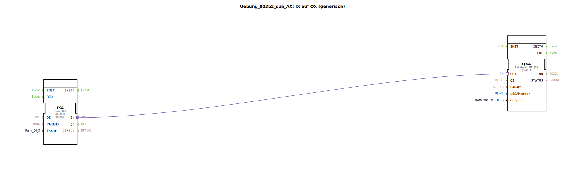

Hier ist die Dokumentation für die Übung `Uebung_003b2_sub_AX`, basierend auf dem bereitgestellten XML-Inhalt.

# Uebung_003b2_sub_AX: IX auf QX (generisch)

*(Platzhalter für Bild der Übung, falls vorhanden)*

* * * * * * * * * *

## Einleitung

Die Sub-Applikation `Uebung_003b2_sub_AX` dient als generischer Baustein, um einen Eingang (IX) direkt auf einen Ausgang (QX) zu mappen. Sie fungiert als Verbindungsglied zwischen Funkeingängen (`Funk::io::DI`) und DataPanel-Ausgängen (`DataPanel::io::MI::DQ`). Der Hauptzweck ist die Weiterleitung eines Signals von einer definierten Eingabequelle zu einem definierten Ausgabeziel über eine Adapterverbindung.

## Verwendete Funktionsbausteine (FBs)

Diese Sub-Applikation kapselt die Logik für die Signalweiterleitung. Nachfolgend werden die internen Komponenten und deren Konfiguration beschrieben.

### Sub-Bausteine: Uebung_003b2_sub_AX

- **Typ**: SubAppType
- **Verwendete interne FBs**:
    - **QXA**: `DataPanel::io::MI::DQ::DataPanel_MI_QXA`
        - Parameter: `QI` = `TRUE` (Baustein ist aktiv)
        - Dateneingang: `u8SAMember` (verbunden mit externer Variable `u8SAMember`)
        - Dateneingang: `Output` (verbunden mit externer Variable `Output`)
        - Adaptereingang: `OUT` (verbunden mit `IXA.IN`)
    - **IXA**: `Funk::io::DI::Funk_IXA`
        - Parameter: `QI` = `TRUE` (Baustein ist aktiv)
        - Parameter: `PARAMS` = `""` (Leerstring, ggf. unsichtbar geschaltet)
        - Dateneingang: `Input` (verbunden mit externer Variable `Input`)
        - Adapterausgang: `IN` (verbunden mit `QXA.OUT`)

- **Funktionsweise**:
    Der Sub-Baustein nimmt Konfigurationsdaten für einen Eingang und einen Ausgang entgegen. Der interne Baustein `IXA` liest den Zustand des physikalischen Eingangs (definiert durch die Variable `Input`). Dieser Zustand wird nicht als einfaches Boolesches Signal, sondern über eine Adapterverbindung (`Connection`) direkt an den Ausgangsbaustein `QXA` weitergegeben. Der `QXA`-Baustein steuert daraufhin den physikalischen Ausgang (definiert durch `Output` und `u8SAMember`) entsprechend an.

## Programmablauf und Verbindungen

Der Ablauf innerhalb dieses Bausteins ist rein signalgetrieben und dient der Hardware-Abstraktion:

1.  **Initialisierung**: Durch den Parameter `QI = TRUE` sind beide internen Treiber-Bausteine (`IXA` und `QXA`) dauerhaft aktiviert.
2.  **Eingangszuweisung**:
    - Über den Eingang `Input` (Typ: `Funk_DI_S`) wird festgelegt, welcher Funkschalter oder Taster (z.B. DigitalInput_Key_01) überwacht werden soll.
    - Diese Information wird an den `IXA`-Baustein geleitet.
3.  **Signalverarbeitung (Adapter)**:
    - Es findet keine logische Verknüpfung (wie UND/ODER) auf Bitebene im sichtbaren Netzwerk statt.
    - Stattdessen existiert eine Adapterverbindung von `IXA.IN` zu `QXA.OUT`. Dies deutet darauf hin, dass der Statusobjekt-Fluss direkt vom Eingangstreiber zum Ausgangstreiber geleitet wird.
4.  **Ausgangszuweisung**:
    - Über den Eingang `u8SAMember` (Typ: `USINT`) wird der Knoteneingang (Node SA 224..239) spezifiziert.
    - Über den Eingang `Output` (Typ: `DataPanel_MI_DO_S`) wird der physikalische Ausgang (z.B. DigitalOutput_1A..8B) bestimmt.
    - Der `QXA`-Baustein nutzt diese Informationen, um das via Adapter empfangene Signal auf die Hardware zu schreiben.

**Schnittstellen:**
- **Input**: Identifiziert den digitalen Eingang.
- **u8SAMember**: Identifiziert die Knotenadresse.
- **Output**: Identifiziert den digitalen Ausgang.

## Zusammenfassung

Die `Uebung_003b2_sub_AX` ist ein modularer Baustein zur direkten Durchschaltung von Signalen. Sie vereinfacht die Applikationserstellung, indem sie die Komplexität der Treiberbausteine (`Funk_IXA` und `DataPanel_MI_QXA`) sowie deren Adapterverbindung verbirgt. Der Anwender muss lediglich die Hardware-Adressen für Eingang und Ausgang an die Sub-Applikation übergeben, um eine funktionierende 1:1-Verbindung herzustellen.