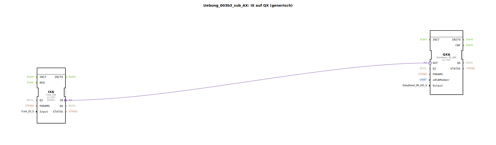

Hier ist die Dokumentation für die Übung basierend auf der bereitgestellten XML-Datei:

# Uebung_003b3_sub_AX: IX auf QX (generisch)

* * * * * * * * * *

## Einleitung

Diese Übung beschreibt eine Sub-Applikation (`SubAppType`), die eine generische Verbindung zwischen einem digitalen Eingang (IX) und einem digitalen Ausgang (QX) herstellt. Der Baustein dient als Brückenelement, um Signale von einem Eingabemodul (z. B. Funkschalter) direkt auf ein Ausgabemodul (z. B. DataPanel) weiterzuleiten.

## Verwendete Funktionsbausteine (FBs)

In dieser Sub-Applikation werden spezifische Funktionsbausteine instanziiert und miteinander verknüpft, um die Signalweiterleitung zu realisieren.

### Sub-Bausteine: IXA
- **Typ**: `Funk::io::DI::Funk_IXA`
- **Verwendete interne FBs**:
    - **Bausteinname**: IXA
        - **Parameter**: 
            - `QI` = `TRUE`
            - `PARAMS` = `""` (Attribut: Visible = false)
        - **Dateneingang**: 
            - `Input` (Verbunden mit dem SubApp-Eingang `Input`)
- **Funktionsweise**: 
  Dieser Baustein repräsentiert die Eingangsseite der Adapterverbindung. Er nimmt die Konfiguration des Eingangs (`Input`) entgegen und stellt die Schnittstelle für das Eingangssignal bereit.

### Sub-Bausteine: QXA
- **Typ**: `DataPanel::io::MI::DQ::DataPanel_MI_QXA`
- **Verwendete interne FBs**:
    - **Bausteinname**: QXA
        - **Parameter**: 
            - `QI` = `TRUE`
        - **Dateneingang**: 
            - `u8SAMember` (Verbunden mit dem SubApp-Eingang `u8SAMember`)
            - `Output` (Verbunden mit dem SubApp-Eingang `Output`)
- **Funktionsweise**: 
  Dieser Baustein repräsentiert die Ausgangsseite. Er empfängt die Adressierung (`u8SAMember`) und die Ausgangskonfiguration (`Output`) für das DataPanel und steuert den entsprechenden physischen Ausgang an.

## Programmablauf und Verbindungen

Die Logik dieser Sub-Applikation basiert auf einer direkten Durchleitung von Signalen über Adapter-Verbindungen.

1.  **Schnittstellen-Definition**:
    -   **Input**: Definiert die Quelle des Signals (z. B. `DigitalInput_Key_01`).
    -   **u8SAMember**: Bestimmt den Netzwerkknoten (Node SA 224..239) für das Ausgabemodul.
    -   **Output**: Definiert den spezifischen Ausgang am DataPanel (z. B. `DigitalOutput_1A..8B`).

2.  **Datenfluss**:
    -   Die Konfigurationsdaten werden von den Eingängen der Sub-Applikation direkt an die internen Bausteine `IXA` und `QXA` weitergeleitet.

3.  **Signalfluss (Adapter)**:
    -   Es besteht eine direkte **Adapter-Verbindung** zwischen `IXA.IN` und `QXA.OUT`.
    -   Durch diese Verbindung wird der logische Zustand des Eingangs direkt auf den Ausgang abgebildet ("gemappt"). Wenn der definierte Eingang aktiv ist, wird der entsprechende Ausgang am DataPanel geschaltet.

Diese Struktur ermöglicht eine saubere Kapselung der IO-Zuordnung, sodass diese Logik in übergeordneten Applikationen einfach wiederverwendet werden kann.

## Zusammenfassung

Die `Uebung_003b3_sub_AX` ist ein generischer Verbindungsbaustein, der einen digitalen Funkeingang auf einen digitalen DataPanel-Ausgang mappt. Durch die Nutzung von Adapter-Technologie und parametrierbaren Eingängen bietet der Baustein eine flexible Möglichkeit, Hardware-IOs ohne komplexe Logikprogrammierung direkt miteinander zu verknüpfen.

## 🛠️ Zugehörige Übungen

* [Uebung_003b3_AX](Uebung_003b3_AX.md)

