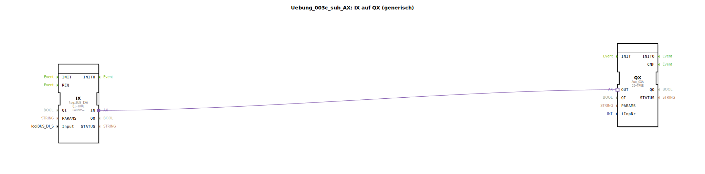

Hier ist die Dokumentation für die Sub-Applikation `Uebung_003c_sub_AX` basierend auf den bereitgestellten Daten.

# Uebung_003c_sub_AX: IX auf QX (generisch)

<Bild der Übung, falls vorhanden>

* * * * * * * * * *

## Einleitung
Die Sub-Applikation **Uebung_003c_sub_AX** dient als generischer Baustein zur Verbindung eines digitalen Eingangs (IX) mit einem Auxiliary-Ausgang (QX). Sie fungiert als Schnittstelle, um Signale vom LogiBUS-System auf das ISOBUS-Auxiliary-System zu mappen, wobei eine spezifische Eingangsnummer (`iInpNr`) berücksichtigt wird.

## Verwendete Funktionsbausteine (FBs)

In dieser Sub-Applikation werden spezifische Bausteine verschaltet, um die Weiterleitung der Signale zu realisieren.

### Sub-Bausteine: Interne Netzwerk-Komponenten
Diese Sub-Applikation besteht intern aus zwei Hauptkomponenten, die über Adapter und Datenleitungen verbunden sind.

- **Verwendete interne FBs**:

    - **Bausteinname**: `IX`
        - **Typ**: `logiBUS::io::DI::logiBUS_IXA`
        - **Beschreibung**: Dient als Schnittstelle für den digitalen Eingang.
        - **Parameter**: 
            - `QI` = `TRUE` (Baustein ist aktiv)
            - `PARAMS` = `` (Unsichtbar/Leer)
        - **Datenausgang/-eingang**:
            - `Input`: Empfängt das Eingangssignal der Sub-Applikation (`Input`).
        - **Adapter**:
            - `IN`: Verbunden mit dem Adapter-Eingang von `QX`.

    - **Bausteinname**: `QX`
        - **Typ**: `isobus::UT::io::Auxiliary::OUT::Aux_QXA`
        - **Beschreibung**: Repräsentiert den Auxiliary-Ausgang.
        - **Parameter**: 
            - `QI` = `TRUE` (Baustein ist aktiv)
        - **Datenausgang/-eingang**:
            - `iInpNr`: Empfängt die Index-Nummer von der Sub-Applikation (`iInpNr`).
        - **Adapter**:
            - `OUT`: Empfängt die Verbindung vom Adapter-Ausgang von `IX`.

- **Funktionsweise**:
    Der Baustein `IX` nimmt das physikalische Eingangssignal (`logiBUS_DI_S`) entgegen. Über eine Adapterverbindung (`Connection`) wird der Zustand direkt an den Baustein `QX` weitergegeben. Der Baustein `QX` nutzt zusätzlich den Eingang `iInpNr`, um das Signal dem korrekten Auxiliary-Index zuzuordnen.

## Programmablauf und Verbindungen

Der Ablauf innerhalb dieser Sub-Applikation ist linear und ereignisgesteuert durch die Adapterverbindungen:

1.  **Eingangssignal**: Über die Schnittstelle der Sub-Applikation wird ein `Input` (vom Typ `logiBUS_DI_S`) und eine Nummer `iInpNr` (vom Typ `USINT`) übergeben.
2.  **Verarbeitung im IX**: Der interne Baustein `IX` wird mit dem `Input` versorgt. Da `QI` auf `TRUE` gesetzt ist, ist dieser Baustein permanent aktiv.
3.  **Adapter-Kommunikation**: Zwischen `IX.IN` und `QX.OUT` besteht eine Adapterverbindung. Dies bedeutet, dass die logische Verknüpfung und der Datenaustausch zwischen dem LogiBUS-Eingang und dem ISOBUS-Auxiliary-Ausgang hier abstrahiert stattfinden.
4.  **Konfiguration des QX**: Der `QX`-Baustein erhält über `iInpNr` die Information, welcher Auxiliary-Eingang im Pool angesprochen werden soll (z.B. der erste, zweite, etc.).

**Lernziele und Anwendung:**
Diese Übung verdeutlicht die Kapselung von Logik in Sub-Applikationen (`SubAppType`). Sie zeigt, wie man unterschiedliche Bussysteme (LogiBUS und ISOBUS Auxiliary) durch Adapterverbindungen innerhalb von 4diac verknüpft, ohne die interne Komplexität jedes Mal neu aufbauen zu müssen. Es ist ein grundlegender Baustein für modularisierte Steuerungssoftware in der Landtechnik.

## Zusammenfassung
Die `Uebung_003c_sub_AX` ist ein wiederverwendbares Modul (SubApp), das einen digitalen LogiBUS-Eingang auf einen ISOBUS-Auxiliary-Ausgang abbildet. Durch die Parametrierung der Eingangsnummer (`iInpNr`) lässt sich der Baustein flexibel für verschiedene Eingänge verwenden, was die Erstellung größerer Steuerungsanwendungen vereinfacht und übersichtlicher gestaltet.