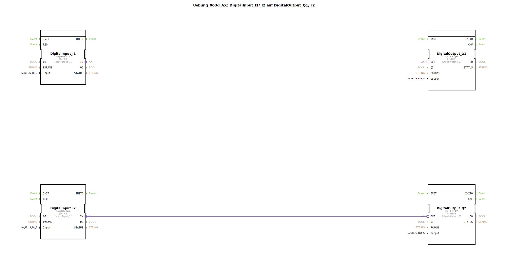

# Uebung_003d_AX: DigitalInput_I1/_I2 auf DigitalOutput_Q1/_I2

Dieser Artikel beschreibt die logiBUS®-Übung `Uebung_003d_AX`. Diese Übung ist strukturell nahezu identisch mit `Uebung_003_AX` und dient der Festigung des Verständnisses für parallele Signalpfade.

----

## Ziel der Übung

Das Ziel ist die Wiederholung der direkten I/O-Verknüpfung mittels Adapter-Technologie. Es wird sichergestellt, dass das Konzept der unabhängigen Datenflüsse verstanden wurde.

-----

## Beschreibung und Komponenten

[cite_start]Die Subapplikation `Uebung_003d_AX.SUB` verbindet zwei Eingänge mit zwei Ausgängen[cite: 1].

### Funktionsbausteine (FBs)

  * **`DigitalInput_I1`** -> **`DigitalOutput_Q1`**
  * **`DigitalInput_I2`** -> **`DigitalOutput_Q2`**

Die Bausteintypen sind `logiBUS_IXA` und `logiBUS_QXA`, verbunden über den Adapter `AX`.

-----

## Funktionsweise

Siehe `Uebung_003_AX`. Die Signale werden 1:1 und latenzarm von den Eingängen auf die Ausgänge durchgeschleift.

-----

## Anwendungsbeispiel

Diese Übung kann als Template für **einfache Verdrahtungstests** genutzt werden. Wenn man eine neue Steuerung in Betrieb nimmt, lädt man oft so ein "dummes" Programm hoch, um zu prüfen, ob physikalisch alles korrekt angeschlossen ist (Schalter betätigen -> LED geht an).