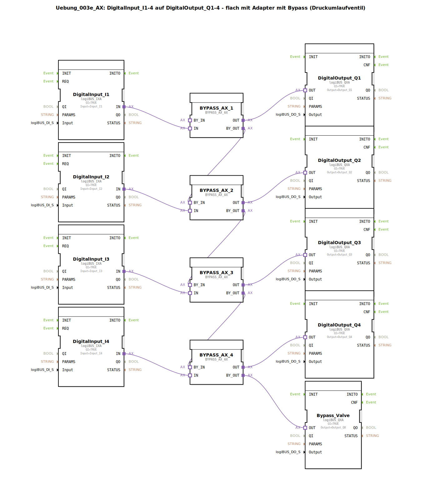

# Uebung_003e_AX: DigitalInput_I1-4 auf DigitalOutput_Q1-4 - flach mit Adapter mit Bypass (Druckumlaufventil)




* * * * * * * * * *

## Einleitung

Die Übung realisiert eine einfache Durchschaltung von vier digitalen Eingängen (I1–I4) auf vier digitale Ausgänge (Q1–Q4). Zusätzlich ist eine Bypass‑Funktion (Druckumlaufventil) integriert, die über ein gemeinsames Magnetventil (Output_Q8) gesteuert wird. Die Signale werden über Bypass‑Adapter (BYPASS_AX_AX) geführt, die einen Haupt‑ und einen Bypass‑Pfad bereitstellen. Durch die Kaskadierung der Bypass‑Pfade kann der gesamte Signalfluss umgeleitet werden.

## Verwendete Funktionsbausteine (FBs)

### Sub-Bausteine:

#### DigitalInput_Ix (x=1..4)
- **Typ**: `logiBUS::io::DI::logiBUS_IXA`
- **Parameter**: QI = `TRUE`; Input = `Input_I1` (bzw. `_I2`, `_I3`, `_I4`)
- **Funktionsweise**: Liest den digitalen Eingangswert vom logiBUS‑IO‑System ein.

#### DigitalOutput_Qx (x=1..4) und Bypass_Valve
- **Typ**: `logiBUS::io::DQ::logiBUS_QXA`
- **Parameter**: 
  - DigitalOutput_Q1..Q4: QI = `TRUE`; Output = `Output_Q1` .. `Output_Q4`
  - Bypass_Valve: QI = `TRUE`; Output = `Output_Q8`
- **Funktionsweise**: Gibt das digitale Signal auf den entsprechenden logiBUS‑Ausgang aus.

#### BYPASS_AX_x (x=1..4)
- **Typ**: `logiBUS::signalprocessing::bypass::BYPASS_AX_AX`
- **Parameter**: keine (reine Adapterverbindungen)
- **Ereignisausgang/-eingang**: keine
- **Datenausgang/-eingang**: Adapter‑Ports `IN`, `OUT`, `BY_IN`, `BY_OUT`
- **Funktionsweise**: Der Baustein besitzt zwei Signalpfade:
  - **Hauptpfad**: `IN` → `OUT` – leitet das Eingangssignal direkt zum Ausgang.
  - **Bypass‑Pfad**: `BY_IN` → `BY_OUT` – dieser Pfad wird aktiv, sobald das nachgeschaltete Bypass‑Ventil öffnet.  
    In dieser Übung sind die Bypass‑Pfade kaskadiert, sodass der Bypass des ersten Blocks den des zweiten speist usw. Dadurch kann der gesamte Signalfluss über die Bypass‑Kette zum gemeinsamen Ventil (Bypass_Valve) umgeleitet werden.

## Programmablauf und Verbindungen

Die gesamte Verschaltung erfolgt über **Adapterverbindungen** (keine Daten‑ oder Ereignisverbindungen):

- **Hauptpfad**:  
  Jeder Digitaleingang (`Input_I1` … `Input_I4`) ist über den `IN`‑Port des zugehörigen `BYPASS_AX`‑Blocks mit dem `OUT`‑Port verbunden, der zum entsprechenden Digitalausgang (`Output_Q1` … `Output_Q4`) führt.

- **Bypass‑Pfad (kaskadiert)**:  
  ```
  BYPASS_AX_1.BY_OUT → BYPASS_AX_2.BY_IN
  BYPASS_AX_2.BY_OUT → BYPASS_AX_3.BY_IN
  BYPASS_AX_3.BY_OUT → BYPASS_AX_4.BY_IN
  BYPASS_AX_4.BY_OUT → Bypass_Valve.OUT (Output_Q8)
  ```

- **Funktionsweise des Bypass**:  
  Wird das gemeinsame Bypass‑Ventil (`Output_Q8`) geschaltet, öffnet der Bypass‑Pfad. Das Signal wird dann nicht mehr über die Hauptausgänge (Q1–Q4) ausgegeben, sondern über die Bypass‑Kette zum Ventil geleitet. Dies simuliert ein Druckumlaufventil, wie es in hydraulischen oder pneumatischen Steuerungen vorkommt.

## Zusammenfassung

Die Übung vermittelt den Umgang mit **Adapterverbindungen** und **Bypass‑Logik** in der 4diac‑IDE. Es wird gezeigt, wie vier digitale Eingänge über Bypass‑Blöcke auf Ausgänge geschaltet werden können und wie eine Kaskadierung der Bypass‑Signale ein gemeinsames Magnetventil steuert. Die Verwendung der logiBUS‑IO‑Bausteine stellt dabei die Verbindung zu realen oder simulierten Ein‑/Ausgängen her.