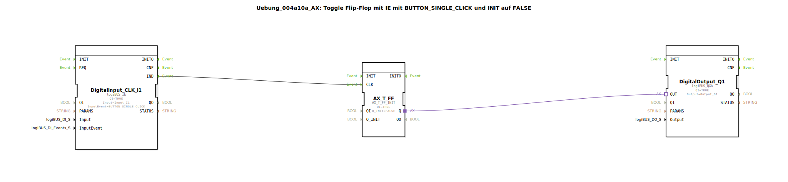

# Uebung_004a10a_AX: Toggle Flip-Flop mit IE mit BUTTON_SINGLE_CLICK und INIT auf FALSE

* * * * * * * * * *

## Einleitung

Diese Übung realisiert ein Toggle-Flip-Flop (T-FF) mit einem Initialwert von `FALSE`. Der Ausgangszustand wird bei jedem einfachen Tastendruck (Ereignis `BUTTON_SINGLE_CLICK`) umgeschaltet. Die Steuerung erfolgt über die logiBUS-Hardware, wobei ein digitaler Eingang (`Input_I1`) und ein digitaler Ausgang (`Output_Q1`) verwendet werden.

## Verwendete Funktionsbausteine (FBs)

### Sub-Bausteine:

#### Baustein `DigitalInput_CLK_I1`
- **Typ**: `logiBUS::io::DI::logiBUS_IE`
- **Verwendete interne FBs**: Keine (Hardwaretreiberbaustein)
- **Parameter**:
    - `QI` = `TRUE` (Aktivierung des Bausteins)
    - `Input` = `Input_I1` (physischer Eingangskanal)
    - `InputEvent` = `BUTTON_SINGLE_CLICK` (auslösendes Ereignis bei einfachem Tastendruck)
- **Funktionsweise**: Dieser Baustein erfasst den Zustand des Eingangs `Input_I1` und erzeugt bei einem Tastendruck (Ereignis vom Typ `BUTTON_SINGLE_CLICK`) ein Ereignis am Ausgang `IND`. Das Signal wird getaktet und an das nachfolgende Flip-Flop weitergegeben.

#### Baustein `AX_T_FF`
- **Typ**: `adapter::events::unidirectional::AX_T_FF_INIT`
- **Verwendete interne FBs**: Keine (Standard-Flip-Flop-Baustein)
- **Parameter**:
    - `QI` = `TRUE` (Aktivierung des Bausteins)
    - `Q_INIT` = `FALSE` (Anfangszustand des Ausgangs)
- **Funktionsweise**: Dies ist ein Toggle-Flip-Flop. Bei jedem empfangenen Ereignis am Eingang `CLK` (verbunden mit `IND` des Eingangsbausteins) wird der interne Zustand `Q` umgeschaltet. Der Ausgangswert wird über den Adapterausgang `Q` bereitgestellt. Der Startwert ist `FALSE`, sodass nach dem ersten Tastendruck der Zustand auf `TRUE` wechselt.

#### Baustein `DigitalOutput_Q1`
- **Typ**: `logiBUS::io::DQ::logiBUS_QXA`
- **Verwendete interne FBs**: Keine (Hardwaretreiberbaustein)
- **Parameter**:
    - `QI` = `TRUE` (Aktivierung des Bausteins)
    - `Output` = `Output_Q1` (physischer Ausgangskanal)
- **Funktionsweise**: Dieser Baustein übernimmt den aktuellen Ausgangswert des Flip-Flops (über den Adapteranschluss `OUT`) und gibt ihn auf den physischen Ausgang `Output_Q1` aus. Der Wert wird dauerhaft gehalten, bis das Flip-Flop seinen Zustand ändert.

## Programmablauf und Verbindungen

1. **Eingangsereignis**: Der Baustein `DigitalInput_CLK_I1` wartet auf einen Tastendruck am Eingang `Input_I1`. Sobald das Ereignis `BUTTON_SINGLE_CLICK` auftritt, wird ein Ereignis am Ausgang `IND` erzeugt.

2. **Ereignisverbindung**: Das Ereignis `IND` wird direkt an den Ereigniseingang `CLK` des Toggle-Flip-Flops `AX_T_FF` weitergeleitet.

3. **Zustandsänderung**: Das Flip-Flop `AX_T_FF` schaltet bei jedem `CLK`-Ereignis seinen internen Zustand um. Der aktuelle Zustand liegt am Adapterausgang `Q` an.

4. **Adapterverbindung**: Der Adapterausgang `Q` des Flip-Flops ist mit dem Adaptereingang `OUT` des Ausgangsbausteins `DigitalOutput_Q1` verbunden. Dadurch wird der neue Zustand sofort an den physischen Ausgang `Output_Q1` übergeben.

5. **Ausgangszustand**: Nach einem Systemstart oder RESET bleibt der Ausgang auf dem initialen Wert `FALSE` (0). Bei jedem weiteren Tastendruck wechselt der Ausgang zwischen `TRUE` (1) und `FALSE` (0).

**Hinweise zur praktischen Durchführung**:  
- Die Übung setzt voraus, dass ein logiBUS-IO-Modul mit einem Taster an `Input_I1` und einer Anzeige (z. B. LED) an `Output_Q1` angeschlossen ist.  
- Das Verhalten ist entprellt, da das Ereignis `BUTTON_SINGLE_CLICK` bereits eine gefilterte Flanke liefert.  
- Die Bausteine sind so konfiguriert, dass sie automatisch aktiv sind (`QI = TRUE`).

## Zusammenfassung

Die Übung demonstriert die einfache Realisierung eines Toggle-Flip-Flops mit hardwarenahen Ein- und Ausgängen. Durch die Kombination eines digitalen Eingangsbausteins mit einem Standard-Flip-Flop und einem Ausgangsbaustein wird ein praktischer Anwendungsfall der Ereignissteuerung in 4diac umgesetzt. Der Schwerpunkt liegt auf dem Verständnis der Ereignisverbindungen und der Initialisierung von Zuständen.