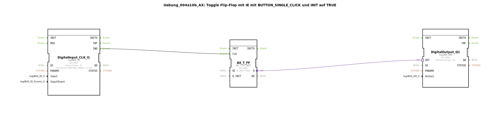

# Uebung_004a10b_AX: Toggle Flip-Flop mit IE mit BUTTON_SINGLE_CLICK und INIT auf TRUE

* * * * * * * * * *

## Einleitung

Diese Übung realisiert einen asynchronen Toggle-Flip-Flop (T-FF) unter Verwendung eines logiBUS-Eingangsbausteins mit dem Ereignis `BUTTON_SINGLE_CLICK` und einem logiBUS-Ausgangsbaustein. Der Funktionsbaustein wird initial auf `TRUE` gesetzt – der Ausgang ist sofort nach dem Start eingeschaltet. Ein Tastendruck auf den Eingang `I1` löscht den Ausgang; ein weiterer Tastendruck schaltet ihn wieder ein (Toggle-Verhalten).

## Verwendete Funktionsbausteine (FBs)

- **DigitalInput_CLK_I1** – Typ: `logiBUS::io::DI::logiBUS_IE`
  - Parameter:
    - `QI` = `TRUE` (Baustein aktiv)
    - `Input` = `Input_I1` (Hardware-Eingangskanal)
    - `InputEvent` = `BUTTON_SINGLE_CLICK` (Ereignis bei kurzem Tastendruck)
  - Ereignisausgang: `IND` (wird bei einem gültigen Tastendruck ausgelöst)
  - **Funktion**: Erzeugt bei einem einzelnen Tastendruck auf den physischen Eingang `I1` ein Ereignis am Ausgang `IND`.

- **AX_T_FF** – Typ: `adapter::events::unidirectional::AX_T_FF_INIT`
  - Parameter:
    - `QI` = `TRUE` (Baustein aktiv)
    - `Q_INIT` = `TRUE` (Anfangswert des Ausgangs)
  - Ereigniseingang: `CLK` (Taktsignal zum Umschalten)
  - Adapterausgang: `Q` (enthält sowohl das Ereignis als auch den Datenwert)
  - **Funktion**: Implementiert ein Toggle-Flip-Flop (T-FF). Bei jedem Ereignis am `CLK`-Eingang wird der interne Zustand umgeschaltet. Der initiale Zustand wird durch `Q_INIT` festgelegt. Der Ausgang `Q` gibt den aktuellen Zustand als Adapterverbindung weiter.

- **DigitalOutput_Q1** – Typ: `logiBUS::io::DQ::logiBUS_QXA`
  - Parameter:
    - `QI` = `TRUE` (Baustein aktiv)
    - `Output` = `Output_Q1` (Hardware-Ausgangskanal)
  - Adaptereingang: `OUT` (nimmt den Zustand über eine Adapterverbindung entgegen)
  - **Funktion**: Setzt den physischen Ausgang `Q1` auf den Wert, der über die Adapterverbindung ankommt.

## Programmablauf und Verbindungen

1. **Startverhalten**: Der Baustein `AX_T_FF` hat `Q_INIT = TRUE`. Dadurch ist der Ausgang `Q` unmittelbar nach dem Start aktiv. Über die Adapterverbindung `AX_T_FF.Q → DigitalOutput_Q1.OUT` wird der Wert an den Ausgangsbaustein weitergegeben, sodass der physische Ausgang `Q1` sofort eingeschaltet ist – dies wird durch den Kommentar „am Anfang gleich mal AN !“ verdeutlicht.

2. **Toggle-Ablauf**:  
   - Wenn die Taste an `I1` einmal kurz gedrückt wird, erzeugt `DigitalInput_CLK_I1` ein Ereignis am Ausgang `IND`.  
   - Dieses Ereignis wird über die Ereignisverbindung `DigitalInput_CLK_I1.IND → AX_T_FF.CLK` an den Takt-Eingang des T-FF weitergeleitet.  
   - Der T-FF kippt daraufhin seinen internen Zustand: Aus `TRUE` wird `FALSE` (oder umgekehrt).  
   - Der neue Zustand wird über die Adapterverbindung an den Ausgangsbaustein übertragen, der daraufhin den physischen Ausgang entsprechend setzt.

3. **Wiederholtes Drücken**: Jeder weitere `BUTTON_SINGLE_CLICK` löst erneut ein Umschalten aus, sodass der Ausgang zwischen `TRUE` und `FALSE` hin- und herschaltet.

**Verbindungsübersicht**:

- **Ereignisverbindung**: `DigitalInput_CLK_I1.IND` → `AX_T_FF.CLK`
- **Adapterverbindung**: `AX_T_FF.Q` → `DigitalOutput_Q1.OUT`

## Zusammenfassung

Die Übung demonstriert den Aufbau eines Toggle-Flip-Flops mit einem initialen Zustand (`TRUE`). Der Eingangsbaustein reagiert ausschließlich auf einen einzelnen Tastendruck (`BUTTON_SINGLE_CLICK`), wodurch Prellen oder Mehrfachauslösungen vermieden werden. Der T-FF wird als vorgefertigter Adapterbaustein (`AX_T_FF_INIT`) verwendet, der sowohl den Umschaltmechanismus als auch die Initialisierung vereint. Die Adapterverbindung zwischen T-FF und Ausgang vereinfacht die Kopplung von Ereignis- und Datenfluss.  

Nach dem Start leuchtet die Ausgangslampe `Q1` sofort. Jeder Tastendruck schaltet sie um – ein einfaches und robustes Ein-/Aus-Verhalten.