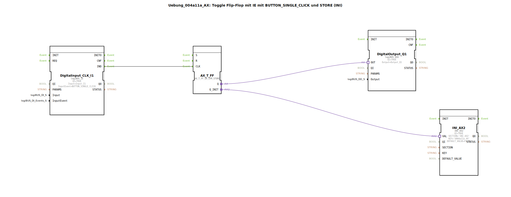

# Uebung_004a11a_AX: Toggle Flip-Flop mit IE mit BUTTON_SINGLE_CLICK und STORE (INI)

* * * * * * * * * *
## Einleitung

Diese Übung realisiert einen Toggle-Flip-Flop (T-Flip-Flop) zur Ansteuerung eines digitalen Ausgangs über einen einzelnen Tastendruck. Der letzte Zustand des Ausgangs wird beim Start der Applikation automatisch aus einem nichtflüchtigen Speicher geladen und beibehalten. Dadurch bleibt der Schaltzustand auch nach einem Neustart erhalten. Die Eingabe erfolgt über einen Taster mit Entprellung, der ein **BUTTON_SINGLE_CLICK**-Ereignis auslöst.

## Verwendete Funktionsbausteine (FBs)

Die SubApplikation nutzt folgende vorgefertigte Funktionsbausteine:

- **DigitalInput_CLK_I1** (Typ `logiBUS::io::DI::logiBUS_IE`)  
  Digitaler Eingang, der bei einem einzelnen Tastendruck das Ereignis `IND` erzeugt. Parameter: `QI = TRUE`, `Input = Input_I1`, `InputEvent = BUTTON_SINGLE_CLICK`.

- **AX_T_FF** (Typ `adapter::events::unidirectional::AX_T_FF_SR_SYM_STORE`)  
  Adapterbaustein eines Toggle-Flip-Flops mit symmetrischem SR-Eingang und integrierter Speicherfunktion. Das Flip-Flop wechselt bei jedem steigenden Impuls am Takteingang (`CLK`) seinen Ausgangszustand (`Q`). Über den Adapteranschluss `Q_INIT` wird der initiale Zustand aus einem Speicherbaustein geladen.

- **DigitalOutput_Q1** (Typ `logiBUS::io::DQ::logiBUS_QXA`)  
  Digitaler Ausgang zur Ansteuerung einer Last (z. B. Lampe oder Relais). Parameter: `QI = TRUE`, `Output = Output_Q1`.

- **INI_AX2** (Typ `eclipse4diac::storage::INI_AX2`)  
  Speicherbaustein zum Lesen des gespeicherten Zustands aus einer INI-Datei (oder einem ähnlichen persistenten Medium). Parameter: `QI = TRUE`, `SECTION = 'INI_AX2'`, `KEY = 'U004a11a_AX'`, `DEFAULT_VALUE = FALSE`. Beim Start liefert dieser Baustein den zuletzt gespeicherten Ausgangswert.

## Programmablauf und Verbindungen

Die SubApplikation besitzt keine eigenen Ein-/Ausgangsschnittstellen; die Verbindungen sind vollständig intern realisiert. Der Ablauf gliedert sich in zwei Phasen:

1. **Initialisierungsphase (Start)**  
   - Der Baustein `INI_AX2` wird aktiviert und liest den unter dem Schlüssel `U004a11a_AX` gespeicherten Wert aus der INI-Datei.  
   - Über die Adapterverbindung `AX_T_FF.Q_INIT → INI_AX2.VAL` wird dieser Wert an das Flip-Flop übergeben, das seinen internen Zustand entsprechend setzt.  
   - Anschließend gibt das Flip-Flop diesen Zustand über die Adapterverbindung `AX_T_FF.Q → DigitalOutput_Q1.OUT` an den Ausgang weiter.

2. **Betriebsphase (wiederholte Tastendrücke)**  
   - Bei jedem einzelnen Tastendruck am Eingang `Input_I1` erzeugt der Baustein `DigitalInput_CLK_I1` das Ereignis `IND`.  
   - Dieses Ereignis wird über die Eventverbindung `DigitalInput_CLK_I1.IND → AX_T_FF.CLK` als Taktsignal an das Flip-Flop geleitet.  
   - Das Flip-Flop wechselt daraufhin seinen Zustand (von `TRUE` nach `FALSE` oder umgekehrt).  
   - Der neue Zustand wird wiederum über die Adapterverbindung an den Ausgang `DigitalOutput_Q1` weitergegeben und gleichzeitig im Speicherbaustein (implizit durch den Adapter) abgelegt.

Ein Kommentar im Netzwerk weist darauf hin, dass der letzte Zustand zu Beginn geladen werden muss.

## Zusammenfassung

Die Übung demonstriert die Kombination eines entprellten Tastereingangs mit einem speichernden Toggle-Flip-Flop. Besonders wichtig ist die Wiederherstellung des letzten Ausgangszustands nach einem Neustart – erreicht durch den Einsatz eines INI-Speicherbausteins. Dadurch eignet sich die Schaltung für Anwendungen, bei denen der Schaltzustand auch nach Spannungsunterbrechung erhalten bleiben muss, z. B. für EIN/AUS-Taster in Steuerungen.

**Lernziele:**  
- Verständnis des Toggle-Flip-Flop-Verhaltens  
- Umgang mit Ereignis-gesteuerten Eingängen (BUTTON_SINGLE_CLICK)  
- Initialisierung von Zuständen aus persistentem Speicher  
- Adapterverbindungen zwischen Funktionsbausteinen in 4diac-IDE