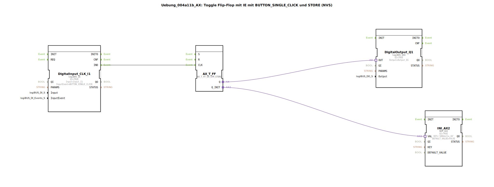

# Uebung_004a11b_AX: Toggle Flip-Flop mit IE mit BUTTON_SINGLE_CLICK und STORE (NVS)

* * * * * * * * * *

## Einleitung

Diese Übung realisiert ein **Toggle-Flip-Flop** (T-FF) mit einem digitalen Eingang (logiBUS DI), der über das Ereignis `BUTTON_SINGLE_CLICK` ausgelöst wird. Der aktuelle Zustand des Flip-Flops wird zudem in einem nichtflüchtigen Speicher (NVS) abgelegt und beim Start wiederhergestellt. Dadurch bleibt der Ausgangszustand auch nach einem Neustart erhalten.

Die Übung demonstriert die Kombination von ereignisgesteuerter Logik (T-FF) mit persistenter Datenspeicherung.

## Verwendete Funktionsbausteine (FBs)

Die Übung besteht aus insgesamt vier Funktionsbausteinen, die in einem Subapplikationsnetzwerk verbunden sind. Es gibt keine weiteren eingebetteten Sub-Bausteine.

- **DigitalInput_CLK_I1** (Typ: `logiBUS_IE`)
    - Parameter:
        - `QI` = 1 (aktiv)
        - `Input` = `Input_I1` (physikalischer DI)
        - `InputEvent` = `BUTTON_SINGLE_CLICK`
    - Funktion: Der Baustein erwartet einen Tastendruck auf dem digitalen Eingang. Bei jeder steigenden Flanke (Single Click) wird ein Ereignis am Ausgang `IND` erzeugt.

- **AX_T_FF** (Typ: `AX_T_FF_SR_SYM_STORE`)
    - Parameter: Keine
    - Funktion: Ein T-Flip-Flop mit Set/Reset und Speicherfähigkeit.  
      Der Eingang `CLK` (Event) toggelt den internen Zustand bei jedem Ereignis.  
      Die Adapterausgänge:
        - `Q` – aktueller Ausgangszustand (an Digitalausgang weitergegeben)
        - `Q_INIT` – dient zur Initialisierung des Flip-Flops mit einem gespeicherten Wert (über NVS)

- **INI_AX2** (Typ: `NVS_AX2`)
    - Parameter:
        - `QI` = 1 (aktiv)
        - `KEY` = `U004a11a_AX`
        - `DEFAULT_VALUE` = 0 (FALSE)
    - Funktion: Liest beim Start den unter dem Schlüssel `U004a11a_AX` gespeicherten Wert aus dem NVS (nichtflüchtiger Speicher) aus.  
      Der gelesene Wert wird am Adapterausgang `VAL` bereitgestellt. Falls noch kein Wert gespeichert ist, wird `DEFAULT_VALUE` (FALSE) ausgegeben.

- **DigitalOutput_Q1** (Typ: `logiBUS_QXA`)
    - Parameter:
        - `QI` = 1 (aktiv)
        - `Output` = `Output_Q1` (physikalischer DO)
    - Funktion: Der Baustein gibt den am Adaptereingang `OUT` anliegenden Wert direkt auf den digitalen Ausgang `Q1` aus.

## Programmablauf und Verbindungen

Die Verbindungen zwischen den Bausteinen definieren den Ablauf:

1. **Eingangsereignis**  
   Bei einem Tastendruck am Eingang I1 erzeugt `DigitalInput_CLK_I1` ein Ereignis an seinem Ausgang `IND`.

2. **Toggle-Flip-Flop**  
   Dieses Ereignis wird über eine **Event-Verbindung** direkt an den Eingang `CLK` des T-FF `AX_T_FF` weitergeleitet. Jedes Ereignis toggelt den internen Zustand des Flip-Flops.

3. **Ausgang**  
   Der aktuelle Ausgangszustand des T-FF (`Q`) wird über eine **Adapterverbindung** an den Eingang `OUT` des Digitalausgangs `DigitalOutput_Q1` übergeben. Somit wird der toggelte Zustand auf dem physikalischen Ausgang Q1 sichtbar.

4. **Speicherung und Initialisierung**  
   Der Baustein `INI_AX2` liest beim Start den gespeicherten Wert aus dem NVS und stellt ihn an seinem Adapterausgang `VAL` bereit.  
   Dieser Wert wird über eine **Adapterverbindung** an den Initialisierungseingang `Q_INIT` des T-FF geführt. Dadurch wird das Flip-Flop beim Start auf den zuletzt gespeicherten Zustand gesetzt (siehe Kommentar im Netzwerk: „am Anfang letzten Zustand laden!“).

   *Hinweis:* Die Rückspeicherung des aktuellen Zustands in den NVS wird vermutlich intern durch den T-FF oder einen weiteren Baustein realisiert; in der vorliegenden Netzwerkgrafik ist die Speicherung nicht als separater FB sichtbar.

## Zusammenfassung

Die Übung veranschaulicht:

- Die Erzeugung von Ereignissen durch einen digitalen Taster mit `BUTTON_SINGLE_CLICK`.
- Das Toggeln eines Z-Ustands mittels eines T-Flip-Flops.
- Die persistente Speicherung des Zustands in einem nichtflüchtigen Speicher (NVS) und dessen Wiederherstellung nach einem Neustart.
- Der Aufbau einer einfachen ereignisgesteuerten Logik mit kombinierten Ein-/Ausgängen (DI/DO).

Damit sind die Grundlagen für den Einsatz von T-Flip-Flops in Kombination mit NVS-Speicherung für typische Anwendungen wie das Ein- und Ausschalten von Ausgängen mit Zustandserhaltung gelegt.